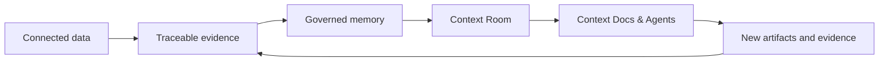
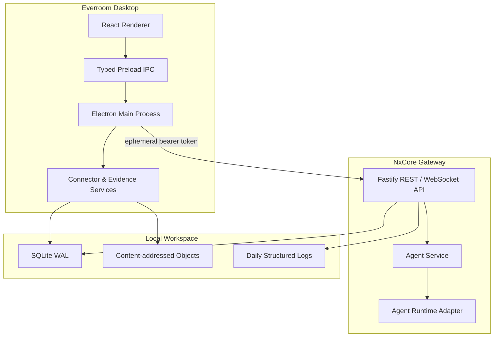

<div align="center">


# Everroom

**The local-first context layer between your data and AI agents.**

Connect data. Build evidence. Govern memory. Move work forward.

[English](./README.md) | [简体中文](./README.zh-CN.md)


</div>

> [!IMPORTANT]
> Everroom is under active development. macOS is the current development target, APIs and storage schemas may change, and several product modules described below are still being built.

## What is Everroom?

Everroom is a personal context workspace for people who work across documents, repositories, conversations, and AI coding tools. It is not another general-purpose chat client, a thin RAG interface, or a passive second-brain notebook.

Everroom sits between your personal data and AI agents. It turns connected sources into traceable evidence, promotes evidence into governed memory, projects relevant context into a **Context Room**, and gives documents and agents only the context they need to complete a task.



The product is guided by four principles:

- **Local first:** data, indexes, working memory, and documents stay on the user's device by default.
- **Evidence before conclusions:** important memories and generated output should remain traceable to their sources.
- **Automation with control:** agents receive explicit, revocable context and tool boundaries.
- **Replaceable foundations:** models, memory engines, connectors, and agent runtimes sit behind Everroom-owned interfaces.

## Current Status

The repository already provides the desktop and backend foundation for the first local workflow.

| Area | Status | What is available today |
| --- | --- | --- |
| Desktop shell | Available | Electron + React workspace with source management and an Agent panel |
| NxCore Gateway | Available | Standalone Fastify service supervised by Electron in development and packaged builds |
| API boundary | Available | TypeBox validation, OpenAPI docs, bearer authentication, health endpoints, and WebSocket support |
| Local storage | Available | SQLite WAL, Drizzle migrations, content-addressed objects, and FTS5 evidence search |
| Data sources | In progress | Local-folder workflow and GitHub connector foundation |
| Evidence pipeline | In progress | File versioning plus Markdown/plain-text evidence blocks with source positions |
| Agent service | In progress | Persistent sessions, runs, messages, event history, cancellation, and streaming; currently backed by a development runtime |
| Memory, Rooms, Docs | Planned | Governed memory, dynamic Context Rooms, and agent-editable Context Docs |

## Architecture

Electron owns the desktop lifecycle and starts NxCore Gateway as an independent local service. The renderer never receives direct database, filesystem, or Gateway credentials. IPC calls are handled by the main process, which forwards authorized REST and WebSocket traffic to the Gateway.



Connector and Evidence services currently remain in the Electron main process. They will move behind the Gateway boundary deliberately as their contracts stabilize.

### Technology Stack

| Layer | Technology |
| --- | --- |
| Desktop | Electron, React, TypeScript, electron-vite |
| Gateway | Node.js 22+, Fastify 5, TypeBox |
| API | REST, WebSocket, OpenAPI |
| Storage | SQLite WAL, better-sqlite3, Drizzle ORM, FTS5 |
| Agent boundary | Shared protocol package and replaceable runtime adapters |
| Logging | Pino, readable console output, daily JSON log rotation |
| Testing | Vitest and TypeScript strict checks |

## Quick Start

### Prerequisites

- macOS
- Node.js 22 or newer
- pnpm 11.15.1 or a compatible pnpm 11 release

### Run the Desktop App

```bash
git clone https://github.com/NxcoreAI/Everroom.git
cd Everroom
pnpm install
pnpm dev
```

`pnpm dev` starts Electron and its renderer, then Electron supervises Gateway in watch mode on `127.0.0.1:3210`. Changes to Gateway TypeScript restart the backend automatically.

The lower-left corner of the desktop sidebar shows the current Gateway state and process ID.

### Agent Service

Gateway defaults to the isolated `fake` runtime so the desktop app can start without model credentials. Configure the built-in Pi runtime to use a real model and expose the Context Room document tools directly to the Agent:

```dotenv
NXCORE_AGENT_RUNTIME=pi
NXCORE_AI_PROVIDER=openai
NXCORE_AI_MODEL=gpt-5.2
NXCORE_AI_BASE_URL=https://api.openai.com/v1
NXCORE_AI_API_KEY=
NXCORE_AI_API=openai-responses
```

The CE Gateway also exposes the bearer-protected `/v1/mcp/documents/:sessionId` Streamable HTTP MCP endpoint for authenticated MCP clients. The retired remote chat transport is not part of the runtime configuration.

### Useful Commands

```bash
pnpm dev          # Start the desktop app and Gateway
pnpm typecheck    # Type-check every workspace package
pnpm test         # Run Agent runtime and Gateway tests
pnpm build        # Build Gateway and Electron
pnpm package:mac  # Create macOS DMG and ZIP artifacts
```

## Gateway

During desktop development:

- API base URL: `http://127.0.0.1:3210`
- OpenAPI UI: `http://127.0.0.1:3210/docs`
- Liveness: `GET /v1/health/live`
- Readiness: `GET /v1/health/ready`

Health and API documentation routes are public on the loopback listener. Other endpoints require the ephemeral bearer token generated by Electron. The token is kept in the main process and is never exposed to the renderer.

Gateway can also run independently:

```bash
pnpm --dir apps/gateway dev -- \
  --data-dir .data \
  --port 3210 \
  --token local-development-token
```

See [`apps/gateway/README.md`](./apps/gateway/README.md) for service-specific details.

## Local Data

On macOS, runtime data is stored under:

```text
~/Library/Application Support/NxCore/
├── database/   # Gateway and desktop SQLite databases
├── logs/       # Daily Gateway JSON logs
├── objects/    # Content-addressed source files
└── runtime/    # Ephemeral Gateway discovery manifest
```

Gateway logs use the pattern `gateway.YYYY-MM-DD.N.log`, rotate at midnight, retain 30 historical files, and redact known credentials. Console output uses readable local timestamps.

## Repository Layout

```text
Everroom/
├── apps/
│   ├── desktop/          # Electron main, preload, and React renderer
│   └── gateway/          # Standalone local backend service
├── packages/
│   ├── agent-contract/   # Shared Agent protocol and event types
│   └── agent-runtime/    # Runtime interface and development adapter
└── docs/                 # Architecture and implementation notes
```

## Roadmap

The first complete product loop targets:

1. Connect local files, GitHub, Feishu, and manually imported web content.
2. Preserve stable source identity, versions, evidence positions, and provenance.
3. Build layered memory with confidence, risk, lifecycle state, conflicts, and undo.
4. Create Context Rooms that progressively reveal only task-relevant context.
5. Create Context Docs with citations, block-level Agent edits, and reviewable diffs.
6. Replace the development Agent runtime with Pi Agent and add Codex, Claude Code, and OpenCode adapters.
7. Add explicit, user-initiated desktop capture with privacy exclusions.

Complex multi-agent DAGs, continuous screen recording, enterprise collaboration, and cloud synchronization are outside the first release.

## Open Source Boundary

The community edition is intended to include the desktop client, core Room and Doc experiences, the Agent runtime boundary, the base memory kernel, local connectors, and extension SDKs. Hosted synchronization, team administration, enterprise controls, and managed connector infrastructure may be delivered separately.

Future SaaS connectors may use a Nango-compatible provider, but the Nango server is not bundled or redistributed with the desktop client. Users will be able to choose a hosted provider or operate a compatible deployment. Final project licensing and the third-party distribution audit will be completed before the first public release.

## Security Model

- Gateway listens on loopback and uses a fresh high-entropy token for each desktop session.
- Renderer access is limited to typed preload APIs; filesystem and database access stay in trusted processes.
- Sensitive headers and credentials are redacted from logs.
- Cloud providers and external agents are opt-in and should receive only the approved context scope.
- Destructive or externally visible Agent actions are designed to require explicit approval.

## Contributing

Everroom is at an early stage, so interfaces are still moving. High-value contribution areas include connectors, Agent adapters, memory evaluators, Room templates, tests, documentation, and privacy reviews. Please open an issue before starting a large architectural change so the implementation can align with the current contracts and roadmap.
