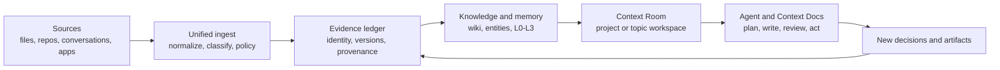
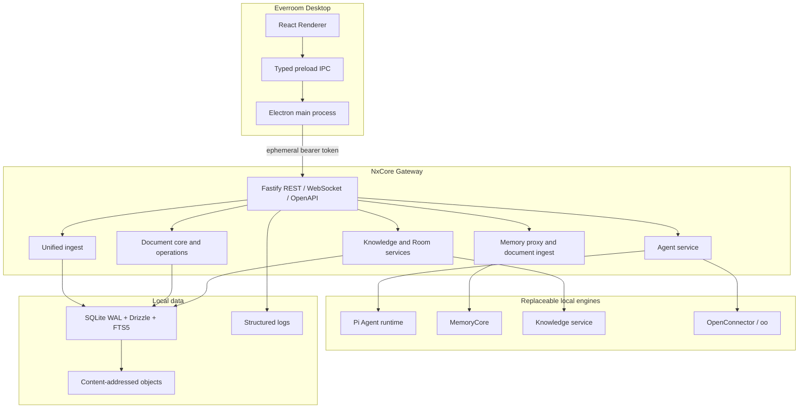

<div align="center">


# Everroom

**The local-first context workspace between your data and AI agents.**

Connect data. Build evidence. Govern memory. Move work forward.

[English](./README.md) | [简体中文](./README.zh-CN.md)


</div>

> [!IMPORTANT]
> Everroom is under active development. macOS is the current development target. APIs, storage schemas, and agent contracts may change while the first complete local workflow is being finished.

## Why Everroom exists

AI agents are good at producing a useful next step when they have the right context. The hard part is everything before that moment: finding the relevant material, separating facts from guesses, remembering what has already been decided, and keeping generated work connected to its sources.

Everroom is built around that missing context layer. It is a personal workspace for documents, repositories, conversations, meetings, and connected applications. It is not intended to be another chat client, a thin RAG screen, or a notebook that quietly accumulates unreviewed summaries.

The product thesis is simple:

> **Context should be assembled from evidence, scoped to a place of work, and made visible enough for a person to govern.**

This leads to a closed loop:



The loop is deliberately reversible. A generated summary is useful only when a person can inspect where it came from, correct it, and let the correction flow back into the next task.

## Product model

| Concept | Product role | What it protects |
| --- | --- | --- |
| **Evidence** | Versioned, addressable source material with positions and provenance | The difference between a source and a model's interpretation |
| **Knowledge** | Wiki pages, entities, links, and route decisions built from evidence | Durable project vocabulary without silently ingesting everything |
| **Memory** | Conversation capture and layered MemoryCore derivations (L0-L3) | Useful continuity across sessions, with a visible lifecycle |
| **Context Room** | The working surface for a project, person, topic, or ongoing responsibility | A bounded context window instead of a global prompt dump |
| **Context Docs** | Versioned documents that agents can create or edit through reviewable operations | Human ownership of the final artifact |
| **Agent** | A scoped worker with explicit tools, sessions, runs, and cancellation | Automation that can be inspected, stopped, and replaced |

### How a Room works

A Room is more than a folder. It is a progressively assembled view of one area of work:

1. Sources are linked to the Room and preserved with stable identity and version history.
2. Routing and evidence checks decide whether material becomes a Room wiki page, an entity candidate, a memory document, or only a link.
3. The Room profile summarizes the current goal, status, people, risks, decisions, and timeline from settled material.
4. An Agent receives only the Room-scoped tools and documents needed for the current request.
5. Document changes are committed through the document kernel, recorded as operations, and sent back through the same ingest path.

The result is a workspace that can become more useful over time without turning every source into permanent memory.

### Product boundaries

Everroom intentionally does not begin with continuous screen recording, an autonomous multi-agent swarm, enterprise administration, or mandatory cloud synchronization. Those features may be valuable later, but the first release is focused on trustworthy local context and reviewable work.

## Current state

The main branch now contains the first integrated product loop. Some features require optional local services or model credentials; the desktop can still start with the isolated development runtime.

| Area | Status | Available today |
| --- | --- | --- |
| Desktop workspace | Available | Electron + React shell, source management, Agent, Memory, Knowledge, Room, and Docs surfaces |
| Local Gateway | Available | Fastify 5 service supervised by Electron, REST/WebSocket/OpenAPI boundary, health and readiness checks |
| Evidence and ingest | Available, evolving | Unified intake, normalization for Markdown/text and office/web formats, content hashes, versions, provenance, policy snapshots, and ingest ledger |
| Knowledge Rooms | Available, evolving | Room registry, per-Room Wiki, entity routing, evidence accumulation, promotion, source attach/revert, Wiki search/read tools |
| Memory | Available when enabled | Pi Agent capture plus MemoryCore L0-L3 pipeline; desktop overview, conversations, atomic memories, scenarios, profile, search, and graceful unavailable states |
| Agent sessions | Available | Persistent sessions, runs, streaming events, cancellation, independent runtime sessions, and scoped memory/knowledge/document tools |
| Context Docs | Available, evolving | Versioned Tiptap documents, block-aware operations, reviewable Agent edits, MCP access, and transactional downstream ingest |
| Connectors | Foundation available | Managed local OpenConnector + `oo` bridge, optional Nango integrations, and Feishu issue automation; provider coverage is still expanding |

## Technical path

Everroom keeps the product boundary stable while allowing the underlying engines to change. The desktop owns lifecycle and trust boundaries; the Gateway owns durable orchestration; specialized services own their own data contracts.



### The implementation strategy

- **Normalize once, understand in the right place.** The ingest layer identifies and normalizes a source once, then fans it out to Knowledge, Memory, or Room links according to a recorded policy snapshot. It does not become a fourth LLM pipeline.
- **One asset, many references.** Original files and parsed Markdown have one storage owner. Downstream systems keep stable references, hashes, and provenance instead of copying the same source into several databases.
- **Room-scoped context.** Knowledge tools resolve the current Room or session before reading Wiki pages, sources, or materials. Agents do not receive a global unbounded corpus by default.
- **Commit before side effects.** Document edits go through a transactional commit core and outbox. Knowledge and Memory fan-out happens after the authoritative document version is committed, so an external service failure cannot corrupt the document.
- **Deterministic external actions.** Connector calls are prepared against real Action Schemas and real connections before execution. Tokens remain in trusted processes, and destructive or externally visible actions are designed to require approval.
- **Graceful degradation.** The fake Agent runtime, disabled MemoryCore, unavailable connectors, and model failures have explicit fallback states. A missing optional service should not make local documents inaccessible.

### Technology stack

| Layer | Technology |
| --- | --- |
| Desktop | Electron 39, React, TypeScript, electron-vite |
| Gateway | Node.js 22+, Fastify 5, TypeBox, REST, WebSocket, OpenAPI |
| Storage | SQLite WAL, better-sqlite3, Drizzle ORM, FTS5, content-addressed objects |
| Documents | Tiptap document model, versioned commits, block references, operation kernel |
| Agent boundary | Shared Agent contracts, Pi runtime adapter, MCP document endpoint |
| Memory | MemoryCore HTTP client and L0-L3 pipeline |
| Connectors | OpenConnector sidecar, `oo` CLI bridge, optional Nango supervisor |
| Observability | Pino structured logs, readable console output, rotating daily JSON files |
| Verification | Vitest, strict TypeScript checks, Gateway and runtime integration tests |

## Quick start

### Prerequisites

- macOS (current development target)
- Node.js 22 or newer
- pnpm 11.15.1 or a compatible pnpm 11 release

### Run the desktop app

```bash
git clone https://github.com/NxcoreAI/Everroom.git
cd Everroom
pnpm install
pnpm dev
```

`pnpm dev` starts Electron and the renderer. Electron supervises the Gateway in watch mode on a loopback port and restarts it when Gateway TypeScript changes. The sidebar displays the current Gateway state and process ID.

### Run with a real Agent model

The default runtime is `fake`, so the app can open without model credentials. To use the built-in Pi runtime, add the following to the development environment:

```dotenv
NXCORE_AGENT_RUNTIME=pi
NXCORE_AI_PROVIDER=openai
NXCORE_AI_MODEL=gpt-5.2
NXCORE_AI_BASE_URL=https://api.openai.com/v1
NXCORE_AI_API_KEY=
NXCORE_AI_API=openai-responses
```

The same boundary can target compatible OpenAI-style providers. Keep credentials in the Gateway environment; they are never sent to the renderer.

### Optional local MemoryCore and Knowledge services

The desktop supervises compatible local services when their feature flags are enabled. The defaults are loopback endpoints:

```dotenv
NXCORE_MEMORY_ENABLED=true
NXCORE_MEMORY_BASE_URL=http://127.0.0.1:8420
NXCORE_KNOWLEDGE_ENABLED=true
NXCORE_KNOWLEDGE_BASE_URL=http://127.0.0.1:8421
```

MemoryCore is packaged from the Everroom-maintained fork of [TencentDB-Agent-Memory](https://github.com/NxcoreAI/TencentDB-Agent-Memory). Service-specific LLM settings remain service-side. If either service is disabled or unavailable, the desktop shows an explicit degraded state and the rest of the local workspace remains usable.

### Useful commands

```bash
pnpm dev          # Start the desktop app and Gateway
pnpm typecheck    # Type-check every workspace package
pnpm test         # Run Agent runtime and Gateway tests
pnpm build        # Build Gateway and Electron
pnpm package:mac  # Create macOS DMG and ZIP artifacts
```

## Gateway and local data

During desktop development:

- API base URL: `http://127.0.0.1:3210`
- OpenAPI UI: `http://127.0.0.1:3210/docs`
- Liveness: `GET /v1/health/live`
- Readiness: `GET /v1/health/ready`

Health and API documentation routes are public on the loopback listener. Other routes require the ephemeral bearer token generated by Electron. Gateway can also run independently:

```bash
pnpm --dir apps/gateway dev -- \
  --data-dir .data \
  --port 3210 \
  --token local-development-token
```

On macOS, runtime data is stored under:

```text
~/Library/Application Support/NxCore/
├── database/   # Gateway, document, and connector databases
├── logs/       # Daily Gateway JSON logs
├── objects/    # Content-addressed source and parsed objects
├── runtime/    # Ephemeral Gateway discovery manifest
└── open-connector/  # Managed connector runtime and CLI data
```

See [`apps/gateway/README.md`](./apps/gateway/README.md) for ASR, mail connector, and standalone Gateway details. The OpenConnector lifecycle and security boundary are documented in [`docs/open-connector-desktop-integration.zh-CN.md`](./docs/open-connector-desktop-integration.zh-CN.md).

## Security and privacy model

- Data, indexes, working memory, and documents stay on the user's device by default.
- The Gateway listens on loopback and uses a fresh high-entropy token for each desktop session.
- The renderer receives typed preload APIs only; filesystem, database, provider tokens, and MemoryCore credentials stay in trusted processes.
- Original sources are versioned and content-addressed. Derived knowledge and memory retain source references where the downstream engine supports them.
- Cloud providers, remote models, and external Agents are opt-in. Everroom should send only the approved Room or task scope.
- Credentials and sensitive headers are redacted from logs. Managed connector configuration files use restricted permissions.
- External side effects are separated from read-only context gathering and are intended to pass through explicit preparation and approval boundaries.

## Repository layout

```text
Everroom/
├── apps/
│   ├── desktop/          # Electron main, preload, and React renderer
│   └── gateway/          # Standalone local backend service and modules
├── packages/
│   ├── agent-contract/   # Shared Agent protocol and event types
│   ├── agent-runtime/    # Runtime interface and development adapter
│   ├── agent-runtime-pi/ # Pi runtime, memory, knowledge, and connector tools
│   ├── document-model/   # Pure document normalization and block references
│   └── reality-contract/ # Shared reality/event contracts
└── docs/                 # Product, architecture, and implementation notes
```

## Roadmap

The next milestones are about making the loop more dependable and portable, rather than adding more surfaces:

1. Finish the unified file management and ingest experience for local files, GitHub, Feishu, web content, and connector records.
2. Improve evidence review: conflict display, provenance navigation, manual attach/revert, and source-level diagnostics.
3. Make Room profiles and Wiki retrieval more useful for long-running projects while keeping routing conservative.
4. Complete Context Docs operation recovery, conflict handling, and richer citation-aware Agent workflows.
5. Expand replaceable Agent adapters beyond Pi, including Codex, Claude Code, and OpenCode integrations where their contracts permit.
6. Add explicit, user-initiated capture workflows with strong privacy exclusions.
7. Evaluate optional sync and collaboration only after the local data model and audit boundaries are stable.

Continuous screen recording, autonomous multi-agent DAGs, enterprise administration, and mandatory cloud synchronization remain outside the first release scope.

## Acknowledgements

Everroom builds on a number of open-source projects and ideas:

- [Electron](https://www.electronjs.org/) and [React](https://react.dev/) for the desktop application foundation.
- [Fastify](https://fastify.dev/), [TypeBox](https://github.com/sinclairzx81/typebox), [Drizzle ORM](https://orm.drizzle.team/), and [SQLite](https://www.sqlite.org/) for the local service and storage layer.
- [TencentDB-Agent-Memory](https://github.com/TencentCloud/TencentDB-Agent-Memory), maintained for Everroom through the [NxcoreAI fork](https://github.com/NxcoreAI/TencentDB-Agent-Memory), for the layered MemoryCore pipeline.
- [Pi](https://github.com/earendil-works/pi) and the surrounding Model Context Protocol ecosystem for the replaceable Agent runtime direction.
- [OpenConnector](https://github.com/oomol-lab/open-connector) and [`oo-cli`](https://github.com/oomol-lab/oo-cli) from OOMOL for the local connector bridge.
- [Liminon](https://liminon.ai/) for inspiration around AI workflows and context products.
- [Nango](https://nango.dev/) for connector integrations and OAuth management.

Upstream licenses remain applicable to their respective components. Everroom's final project license and third-party distribution audit will be completed before the first public release.

## Open-source boundary and contributing

The intended community edition includes the desktop client, core Room and Doc experiences, the Agent boundary, the local memory and knowledge integrations, local connectors, and extension SDKs. Hosted synchronization, team administration, enterprise controls, and managed connector infrastructure may be delivered separately.

Interfaces are still moving. Useful contribution areas include connectors, Agent adapters, memory and knowledge evaluators, Room templates, document operations, tests, documentation, and privacy reviews. Please open an issue before starting a large architectural change so it can align with the current contracts and roadmap.
