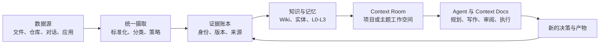

<div align="center">


# Everroom

**连接个人数据与 AI Agent 的本地优先上下文工作空间。**

连接数据，形成证据，治理记忆，推进工作。

[English](./README.md) | [简体中文](./README.zh-CN.md)


</div>

> [!IMPORTANT]
> Everroom 正处于积极开发阶段。目前以 macOS 为主要开发目标。在首个完整本地工作流完成之前，API、存储 Schema 和 Agent 契约仍可能发生变化。

## 为什么需要 Everroom

当 AI Agent 获得正确的上下文时，通常很擅长给出有用的下一步。真正困难的是此前的所有工作：找到相关材料、区分事实与推测、记住已经做出的决定，并让生成的工作成果始终与来源保持关联。

Everroom 围绕这一缺失的上下文层构建。它是一个面向文档、代码仓库、对话、会议和已连接应用的个人工作空间。它无意成为另一个聊天客户端、轻量 RAG 界面，或悄悄堆积未经审阅摘要的笔记本。

产品理念很简单：

> **上下文应当从证据中组装，限定在具体工作范围内，并以足够可见的方式交由人来治理。**

由此形成一个闭环：



这个闭环被有意设计为可逆的。只有当人能够检查摘要的来源、纠正其中的问题，并让修正结果进入下一项任务时，生成的摘要才真正有用。

## 产品模型

| 概念 | 产品角色 | 它所保护的边界 |
| --- | --- | --- |
| **Evidence** | 带位置和来源信息、可寻址且有版本的源材料 | 原始来源与模型解释之间的区别 |
| **Knowledge** | 从证据构建的 Wiki 页面、实体、链接和路由决策 | 在不静默摄取一切的前提下，沉淀持久的项目词汇与认知 |
| **Memory** | 对话捕获与 MemoryCore 的 L0-L3 分层派生结果 | 跨会话的有效连续性，以及可见的记忆生命周期 |
| **Context Room** | 面向项目、人物、主题或长期职责的工作界面 | 有边界的上下文窗口，而不是全局 Prompt 堆积 |
| **Context Docs** | Agent 可通过可审阅操作创建或编辑的版本化文档 | 人对最终产物的所有权 |
| **Agent** | 具有明确工具、会话、运行记录和取消能力的限定范围执行者 | 可检查、可停止、可替换的自动化 |

### Room 如何工作

Room 不只是文件夹，而是围绕一个工作领域逐步组装出的视图：

1. 数据源与 Room 建立关联，并以稳定身份和版本历史保存。
2. 路由与证据检查决定材料应成为 Room Wiki 页面、实体候选、记忆文档，还是仅保留为链接。
3. Room Profile 从已经确认的材料中概括当前目标、状态、人物、风险、决策和时间线。
4. Agent 只获得当前请求所需的 Room 范围工具和文档。
5. 文档变更通过文档内核提交、记录为操作，再经由同一条摄取路径回流。

最终得到的是一个会随时间变得更有用的工作空间，同时不会把每个数据源都转化为永久记忆。

### 产品边界

Everroom 不会从连续屏幕录制、自主多 Agent 集群、企业管理或强制云同步开始。它们未来可能有价值，但首个版本聚焦于可信的本地上下文和可审阅的工作成果。

## 当前状态

主分支已经包含首个集成的产品闭环。部分功能需要可选的本地服务或模型凭据；即使没有这些依赖，桌面端仍可使用隔离的开发 Runtime 启动。

| 模块 | 状态 | 当前可用能力 |
| --- | --- | --- |
| 桌面工作空间 | 已可用 | Electron + React Shell，以及数据源、Agent、Memory、Knowledge、Room 和 Docs 界面 |
| 本地 Gateway | 已可用 | 由 Electron 管理的 Fastify 5 服务，提供 REST、WebSocket、OpenAPI 边界以及健康和就绪检查 |
| Evidence 与 Ingest | 已可用，持续演进 | 统一输入、Markdown/文本及办公和 Web 格式标准化、内容哈希、版本、来源、策略快照和摄取账本 |
| Knowledge Rooms | 已可用，持续演进 | Room 注册表、每个 Room 独立的 Wiki、实体路由、证据累积与提升、来源挂载/撤销，以及 Wiki 搜索/读取工具 |
| Memory | 启用后可用 | Pi Agent 对话捕获与 MemoryCore L0-L3 管道；桌面端支持概览、对话、原子记忆、场景、画像、搜索和明确的不可用状态 |
| Agent 会话 | 已可用 | 持久化会话、运行、流式事件、取消、独立 Runtime 会话，以及限定范围的 Memory、Knowledge 和文档工具 |
| Context Docs | 已可用，持续演进 | 版本化 Tiptap 文档、块感知操作、可审阅的 Agent 编辑、MCP 访问和事务化下游摄取 |
| Connectors | 基础能力已可用 | 托管的本地 OpenConnector + `oo` Bridge、可选 Nango 集成和飞书 Issue 自动化；Provider 覆盖范围仍在扩展 |

## 技术路径

Everroom 在允许底层引擎替换的同时，保持产品边界稳定。桌面端负责生命周期和信任边界，Gateway 负责持久化编排，专用服务各自维护自身的数据契约。

```mermaid
flowchart TB
    subgraph Desktop["Everroom Desktop"]
        UI["React Renderer"]
        IPC["类型化 Preload IPC"]
        MAIN["Electron 主进程"]
        UI --> IPC --> MAIN
    end

    subgraph Gateway["NxCore Gateway"]
        API["Fastify REST / WebSocket / OpenAPI"]
        INGEST["统一摄取"]
        KNOW["Knowledge 与 Room 服务"]
        MEM["Memory 代理与文档摄取"]
        DOCS["文档核心与操作"]
        AGENT["Agent 服务"]
        API --> INGEST
        API --> KNOW
        API --> MEM
        API --> DOCS
        API --> AGENT
    end

    subgraph Engines["可替换的本地引擎"]
        PI["Pi Agent Runtime"]
        MC["MemoryCore"]
        KS["Knowledge Service"]
        OC["OpenConnector / oo"]
    end

    subgraph Storage["本地数据"]
        DB["SQLite WAL + Drizzle + FTS5"]
        OBJECTS["内容寻址对象"]
        LOGS["结构化日志"]
    end

    MAIN -->|"临时 Bearer Token"| API
    AGENT --> PI
    MEM --> MC
    KNOW --> KS
    AGENT --> OC
    INGEST --> DB
    DOCS --> DB
    KNOW --> DB
    DB --> OBJECTS
    API --> LOGS
```



### 实现策略

- **只标准化一次，在正确的位置理解。** 摄取层只对数据源进行一次识别和标准化，再依据已记录的策略快照将其分发到 Knowledge、Memory 或 Room 链接。它不会成为第四条 LLM 管道。
- **一份资产，多处引用。** 原始文件和解析后的 Markdown 只有一个存储所有者。下游系统保存稳定引用、哈希和来源信息，而不是将同一数据源复制到多个数据库。
- **Room 范围上下文。** Knowledge 工具在读取 Wiki 页面、数据源或材料前，会先解析当前 Room 或会话。默认情况下，Agent 不会获得一个全局且无边界的语料库。
- **先提交，再产生副作用。** 文档编辑通过事务化提交核心和 Outbox 完成。只有权威文档版本提交后，才向 Knowledge 和 Memory 分发，因此外部服务故障不会破坏文档。
- **确定性的外部操作。** Connector 调用在执行前，会根据真实 Action Schema 和真实连接完成准备。Token 始终保留在可信进程内；破坏性操作或对外可见操作按设计需要经过审批。
- **优雅降级。** Fake Agent Runtime、已禁用的 MemoryCore、不可用的 Connector 和模型故障都有明确的回退状态。缺少可选服务不应导致本地文档无法访问。

### 技术栈

| 层级 | 技术 |
| --- | --- |
| 桌面端 | Electron 39、React、TypeScript、electron-vite |
| Gateway | Node.js 22+、Fastify 5、TypeBox、REST、WebSocket、OpenAPI |
| 存储 | SQLite WAL、better-sqlite3、Drizzle ORM、FTS5、内容寻址对象 |
| 文档 | Tiptap 文档模型、版本化提交、块引用、操作内核 |
| Agent 边界 | 共享 Agent 契约、Pi Runtime Adapter、MCP 文档端点 |
| Memory | MemoryCore HTTP Client 和 L0-L3 管道 |
| Connectors | OpenConnector Sidecar、`oo` CLI Bridge、可选 Nango Supervisor |
| 可观测性 | Pino 结构化日志、可读控制台输出、按日轮转的 JSON 文件 |
| 验证 | Vitest、TypeScript 严格检查、Gateway 和 Runtime 集成测试 |

## 快速开始

### 环境要求

- macOS（当前开发目标）
- Node.js 22 或更高版本
- pnpm 11.15.1，或兼容的 pnpm 11 版本

### 启动桌面应用

```bash
git clone https://github.com/NxcoreAI/Everroom.git
cd Everroom
pnpm install
pnpm dev
```

`pnpm dev` 会启动 Electron 和 Renderer。Electron 在本地回环端口上以 Watch 模式管理 Gateway，并在 Gateway TypeScript 发生变化时重启它。侧栏会显示当前 Gateway 状态和进程 ID。

### 使用真实 Agent 模型运行

默认 Runtime 为 `fake`，因此没有模型凭据时应用仍可启动。要使用内置 Pi Runtime，请在开发环境中添加以下配置：

```dotenv
NXCORE_AGENT_RUNTIME=pi
NXCORE_AI_PROVIDER=openai
NXCORE_AI_MODEL=gpt-5.2
NXCORE_AI_BASE_URL=https://api.openai.com/v1
NXCORE_AI_API_KEY=
NXCORE_AI_API=openai-responses
```

同一边界也可以连接兼容 OpenAI API 风格的 Provider。凭据应保留在 Gateway 环境中，绝不会发送给 Renderer。

### 可选的本地 MemoryCore 与 Knowledge 服务

启用对应 Feature Flag 后，桌面端会管理兼容的本地服务。默认使用以下本地回环端点：

```dotenv
NXCORE_MEMORY_ENABLED=true
NXCORE_MEMORY_BASE_URL=http://127.0.0.1:8420
NXCORE_KNOWLEDGE_ENABLED=true
NXCORE_KNOWLEDGE_BASE_URL=http://127.0.0.1:8421
```

MemoryCore 来自 Everroom 维护的 [TencentDB-Agent-Memory Fork](https://github.com/NxcoreAI/TencentDB-Agent-Memory)。服务专用的 LLM 配置仍由服务端管理。如果任一服务被禁用或不可用，桌面端会显示明确的降级状态，其他本地工作空间仍可正常使用。

### 常用命令

```bash
pnpm dev          # 启动桌面应用与 Gateway
pnpm typecheck    # 检查所有 Workspace 包的类型
pnpm test         # 运行 Agent Runtime 与 Gateway 测试
pnpm build        # 构建 Gateway 与 Electron
pnpm package:mac  # 生成 macOS DMG 与 ZIP 产物
```

## Gateway 与本地数据

桌面开发模式下：

- API 地址：`http://127.0.0.1:3210`
- OpenAPI UI：`http://127.0.0.1:3210/docs`
- 存活检查：`GET /v1/health/live`
- 就绪检查：`GET /v1/health/ready`

健康检查和 API 文档路由可以通过本地回环 Listener 直接访问，其他路由需要 Electron 生成的临时 Bearer Token。Gateway 也可以独立运行：

```bash
pnpm --dir apps/gateway dev -- \
  --data-dir .data \
  --port 3210 \
  --token local-development-token
```

在 macOS 上，运行时数据存储在：

```text
~/Library/Application Support/NxCore/
├── database/   # Gateway、文档和 Connector 数据库
├── logs/       # 按日生成的 Gateway JSON 日志
├── objects/    # 内容寻址的数据源和解析对象
├── runtime/    # 临时 Gateway 发现清单
└── open-connector/  # 托管的 Connector Runtime 与 CLI 数据
```

ASR、邮件 Connector 和 Gateway 独立运行的详细信息见 [`apps/gateway/README.md`](./apps/gateway/README.md)。OpenConnector 生命周期和安全边界见 [`docs/open-connector-desktop-integration.zh-CN.md`](./docs/open-connector-desktop-integration.zh-CN.md)。

## 安全与隐私模型

- 数据、索引、工作记忆和文档默认保存在用户设备上。
- Gateway 只监听本地回环地址，并为每次桌面会话使用新的高熵 Token。
- Renderer 只能使用类型化 Preload API；文件系统、数据库、Provider Token 和 MemoryCore 凭据始终保留在可信进程中。
- 原始数据源以版本化、内容寻址的方式保存。在下游引擎支持的情况下，派生知识和记忆会保留来源引用。
- Cloud Provider、远程模型和外部 Agent 均由用户选择启用。Everroom 应当只发送已经批准的 Room 或任务范围。
- 日志会脱敏凭据和敏感请求头。托管 Connector 的配置文件使用受限权限。
- 外部副作用与只读上下文收集相互分离，并应通过明确的准备和审批边界。

## 仓库结构

```text
Everroom/
├── apps/
│   ├── desktop/          # Electron main、preload 与 React renderer
│   └── gateway/          # 独立本地后端服务及其模块
├── packages/
│   ├── agent-contract/   # 共享 Agent 协议与事件类型
│   ├── agent-runtime/    # Runtime 接口与开发 Adapter
│   ├── agent-runtime-pi/ # Pi Runtime、Memory、Knowledge 与 Connector 工具
│   ├── document-model/   # 纯文档标准化与块引用
│   └── reality-contract/ # 共享 Reality/Event 契约
└── docs/                 # 产品、架构与实施说明
```

## 路线图

下一阶段的重点是让闭环更加可靠、可移植，而不是增加更多界面：

1. 完成本地文件、GitHub、飞书、Web 内容和 Connector 记录的统一文件管理与摄取体验。
2. 改进证据审阅：冲突展示、来源导航、手动挂载/撤销，以及数据源级诊断。
3. 在保持保守路由策略的同时，让 Room Profile 和 Wiki 检索更适合长期项目。
4. 完善 Context Docs 操作恢复、冲突处理和更丰富的引用感知 Agent 工作流。
5. 将可替换的 Agent Adapter 扩展到 Pi 之外，包括契约允许情况下的 Codex、Claude Code 和 OpenCode 集成。
6. 增加由用户主动触发、具有严格隐私排除规则的捕获工作流。
7. 只在本地数据模型和审计边界稳定后，再评估可选同步与协作。

连续屏幕录制、自主多 Agent DAG、企业管理和强制云同步仍不属于首个版本的范围。

## 致谢

Everroom 建立在众多开源项目和理念之上：

- [Electron](https://www.electronjs.org/) 与 [React](https://react.dev/) 提供桌面应用基础。
- [Fastify](https://fastify.dev/)、[TypeBox](https://github.com/sinclairzx81/typebox)、[Drizzle ORM](https://orm.drizzle.team/) 和 [SQLite](https://www.sqlite.org/) 提供本地服务与存储层。
- [TencentDB-Agent-Memory](https://github.com/TencentCloud/TencentDB-Agent-Memory) 提供分层 MemoryCore 管道，并由 [NxcoreAI Fork](https://github.com/NxcoreAI/TencentDB-Agent-Memory) 为 Everroom 持续维护。
- [Pi](https://github.com/earendil-works/pi) 与 Model Context Protocol 生态为可替换 Agent Runtime 方向提供基础。
- OOMOL 的 [OpenConnector](https://github.com/oomol-lab/open-connector) 与 [`oo-cli`](https://github.com/oomol-lab/oo-cli) 提供本地 Connector Bridge。
- [Liminon](https://liminon.ai/) 为 AI 工作流和上下文产品方向提供了启发。
- [Nango](https://nango.dev/) 提供 Connector 集成和 OAuth 管理能力。

各上游组件继续适用其各自许可证。Everroom 的最终项目许可证和第三方分发审计将在首次公开发布前完成。

## 开源边界与参与贡献

社区版计划包含桌面客户端、核心 Room 和 Doc 体验、Agent 边界、本地 Memory 与 Knowledge 集成、本地 Connector 和扩展 SDK。托管同步、团队管理、企业控制和托管 Connector 基础设施可能单独提供。

接口仍在持续演进。当前有价值的贡献方向包括 Connector、Agent Adapter、Memory 与 Knowledge 评估器、Room 模板、文档操作、测试、文档和隐私审查。开始大型架构改动前，请先创建 Issue，确保实现与当前契约和路线图保持一致。
