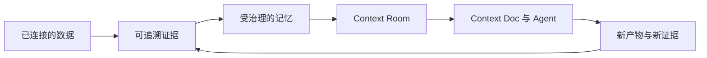
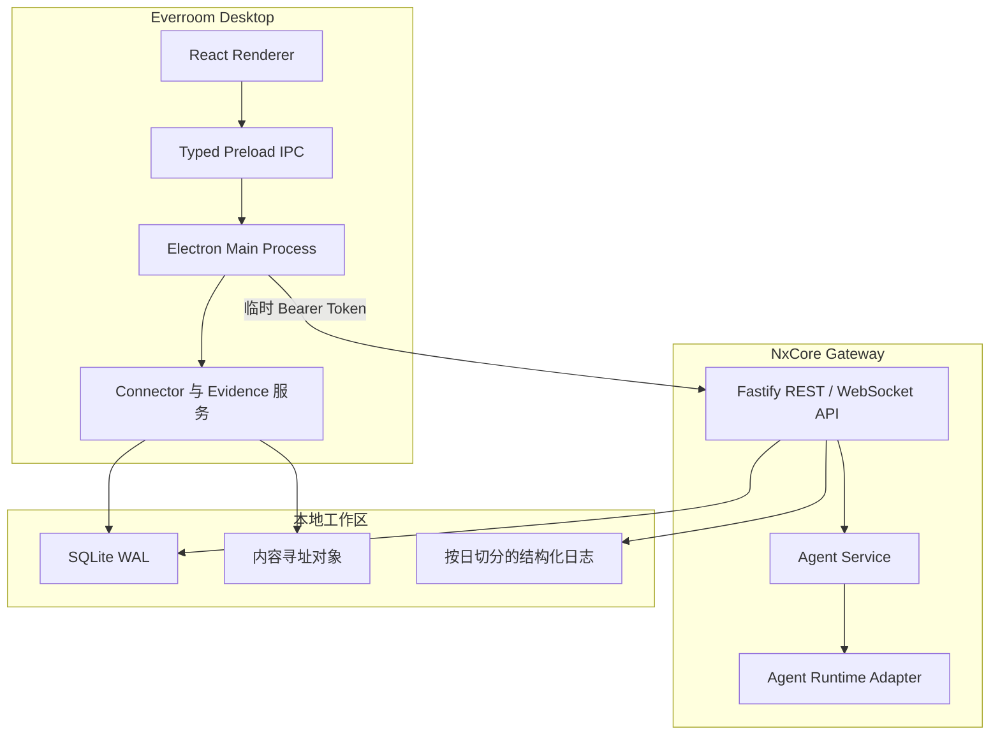

<div align="center">


# Everroom

**连接个人数据与 AI Agent 的本地优先上下文层。**

连接数据，形成证据，治理记忆，推进下一步。

[English](./README.md) | [简体中文](./README.zh-CN.md)


</div>

> [!IMPORTANT]
> Everroom 正处于快速开发阶段。目前以 macOS 为主要开发目标，API 与存储结构仍可能调整，下文部分产品模块尚在建设中。

## Everroom 是什么？

Everroom 是面向个人的上下文工作空间，服务于同时使用文档、代码仓库、沟通记录和 AI 编程工具的人。它不是另一个通用聊天客户端、简单的 RAG 界面，也不是被动记录信息的第二大脑笔记。

Everroom 位于个人数据与 AI Agent 之间：将连接的数据转化为可追溯证据，将证据提升为受治理的记忆，再把与目标相关的上下文投影到 **Context Room**，最终让文档和 Agent 只获得完成任务所需的信息。



产品遵循四项原则：

- **本地优先：** 数据、索引、工作记忆和文档默认保存在用户设备上。
- **证据先于结论：** 关键记忆和生成内容应当能够回到原始来源。
- **自动化但可治理：** Agent 获得明确、临时且可撤销的上下文和工具权限。
- **底座可替换：** 模型、记忆引擎、连接器和 Agent runtime 均通过 Everroom 自有接口接入。

## 当前进度

仓库已经具备首个本地工作流所需的桌面端和后端基础设施。

| 模块 | 状态 | 当前能力 |
| --- | --- | --- |
| 桌面框架 | 已可用 | Electron + React 工作空间、数据源管理和 Agent 面板 |
| NxCore Gateway | 已可用 | 由 Electron 管理的独立 Fastify 服务，覆盖开发和打包运行方式 |
| API 边界 | 已可用 | TypeBox 校验、OpenAPI 文档、Bearer 鉴权、健康检查和 WebSocket |
| 本地存储 | 已可用 | SQLite WAL、Drizzle migration、内容寻址对象与 FTS5 证据检索 |
| 数据源 | 开发中 | 本地文件夹工作流和 GitHub Connector 基础能力 |
| OpenConnector | 已可用 | 通过 oo CLI 搜索、检查并执行 Action，提供桌面控制台与 Agent 工具 |
| 证据管线 | 开发中 | 文件版本，以及带来源位置的 Markdown / 纯文本证据块 |
| Agent 服务 | 开发中 | 已接入 Pi 与开发 runtime，支持持久化会话、运行、消息、事件历史、取消和流式传输 |
| Memory、Room、Doc | 规划中 | 受治理记忆、动态 Context Room 和可由 Agent 编辑的 Context Doc |

## 技术架构

Electron 负责桌面应用生命周期，并将 NxCore Gateway 作为独立本地服务启动。Renderer 无法直接访问数据库、文件系统或 Gateway 凭据；所有 IPC 请求由主进程处理，再由主进程将授权后的 REST 与 WebSocket 流量转发给 Gateway。



Connector 与 Evidence 服务目前仍位于 Electron 主进程。相关契约稳定后，它们会有计划地迁移到 Gateway 边界之后。

### 技术栈

| 层级 | 技术 |
| --- | --- |
| 桌面端 | Electron、React、TypeScript、electron-vite |
| Gateway | Node.js 22+、Fastify 5、TypeBox |
| API | REST、WebSocket、OpenAPI |
| 存储 | SQLite WAL、better-sqlite3、Drizzle ORM、FTS5 |
| Agent 边界 | 共享协议包与可替换 runtime adapter |
| 日志 | Pino、可读终端输出、按日切分的 JSON 文件日志 |
| 测试 | Vitest 与 TypeScript 严格检查 |

## 快速开始

### 环境要求

- macOS
- Node.js 22 或更高版本
- pnpm 11.15.1，或兼容的 pnpm 11 版本

### 启动桌面应用

```bash
git clone https://github.com/NxcoreAI/Everroom.git
cd Everroom
pnpm install
pnpm dev
```

`pnpm dev` 会启动 Electron 和 Renderer，随后由 Electron 在 `127.0.0.1:3210` 以 watch 模式管理 Gateway。修改 Gateway TypeScript 代码后，后端会自动重启。

桌面端侧栏左下角会展示 Gateway 当前状态与进程 PID。

### Agent 服务

Gateway 会读取仓库根目录的 `.env`，也兼容 `apps/gateway/.env` 和通过 `NXCORE_ENV_FILE` 指定的文件。默认使用隔离的 `fake` runtime，确保没有模型密钥时桌面应用仍可启动。需要真实 Agent 时，配置内置 Pi runtime；Context Room 文档工具会直接注入 Agent：

Gateway 中的生成式模型调用统一通过 `AgentResolver` 按稳定 ID 选择 Agent。主对话、Connector 同步、转写总结、Cursor Completion、Knowledge 抽取/判定/登记和 Web Search 都拥有独立的 Runtime 与 `config/sessions/workspace` 目录；业务模块不直接调用 LLM API。向量 Embedding 是非生成式基础设施能力，不经过 Agent Resolver。

```dotenv
NXCORE_AGENT_RUNTIME=pi
NXCORE_AI_PROVIDER=openai
NXCORE_AI_MODEL=gpt-5.2
NXCORE_AI_BASE_URL=https://api.openai.com/v1
NXCORE_AI_API_KEY=
NXCORE_AI_API=openai-responses
```

CE Gateway 同时提供受 Bearer Token 保护的 `/v1/mcp/documents/:sessionId` Streamable HTTP MCP 入口，供经过认证的 MCP 客户端使用。已废弃的远端聊天传输不再属于 runtime 配置。

#### 文件驱动的子 Agent

子 Agent 只能被主 Agent 或 Gateway 内部工作流调度，不提供独立聊天入口，也不需要管理页面。Gateway 默认扫描仓库根目录的 `agents`。该目录在 Gateway 构建时复制到 `dist/agents`，并随 Desktop 一起打包；开发或测试时可以通过环境变量临时覆盖：

```dotenv
NXCORE_SUBAGENTS_ENABLED=true
NXCORE_SUBAGENTS_DIR=/absolute/path/to/everroom-agents
```

每个一级子目录代表一个 Agent：

```text
everroom-agents/
└── mail-researcher/
    ├── agent.yaml
    ├── SYSTEM.md
    └── skills/
        └── summarize/
            └── SKILL.md
```

最小 `agent.yaml`：

```yaml
schemaVersion: 1
id: mail-researcher
name: 邮件研究员
description: 检索邮件并返回带来源的摘要
mode: dispatch_only
systemPrompt: ./SYSTEM.md
skills:
  - ./skills/summarize
mcp:
  - server: gmail
    includeTools: [search_messages, get_message]
policy:
  allowedCallers: [primary-agent]
  timeoutMs: 300000
  maxConcurrency: 1
  maxToolCalls: 40
```

`mcp.server` 引用设置中已有的全局 MCP 服务器名称，子 Agent 只会看到自己绑定并通过 `includeTools` 筛选后的服务器。修改目录内容后重启 Gateway 会自动生成新的不可变 Revision；已有 Invocation 继续使用原 Revision。完整约束见 [`docs/subagent-framework-design.zh-CN.md`](./docs/subagent-framework-design.zh-CN.md)。

每个 `SKILL.md` 必须包含 `name` 和 `description` YAML frontmatter。子 Agent 通过受限 `read` 工具读取自己的 Skill 快照，不能借此读取工作区或设备上的其他文件。MCP 的 `includeTools` 必须显式填写；需要开放服务器全部工具时使用 `["*"]`。

### OpenConnector

桌面端“数据源”和“连接器”是互斥页面，由根目录 `.env` 中的
`NXCORE_DESKTOP_PAGE_MODE` 控制，取值为 `sources` 或 `connectors`。缺省值为
`sources`；此模式下不启动 OpenConnector/CLI 连接器服务。需要使用“连接器”页时设置：

```dotenv
NXCORE_DESKTOP_PAGE_MODE=connectors
```

项目内的两套连接器使用独立命名空间：Nango 连接器使用
`NXCORE_NANGO_CONNECTOR_*`、`/v1/nango-connectors/*` 和
`nango-connector:*`；基于 OpenConnector/`oo` CLI 的 CLI 连接器使用
`NXCORE_CLI_CONNECTOR_*`、`/v1/cli-connectors/*` 和 `cli-connector:*`。
`NANGO_*` 与 `OO_*` 只用于各自第三方子进程的内部协议。

OpenConnector 已作为桌面端托管服务集成，无需安装 Docker、单独启动网关或手工填写 Token。启动 EverRoom 时会自动拉起固定版本的本地 OpenConnector，退出应用时自动回收进程；首次启动生成的加密密钥、Admin Token、Runtime Token 和端口保存在 EverRoom 用户数据目录中。

默认不需要任何配置。仅当需要连接已有的外部 OpenConnector 时，才在根目录 `.env` 显式关闭托管模式：

```dotenv
NXCORE_CLI_CONNECTOR_MANAGED=false
NXCORE_CLI_CONNECTOR_URL=https://connector.example.com
NXCORE_CLI_CONNECTOR_RUNTIME_TOKEN=<runtime-token>
```

桌面端内置固定版本的 `oo` CLI，并通过受限 IPC 为侧栏“连接器”控制台提供 Action 搜索、Schema、账号选择、参数校验、执行和实时日志。“Web 管理台”会打开隔离的本地窗口并自动完成管理认证。Pi Agent 同时获得 `connector_search`、`connector_schema`、`connector_apps`、`connector_run` 四个工具；执行前会先读取实际账号连接，不猜测连接名称。Admin Token 和 Runtime Token 都不会进入 Renderer。完整设计见 [`docs/open-connector-desktop-integration.zh-CN.md`](./docs/open-connector-desktop-integration.zh-CN.md)。

连接器后台同步采用独立的领域 Agent：定时任务为邮箱、文档或日程 Agent 注入同步目标、允许的只读 Action、上次检查点、领域提示词和目标 Schema；Agent 通过 `oo` CLI 完成能力发现、分页获取、解析与清洗，但不能使用 Shell 或直接访问数据库。清洗后的数据只能通过受控批量写入工具进入 `connector_emails`、`connector_documents` 或 `connector_calendar_events`，由 Gateway 确定性执行 Schema 校验、幂等 upsert、事务、隔离记录和检查点提交。普通对话 Agent 在本地模式下只查询这些领域表。

### 常用命令

```bash
pnpm dev          # 启动桌面端与 Gateway
pnpm typecheck    # 检查所有 workspace 包的类型
pnpm test         # 运行 Agent runtime 与 Gateway 测试
pnpm build        # 构建 Gateway 与 Electron
pnpm package:mac  # 生成 macOS DMG 与 ZIP
```

## Gateway

桌面开发模式下：

- API 地址：`http://127.0.0.1:3210`
- OpenAPI UI：`http://127.0.0.1:3210/docs`
- 存活检查：`GET /v1/health/live`
- 就绪检查：`GET /v1/health/ready`

健康检查和 API 文档可以通过本地回环地址直接访问，其余接口需要 Electron 生成的临时 Bearer Token。Token 只保存在主进程，不会暴露给 Renderer。

Gateway 也可以独立启动：

```bash
pnpm --dir apps/gateway dev -- \
  --data-dir .data \
  --port 3210 \
  --token local-development-token
```

服务端细节见 [`apps/gateway/README.md`](./apps/gateway/README.md)。

## 本地数据

macOS 默认运行时目录：

```text
~/Library/Application Support/NxCore/
├── database/   # Gateway 与桌面端 SQLite 数据库
├── logs/       # Gateway 按日切分的 JSON 日志
├── objects/    # 内容寻址的来源文件
└── runtime/    # 临时 Gateway 发现清单
```

Gateway 日志命名为 `gateway.YYYY-MM-DD.N.log`，每天零点切分，保留 30 个历史文件，并自动脱敏已知凭据。终端日志使用可读的本地时间。

## 仓库结构

```text
Everroom/
├── apps/
│   ├── desktop/          # Electron main、preload 与 React renderer
│   └── gateway/          # 独立本地后端服务
├── packages/
│   ├── agent-contract/   # 共享 Agent 协议与事件类型
│   ├── agent-runtime/    # Runtime 接口与开发 adapter
│   └── agent-runtime-pi/ # Pi SDK 隔离适配器
└── docs/                 # 架构和实施说明
```

## 路线图

首个完整产品闭环包括：

1. 连接本地文件、GitHub、飞书与手动导入的网页内容。
2. 保存稳定的来源身份、版本、证据位置和溯源关系。
3. 构建包含置信度、风险、生命周期、冲突与撤销能力的分层记忆。
4. 创建只逐步展开任务相关上下文的 Context Room。
5. 创建支持引用、块级 Agent 编辑和可审阅 Diff 的 Context Doc。
6. 将 Pi Agent 移入独立 Agent Host，并增加 Codex、Claude Code 和 OpenCode adapter。
7. 增加由用户主动触发、支持隐私排除规则的桌面截取能力。

复杂多 Agent DAG、连续屏幕录制、企业协作和云端同步不属于首版范围。

## 开源边界

社区版计划包含桌面客户端、基础 Room 与 Doc 体验、Agent runtime 边界、基础 Memory Kernel、本地 Connector 和扩展 SDK。托管同步、团队管理、企业控制与托管连接器基础设施可能单独提供。

未来 SaaS Connector 可以通过兼容 Nango 的 Provider 接入，但客户端不会捆绑或再分发 Nango 服务端。用户可以选择托管 Provider 或运行兼容部署。项目最终许可证和第三方依赖分发审查将在首次公开发布前完成。

## 致谢

Everroom 建立在众多开源项目和理念之上：

- [Electron](https://www.electronjs.org/) 与 [React](https://react.dev/) 提供桌面应用基础。
- [Fastify](https://fastify.dev/)、[TypeBox](https://github.com/sinclairzx81/typebox)、[Drizzle ORM](https://orm.drizzle.team/) 和 [SQLite](https://www.sqlite.org/) 提供本地服务与存储层。
- [TencentDB-Agent-Memory](https://github.com/TencentCloud/TencentDB-Agent-Memory) 通过 [NxcoreAI Fork](https://github.com/NxcoreAI/TencentDB-Agent-Memory) 为 Everroom 提供分层 MemoryCore 管道。
- [Pi](https://github.com/earendil-works/pi) 与 Model Context Protocol 生态为可替换 Agent runtime 方向提供基础。
- OOMOL 的 [OpenConnector](https://github.com/oomol-lab/open-connector) 与 [`oo-cli`](https://github.com/oomol-lab/oo-cli) 提供本地 Connector Bridge。
- [Liminon](https://liminon.ai/) 为 AI 工作流和上下文产品方向提供启发。
- [Nango](https://nango.dev/) 提供 Connector 集成和 OAuth 管理能力。

## 安全模型

- Gateway 只监听本地回环地址，每次桌面会话使用新的高熵 Token。
- Renderer 只能访问类型化 preload API；文件系统和数据库保留在可信进程中。
- 日志会自动脱敏敏感请求头与凭据。
- 云模型和外部 Agent 默认不启用，并且只应获得用户批准的上下文范围。
- 删除数据或对外产生影响的 Agent 操作，设计上必须经过用户明确确认。

## 参与贡献

Everroom 仍处于早期阶段，接口会持续演进。当前有价值的贡献方向包括 Connector、Agent adapter、记忆评估器、Room 模板、测试、文档和隐私审查。开始大规模架构改动前，请先创建 Issue，确保实现与当前契约和路线图保持一致。
