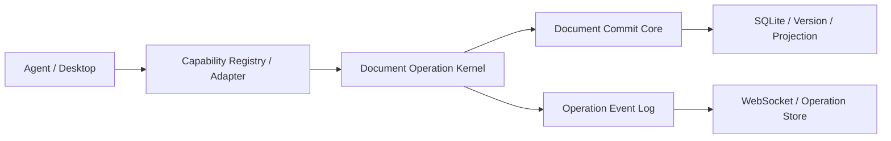

# Agent 文档能力开发 SOP

> 状态：当前规范真源<br>
> 适用范围：Gateway 文档域、Agent 文档能力、MCP/Pi 适配、Desktop 文档操作交互<br>
> 更新日期：2026-08-18

本文规定 Agent 文档能力的设计、实现、测试和发布流程。后续新增或修改文档能力必须遵守本文，不得重新引入旧 transaction、Patch REST API 或 Renderer ACK 模式。

## 1. 架构边界



| 层 | 主要位置 | 允许职责 | 禁止职责 |
| --- | --- | --- | --- |
| 文档模型 | `packages/document-model` | 正文规范化、块 ID、引用、路径、迁移纯函数 | 数据库、网络、事件 |
| 文档核心 | `apps/gateway/src/modules/documents/core` | Repository、Content Engine、Commit、Query、Lifecycle | Agent 状态机、UI 决策 |
| Operation Kernel | `apps/gateway/src/modules/documents/operations` | 状态迁移、命令幂等、revision、串行执行、原子提交、事件审计 | 能力专属语义、UI 展示 |
| 能力插件 | `apps/gateway/src/modules/documents/capabilities` | manifest、专用工具、OperationPlan、类型化命令 | 直接访问数据库、直接发布事件、绕过 Commit Core |
| Agent 适配 | `mcp-host.ts`、`mcp-routes.ts`、`pi-tools.ts` | 从 Registry 生成 MCP/Pi 工具并注入可信上下文 | 维护第二份工具表或分发 switch |
| Desktop Store | `components/context-room/operations` | 活动操作恢复、权威快照、决策草稿、命令协调 | 文档业务状态机、直接拼 REST URL |
| Presenter / Editor | `presenterRegistry.ts` 和编辑器组件 | 展示 view model、收集用户动作 | 恢复 Operation、直接写数据库或自行认定提交成功 |

`DocumentService` 当前是应用服务和兼容 facade。新功能应进入上述专用模块，不得继续向 `DocumentService` 堆叠新的 Agent 生命周期或 Patch 状态机。

## 2. 不可破坏的系统约束

### 2.1 正文写入只有一个入口

所有持久化正文变更必须经过 `DocumentCommitService`：

- 人工保存、导入、历史恢复走 Commit Core。
- Agent create/edit/continue/selection-rewrite 由插件产生 mutation intent，再由 Operation Kernel 调用 Commit Core。
- `documents`、`doc_versions`、`document_blocks`、`document_block_references` 必须在同一事务内更新。
- `document_operation_commands`、Operation 状态/条目、Operation 事件与 Agent 正文提交必须原子完成。
- 事务提交后才允许发布 `document.changed` 和 `document.operation.changed`。

禁止：

- 在插件、REST 路由、MCP handler 或 Renderer 中直接 `insert/update documents`。
- 在 Commit Core 外直接插入 `doc_versions`。
- 先保存文档，再单独更新 Operation；任一步失败都必须整体回滚。
- 把 `afterCommit` 当作提交的一部分。它只用于通知或记忆捕获，失败不得改变已提交的权威状态。

### 2.2 标题和正文契约

- `documents.title` 是当前标题的唯一真源。
- `doc_versions.title` 与对应的 `contentJson + schemaVersion` 一起构成历史快照。
- 持久化 Tiptap JSON 只保存正文，不得包含 `documentTitle` 节点。
- 旧 `documentTitle` 节点只允许在兼容读取时提取并剥离，不得重新写入。
- 完整文档调用 `DocumentContentEngine.normalizeDocument()`。
- Markdown 片段、Patch hunk、续写块调用 `normalizeFragment()`；片段规范化不得注入标题或完整文档结构。
- 标题编辑必须通过显式 `title` 字段保存，不能依赖正文节点推导。

### 2.3 块 ID 和引用

- 新块 ID 必须由统一内容引擎或 `crypto.randomUUID()` 生成。
- 导入、粘贴、复制内容必须按既有模型规则重新分配 ID，并正确重映射复制树内部引用。
- 不得用数组下标、文本摘要、标题或临时序号充当稳定块 ID。
- `everroom://room/{roomId}/{documentId}/{blockId}` 的解析和投影必须由共享模型处理，不得在插件中用字符串替换自行实现。
- 修改 `packages/document-model` 的 ID/引用规则时，必须同时增加纯函数测试和 Gateway 投影测试。

### 2.4 权威状态和事件

- SQLite 是权威状态；WebSocket 是失效通知和快照传播机制，不是唯一日志来源。
- Desktop 收到 `document.operation.changed` 后按 operation ID 调用 GET 刷新详情。
- Desktop 收到 `document.changed` 后合并权威文档，必须按 `version`，同版本按 `updatedAt` 防止旧响应覆盖新状态。
- 断线重连、应用启动和编辑器重新挂载都必须能从 REST 基线恢复，不依赖历史事件重放。
- Editor 的流式动画、diff decoration 和候选预览都只是表现层，不能作为提交确认。

## 3. Operation Kernel 契约

### 3.1 何时创建 Operation

| 能力 | 是否创建 Operation | 原因 |
| --- | --- | --- |
| `room.list`、`document.list`、`document.read` | 否 | 只读查询 |
| `document.create` | 是 | 有流式草稿和最终提交 |
| `document.edit` | 是 | 需要用户审阅及原子应用 |
| `document.continue` | 是 | 需要逐项决策和逐次提交 |
| `document.selection-rewrite` | 是 | 需要预览并在接受后权威保存 |

规则：只要能力会修改正文、等待用户决策、跨请求持续运行或需要恢复，就必须创建 Operation。查询插件不得为一次普通读取创建 Operation。

### 3.2 交互模式

| 模式 | 用途 | 提交语义 |
| --- | --- | --- |
| `streaming_commit` | 新建文档 | append 更新 version 0 draft；commit 原子转为 active version 1 |
| `atomic_review` | 普通编辑 | 用户完成 hunk 决策后一次提交，文档版本只增加一次 |
| `incremental_review` | 续写 | 每个接受项独立提交并增加一次版本；拒绝不增加版本 |
| `preview_replace` | 选区重写 | 接受后由 Kernel 直接提交完整权威正文 |

新增模式必须先证明现有四种模式无法表达，并同步修改 contract、数据库 enum、状态机、Kernel 测试和 Desktop 恢复逻辑。不能只在插件里约定一个新字符串。

### 3.3 状态迁移

允许的迁移以 `operations/state-machine.ts` 为准：

```text
created
  -> running | cancelled | failed

running
  -> awaiting_input | awaiting_review | applying | completed
  -> cancelled | failed | expired

awaiting_input
  -> running | awaiting_review | applying
  -> cancelled | failed | expired

awaiting_review
  -> applying | rejected | conflicted | cancelled | failed

applying
  -> awaiting_review | completed | conflicted | failed

conflicted
  -> cancelled
```

`completed/rejected/failed/cancelled/expired` 是终态。`conflicted` 仅允许清理为 `cancelled`。插件不得绕过 `assertDocumentOperationTransition()`，不得让终态 Operation 重新运行。

### 3.4 命令幂等和 revision

每条命令必须包含：

```ts
{
  commandId: string
  expectedRevision: number
  type: string
  payload?: Record<string, unknown>
}
```

- `commandId` 标识一次逻辑命令。网络层重试同一命令时必须复用原 ID。
- 相同 `commandId` 的已完成命令返回已保存结果，不重复写文档或捕获记忆。
- `commandId` 被另一 Operation 使用时必须返回冲突。
- `expectedRevision` 必须来自最近一次权威 Operation 快照。
- revision 冲突返回 409；客户端必须 GET 最新 Operation，保留仍有效的本地未提交选择，再由用户重试。
- 不得假设一次用户动作只增加一个 revision。进入 `applying` 和完成提交可能分别增加 revision，始终使用响应中的最新值。

### 3.5 并发和冲突

- Kernel 按 Room + 文档串行执行命令；create 草稿按 draft document ID 串行。
- 同一文档允许多个 `awaiting_review` Operation 共存。
- edit/continue 在 `running/awaiting_input` 构建阶段必须持有短期文档写租约；进入 `awaiting_review`、冲突或任一终态时由 Kernel 在同一事务内释放。
- 每个 Operation 固定绑定 `baseVersion`。
- 一个 Operation 成功写入后，其他 baseVersion 已过期的活动 Operation 进入 `conflicted`。
- 人工保存或历史恢复推进版本时，旧 Operation 的冲突迁移必须与文档提交处于同一事务；提交后 hook 失败不得让已提交请求返回失败。
- 当前策略不自动 rebase。任何自动 rebase 需求必须作为独立设计评审，不得在 presenter 或插件中静默实现。

## 4. 新增文档能力的标准流程

### 步骤 1：写清能力契约

实现前先确定：

1. 能力 ID 和版本，例如 `document.summarize-into`、version `1`。
2. `query` 还是 `mutation`。
3. 是否要求 Room、活动文档或用户选择。
4. 使用哪种交互模式。
5. 是否需要新 presenter；能否复用现有 presenter key。
6. 输入、Operation item、命令、结果和失败语义。
7. 崩溃恢复、取消、过期和冲突后的行为。

如果这些问题没有答案，不进入编码阶段。

### 步骤 2：定义插件，不扩充分发器

在 `capabilities/` 下新增或拆分插件，实现 `DocumentCapabilityPlugin`：

- `manifest`：ID、版本、类型、交互模式、权限、上下文要求、presenter key。
- `tools`：一个或多个名称明确的 Agent 工具，每个工具有独立 schema 和说明。
- `promptGuidelines`：只写该能力必要规则；不要把能力说明塞回 Pi 全局主提示词。
- `start`：验证权威资源后返回 `DocumentOperationPlan`。
- `command`：只接受该能力声明的命令类型，其他命令返回 `UNSUPPORTED_OPERATION_COMMAND`。
- `recover`：仅在默认 Kernel 恢复规则不足时实现。

然后在 `capabilities/builtins.ts` 注册插件。不得：

- 修改 MCP 大 switch 或维护第二份工具 definitions。
- 创建 `action + payload` 万能工具。
- 把数据库连接、Event Broker 或 Electron API 传给插件。
- 相信 Agent 传入的 title、version、Room 归属或文档状态；必须重新读取权威文档。

### 步骤 3：生成 OperationPlan 和 items

- `plan.operation` 的 capability ID/version、mode、presenter、Room、session、run、document 必须与请求和 manifest 一致；Registry 会拒绝伪造计划。
- item `sequence` 在同一 Operation 内必须唯一且稳定。
- `contentHash` 必须覆盖影响幂等判断的目标、before/after 和关键输入。
- edit 使用 `insert/replace/delete`；selection rewrite 使用 `replace_selection`；流式片段使用 `stream_chunk`。
- before/after 必须是可审计的规范化 Tiptap 内容，不能只存不可验证的自然语言摘要。

### 步骤 4：通过 Kernel 提交 mutation intent

插件 `command()` 返回 mutation，不自行保存：

- 更新现有文档：调用应用服务的 `prepareOperationCommit()` 获得 `commit`。
- 创建正式文档：使用 create/finalize 的 prepared mutation，由 Kernel 校验 draft ID、Room 和 capability。
- 流式草稿只允许 version 0、`status=draft`，并绑定 `activeTransactionId=operation.id`。
- selection rewrite 只有 `review.apply` 成功返回权威 document 后才允许记录记忆。

Kernel 会在一个事务内执行文档写入、item 决策、Operation revision、command result 和 event log。插件不得先 `await save()` 再返回 Operation mutation。

### 步骤 5：接入 Agent 上下文和选择流程

- Pi 直接注入 Gateway 已验证的 `DocumentExecutionContext`。
- 修改已有文档时，`document.read` 必须签发绑定 `session + run + Room + document + version` 的短期 receipt；mutation begin 必须验证 receipt，hunk 的块目标必须来自同一读取快照。提示词要求不能代替服务端验证。
- HTTP MCP 必须先通过 `POST /v1/agent/mcp-sessions` 创建短期 opaque session，再访问 `/v1/mcp/documents/:sessionId`。
- MCP 请求不得用 query/body 覆盖绑定的 Agent session、run 或 Room。
- run 结束、取消、DELETE MCP session 或 AgentService dispose 时必须撤销可信 session。
- 需要 Room/文档选择时使用持久化 `PendingAgentIntent`，保存原始 prompt、来源 run、能力、资源白名单和过期时间。
- 恢复运行时继续使用 `originalPrompt`；不得改写成丢失用户主题的替代 prompt。
- 新能力若需要 picker，必须扩展 PendingAgentIntent contract、白名单验证、提交路由和测试；不要新增 Renderer 临时选择状态机。

### 步骤 6：接入 Desktop presenter

只有需要专用展示时才新增 presenter：

1. 在 `presenterRegistry.ts` 注册稳定的 presenter key。
2. 将 `DocumentOperationEntry` 转为纯 view model。
3. 组件接收 view model、busy/error 和类型化 command callbacks。
4. 网络请求、恢复、revision 和错误分类留在 `DocumentOperationProvider`/Operation Bridge。
5. 应用成功后只采用命令响应中的权威 `RoomDocument`。

禁止：

- 在 `TiptapDocumentEditor` 中调用 Operation REST API。
- 点击接受时先本地替换正文，再等待服务保存。
- 用单个全局 `reviewPatchId` 表示所有待审阅操作。
- 用隐藏 Agent 卡片的副作用触发 Operation 恢复。
- 为新能力新增一套绕过 Operation Store 的 Provider 或专用 IPC。

### 步骤 7：贯通 Bridge 时保持链路完整

Desktop 数据链路是：

```text
Gateway route
  -> DocumentGatewayBridge
  -> main process IPC handler
  -> preload API
  -> NxcoreDesktopApi type
  -> renderer OperationBridge
```

新增 IPC 时必须同步修改整条链路。`registerDocumentHandlers()` 使用完整 handler map，新增 `DOCUMENT_CHANNELS` 但漏注册 handler 应让 typecheck 失败。Operation API 优先复用通用：

- `GET /v1/document-operations`
- `POST /v1/document-operations`
- `GET /v1/document-operations/:id`
- `POST /v1/document-operations/:id/commands`

新增一种能力通常不应新增 REST 路由或 IPC 通道。

## 5. 修改现有模块的注意事项

### 修改 Content Engine

- 保持纯函数和确定性，测试完整文档与 fragment 两条路径。
- 校验 legacy title 被剥离、引用投影正确、重复 ID 被处理、新 ID 为 UUID。
- schema version 升级必须实现持久化迁移调用链，不能只添加未使用的迁移函数。

### 修改 Commit Core

- 必测 expectedVersion 成功和冲突。
- 必测 title/content/schemaVersion 的版本快照一致性。
- 必测投影失败、版本插入失败时正文不部分提交。
- 事件和 hook 必须在事务成功后执行。
- 人工写入和 Agent 写入不能出现两套提交逻辑。

### 修改 Operation Kernel

- 同步更新状态机合法/非法命令矩阵。
- 保持 command idempotency 和 revision CAS。
- 保持同文档串行、其他文档可并行。
- 新的文档 mutation 类型必须满足“一条命令最多一个文档 mutation”。
- 重启恢复必须区分可恢复 review 和不可恢复 streaming draft。
- 操作审计事件 revision 必须与 Operation revision 对齐。

### 修改 Capability Registry

- MCP definitions、Pi tools 和能力提示词必须继续来自同一 Registry。
- 重复 capability ID 和 tool name 必须启动失败。
- query 插件不能启动或提交 mutation Operation。
- manifest 版本变化时要定义旧 Operation 的恢复或终止策略。
- mutation 工具失败必须返回稳定错误码、当前版本和明确 `nextAction`；不得只返回自然语言错误。
- 工具诊断日志只记录 session/run、资源 ID、版本、序号、目标、耗时和内容字节数，不记录 Markdown、选区正文或完整文档快照。

### 修改 Desktop Store

- 启动时恢复 `created/running/awaiting_input/awaiting_review/applying/conflicted/failed`。
- 同一 Operation 同时只发送一个命令。
- 409 后刷新详情，不能覆盖仍有效的本地 decisions。
- 终态 Operation 必须卸载 presenter 并释放编辑器锁；存在下一条 review 时正确转移 focus。
- WebSocket/IPC 不可用时显示明确错误，不回退旧 Patch API。

## 6. 数据库与迁移规范

- schema 变更必须通过新的顺序 migration，禁止修改已经发布的 migration。
- 同时更新 `drizzle/meta/_journal.json` 和快照，并增加 `database-migrations.test.ts` 断言。
- enum、索引、外键和清理语义必须与 contract/Kernel 一致。
- Operation、items、commands、events 是审计链，不能在普通清理任务中只删其中一部分。
- 破坏性数据清理必须在发布说明中明确影响范围；不得顺带清除 Rooms、Memory 或 Agent sessions。
- 不得使用双写作为长期兼容方案。切换完成后删除旧表、旧路由、旧 IPC、旧事件和死代码。

## 7. 测试要求

### 最低测试矩阵

每个 mutation 能力至少覆盖：

- manifest/context/permission 校验。
- start 计划字段与权威 Room/文档匹配。
- 正常状态迁移和所有非法命令。
- 相同 `commandId` 重试只执行一次副作用。
- stale `expectedRevision` 在插件 handler 执行前失败。
- stale `baseVersion` 不写正文并进入明确冲突路径。
- 跨 run 或过期 read receipt 被拒绝，Operation ID 不能冒充读取快照中的 block ID。
- 构建阶段租约阻止普通保存，并在 prepare/cancel/conflict/expire 后释放。
- 数据库中段失败时文档、版本、投影、Operation、command、event 全部回滚。
- 成功提交后其他同文档旧提案进入 `conflicted`。
- 取消、过期、Agent run 结束和 Gateway 重启恢复。
- WebSocket 丢失后 REST 恢复。

交互模式还必须覆盖：

- create：sequence、重复 append hash、chunk/总大小限制、draft 清理、无 Renderer commit。
- atomic review：部分接受/拒绝后的单次原子应用。
- continuation：逐项接受/拒绝、close、accept-all 串行版本。
- selection rewrite：保存成功后才更新编辑器和捕获记忆。
- Desktop：操作中心恢复、多操作导航、延迟挂载、409 刷新、网络失败和终态卸载。

### 推荐验证命令

开发中先跑定向测试：

```bash
pnpm --filter @nxcore/document-model test
pnpm --filter @nxcore/gateway exec vitest run \
  tests/document-core.test.ts \
  tests/document-operations.test.ts \
  tests/document-capabilities.test.ts
pnpm --filter @nxcore/desktop exec vitest run \
  tests/document-operation-bridge.test.ts \
  tests/document-operation-provider.test.tsx
```

合入前必须从仓库根目录运行：

```bash
pnpm typecheck
pnpm test
pnpm build
git diff --check
```

若并行测试仅出现已知性能用例超时，应单 worker 或单文件复跑并记录结果；不能直接把超时视为通过。

## 8. Code Review 检查清单

提交者和审阅者逐项确认：

- [ ] 能力是独立插件，并已注册到唯一 Capability Registry。
- [ ] 没有新增 MCP/Pi 工具副本或分发 switch。
- [ ] query 不创建 Operation；mutation 必须创建 Operation。
- [ ] 所有正文写入最终经过 `DocumentCommitService`。
- [ ] 标题只写 `documents.title`，正文不含 `documentTitle`。
- [ ] fragment 使用 `normalizeFragment()`，完整正文使用 `normalizeDocument()`。
- [ ] 插件未访问数据库或 Event Broker。
- [ ] 命令包含稳定 `commandId` 和最新 `expectedRevision`。
- [ ] 文档写入与 Operation/command/event 在同一事务中提交。
- [ ] 成功后返回并采用权威 `RoomDocument`，没有本地提前认定成功。
- [ ] 多 pending proposal、版本冲突、取消、过期和重启均有明确行为。
- [ ] 需要选择资源时使用 `PendingAgentIntent` 和服务端白名单。
- [ ] MCP 使用可信 opaque session，不信任请求级上下文覆盖。
- [ ] Desktop 网络和状态逻辑位于 Store/Bridge，Editor 只负责展示和命令回调。
- [ ] 新 IPC（如确有必要）已贯通 main、preload、shared type 和 renderer。
- [ ] schema 变化有新 migration、meta 快照和迁移测试。
- [ ] 定向测试、全仓 typecheck/test/build 和 `git diff --check` 全部通过。

## 9. 完成定义

一项 Agent 文档能力只有同时满足以下条件才算完成：

1. 通过插件和 Registry 可被 MCP/Pi 一致发现和调用。
2. 所有正文写入可追溯到 Commit Core 和唯一 Operation command。
3. Operation、items、commands、events、文档版本和用户决策形成完整审计链。
4. 应用重启或事件丢失后，未完成操作能在操作中心恢复或进入明确终态。
5. 同文档并发提案不会静默覆盖，版本冲突可见且不自动 rebase。
6. 不需要修改 Kernel 分发逻辑、MCP/Pi 总表、REST 路由总表或编辑器总控。
7. 测试和生产构建通过，旧架构入口没有被重新引入。
