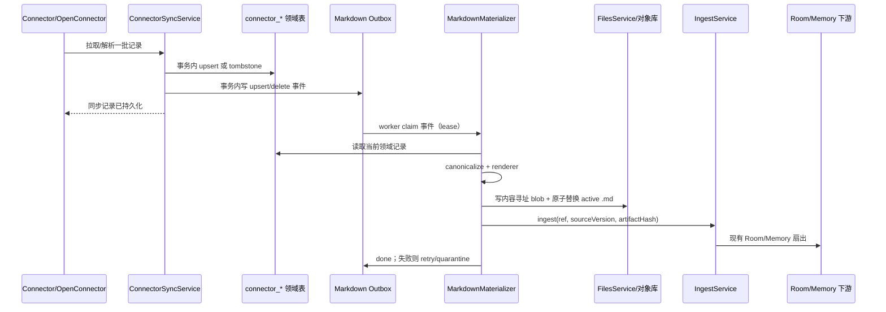

# 连接器数据自动 Markdown 化设计

## 1. 背景与目标

当前连接器同步链路是：OpenConnector 拉取数据 → 写入 `connector_*` 领域表 → 用户或桌面端显式调用 `/v1/cli-connectors/data/ingest` → 统一理解引擎生成 Markdown 并扇出到 Room/Memory。

这个时序有一个结构性问题：**同步成功不代表已经产生可阅读、可索引、可追溯的 Markdown 文件**。邮件尤其明显：一封邮件应当有一个稳定的 `.md` 对应物，后续更新覆盖同一身份，删除能够撤销下游索引，连接器或模型服务短暂不可用也不能丢失待处理数据。

本设计的目标：

1. 所有连接器领域记录在同步落库后自动生成 Markdown artifact；邮件一条记录对应一个 `.md`。
2. Markdown 生成是确定性的，不依赖 LLM；同一份规范化数据和同一渲染器版本生成相同内容。
3. artifact 有稳定身份、内容哈希、版本、状态和来源映射，可增量更新、重试和回溯。
4. 生成的 Markdown 自动进入现有统一 ingest；不再要求用户手动选中邮件执行 ingest。
5. 附件、HTML、缺失字段、删除、重复事件和进程崩溃都有明确语义。

非目标：本期不把连接器原始响应完整复制到 Markdown，不用 LLM 摘要替代原文，不改变各下游链路的理解逻辑。

## 2. 现有代码基线

当前代码已经具备几个可复用的基础：

- `apps/gateway/src/modules/connectors/service.ts` 将同步数据写入 `connectorEmails`、`connectorDocuments`、`connectorCalendarEvents`，并且 Gmail 有 bootstrap/history 增量模式。
- `apps/gateway/src/modules/ingest/connector-markdown.ts` 已有邮件、文档、日程的确定性 Markdown renderer。
- `apps/gateway/src/modules/ingest/service.ts` 已支持 `connector-email`、`connector-document`、`connector-calendar` 引用，并将结果写入 `parsed_contents` 和 `ingest_events`。
- `apps/gateway/src/modules/files/service.ts` 管理内容寻址对象库和解析产物，但 `parsed_contents` 本身不是用户可见的独立 `.md` 文件。
- `/v1/cli-connectors/data/ingest` 目前是手动触发入口，应保留为重试/补偿入口，而不是主流程。

因此本设计不新增第四套理解管线，而是在“领域记录落库”和“统一 ingest”之间增加持久化的 Markdown materialization 层。

## 3. 总体流程



关键决策：

- **同步事务只负责领域数据和 outbox 事件**。不在同步事务中调用文件系统、MemoryCore 或 Knowledge，避免一个下游故障阻塞 Gmail history 游标提交。
- **materializer 读取当前行而不是只信事件 payload**。同一邮件在 worker 排队期间连续更新时，旧事件可以被安全折叠，最终只渲染最新版本。
- **artifact 写成功后才调用 ingest**。artifact 是可恢复的事实源；ingest 失败可以单独重试，不需要重新调用连接器。
- **自动 ingest 与手动 ingest 幂等**。两者都使用相同的 source identity/content hash，命中台账后不重复扇出。

## 4. 稳定身份与文件布局

### 4.1 身份

artifact 的逻辑键：

```text
(owner_id, service, connection_name, dataset, resource_type, source_record_id)
```

不要用主题、发件人或日期作为主键：主题可变、同主题邮件很多，日期修正也不应导致文件换身份。

文件名使用经过编码的 `source_record_id`，禁止直接把外部 ID 拼进路径。推荐布局：

```text
<gateway dataDir>/connectors/markdown/
  <service>/<connection-key>/<resource-type>/<source-id-sha256-24>.md
```

`connection-key` 由连接名哈希得到，避免邮箱地址、OAuth 标识或其他 PII 出现在路径中。路径是稳定的，邮件更新时原子覆盖同一个 active 文件。

### 4.2 内容与版本

新增 `connector_markdown_artifacts` 表（名称可按现有迁移命名规则调整）：

| 字段 | 说明 |
| --- | --- |
| `id` | `cma-<uuid>`，内部 artifact ID |
| `owner_id/service/connection_name/dataset/resource_type/source_record_id` | 逻辑唯一键 |
| `ingest_source_id` | 对应 `connector_*` 领域行 ID；沿用现有 ingest source identity，迁移不重复产知识 |
| `active_path` | 相对 `dataDir` 的 active `.md` 路径 |
| `source_version` | 领域记录版本；没有显式版本时用单调递增 ledger version |
| `source_content_hash` | 领域记录 canonical hash |
| `markdown_content_hash` | 生成后 Markdown hash |
| `renderer_version` | 例如 `mail-v2` |
| `version` | artifact 版本号，从 1 递增 |
| `status` | artifact 状态：`pending` / `ready` / `failed` / `deleted` |
| `ingest_status` | 下游状态：`pending` / `succeeded` / `skipped` / `failed` |
| `last_error` | 脱敏后的最近错误 |
| `parsed_id` | 对应 `parsed_contents` 行，可为空直到 ingest 完成 |
| `ingest_event_id` | 对应统一 ingest 台账行，可为空直到 ingest 完成 |
| `created_at/updated_at/deleted_at` | 生命周期字段 |

逻辑唯一键需要数据库 unique index，`connection_name` 在入表前规范为非空 connection key，不能依赖 SQLite 对 `NULL` 的 unique 语义。`ingest_source_id` 保留当前 `connector_emails/documents/calendar_events.id`，使自动化上线前已手动 ingest 的记录仍命中同一个来源。

内容历史不要求永远保留完整副本：`parsed_contents` 按 hash/parser version 保留可复用内容；如产品需要用户查看历史，再增加 `connector_markdown_versions`，默认保留最近 N 个版本。

active 文件写入必须遵循：临时文件写入 → `fsync`（可配置）→ `rename` 原子替换。目录权限沿用本地数据目录的 `0700`，文件权限 `0600`。

## 5. Outbox 与 worker

新增 `connector_markdown_outbox` 表：

```text
id, owner_id, artifact_key, source_record_id, operation(upsert|delete),
source_content_hash, source_updated_at, attempts, available_at,
lease_until, status(pending|processing|done|dead), last_error, created_at, updated_at
```

### 5.1 入队规则

领域 upsert 和 outbox insert 在**同一个 SQLite 事务**中完成：

- 新增记录：`upsert` 事件。
- 内容 hash 变化：`upsert` 事件；同一 artifact 的 pending 事件可合并为最新 hash。
- 只有同步时间变化、内容 hash 未变：不生成渲染任务。
- Gmail `messagesDeleted` 或明确的 404：`delete` 事件。
- 暂时的 provider 错误、分页失败、进程退出：不生成删除事件。

worker 启动时恢复 `lease_until < now` 的 processing 事件。每次 claim 使用短租约和 owner 条件，避免两个 worker 同时处理同一事件。

### 5.2 处理步骤

1. 按 artifact key 读取当前领域行；若已被新事件覆盖，旧事件直接标记 `done`（coalesced）。
2. 做 canonicalization，生成统一连接器记录模型。
3. 选择 resource renderer，生成 Markdown 并计算 hash。
4. hash 与现有 active hash 和 renderer version 均相同，直接标记 ready，不写文件、不触发 ingest。
5. 否则写 blob、原子替换 active `.md`，更新 artifact row。
6. 调用 `IngestService.ingest({ source: { ref: { sourceKind: "connector-markdown", sourceId: artifact.id } }, originChannel: "connector" })`。新增的 ref adapter 从 artifact 读取已经生成的 Markdown/`parsed_id`，再映射回 `mail/cloud-doc/calendar-event + ingest_source_id` 写 ingest 台账，不从领域行二次渲染。
7. 记录 `parsed_id`、`ingest_event_id`，outbox 标记 done。若当前策略明确不进入任何下游，则 `ingest_status=skipped`。

失败处理：

- 可重试错误（文件锁、MemoryCore 不可用、Knowledge 暂时失败）：指数退避，例如 30s、2m、10m、1h，最多 10 次。文件已经写成功时 artifact 保持 `ready`，只把 `ingest_status` 标为 `failed` 并重试下游阶段。
- 不可重试的 schema/字段错误：artifact `failed`，记录脱敏错误并将事件置 `dead`；原始领域数据保留，等待修复 renderer 后 rebuild。
- 任何错误都不能自动把领域记录标记为 deleted，也不能推进错误的 Gmail history checkpoint。

## 6. 邮件 Markdown 契约

### 6.1 Canonical 邮件模型

`gmailMessageToDomainRecord` 需要扩展为尽量完整的规范模型。必需字段和可选字段分开，缺失值保留为 `null`/空数组，不臆造：

```ts
interface CanonicalMail {
  sourceRecordId: string;
  messageId: string;
  threadId: string | null;
  inReplyTo: string | null;
  references: string[];
  subject: string;
  from: Person | null;
  to: Person[];
  cc: Person[];
  bcc: Person[];
  replyTo: Person[];
  sentAt: string | null;
  receivedAt: string | null;
  labels: string[];
  isRead: boolean | null;
  isStarred: boolean | null;
  isDraft: boolean | null;
  isSpam: boolean | null;
  isTrash: boolean | null;
  bodyText: string;
  bodyHtml: string | null;
  attachments: AttachmentMeta[];
  sourceUrl: string | null;
  sourceUpdatedAt: string | null;
}
```

当前表中的 `senderName/senderAddress/recipients/bodyText/labels/extensionPayload` 可以兼容迁移；新增字段优先放入显式列，provider 特有字段继续放 `extensionPayload`。`bcc` 等敏感字段只在 provider 返回且本地策略允许时写入。

### 6.2 推荐 Markdown 结构

```markdown
---
artifact_version: 1
renderer_version: mail-v2
source_kind: mail
connector: gmail
connection_name: "<display-safe-name>"
dataset: emails
source_record_id: "..."
message_id: "..."
thread_id: "..."
in_reply_to: null
subject: "..."
from: {name: "Alice", address: "alice@example.com"}
to: [{name: "Bob", address: "bob@example.com"}]
cc: []
bcc: []
reply_to: []
sent_at: "2026-08-20T09:30:00+08:00"
received_at: "2026-08-20T09:30:03+08:00"
labels: [INBOX, IMPORTANT]
is_read: true
is_starred: false
has_attachments: true
source_url: "https://mail.google.com/..."
source_updated_at: "2026-08-20T09:30:03+08:00"
source_content_hash: "..."
---

# 会议时间确认

## 邮件信息

- 发件人：Alice <alice@example.com>
- 收件人：Bob <bob@example.com>
- 抄送：无
- 发送时间：2026-08-20T09:30:00+08:00
- 线程：`thread-123`
- 标签：INBOX、IMPORTANT
- 状态：已读；重要；非草稿；非垃圾邮件；非回收站

## 正文

邮件纯文本正文……

## 附件

| 文件名 | MIME | 大小 | 来源 ID | 本地状态 |
| --- | --- | ---: | --- | --- |
| agenda.pdf | application/pdf | 120 KB | att-1 | 未下载 |
```

实现要求：

- frontmatter 使用结构化 YAML 序列化器，不能通过字符串拼接生成可被换行、冒号或 `---` 破坏的 YAML。
- 标题、正文、文件名等外部文本按 Markdown 普通文本处理；HTML 先做白名单清洗，再转换为 Markdown。禁止把未经清洗的 HTML 直接插入 artifact。
- `bodyText` 优先；仅有 HTML 时使用 `bodyHtml → sanitize → HTML-to-Markdown`，并在 `conversion_notes` 标明来源。
- 不能解析的 HTML 不阻塞邮件 artifact：保留纯文本 fallback，并把转换错误放入诊断字段。
- 不在 Markdown 中写入 OAuth token、完整原始响应、内部日志或 provider 私密 header。

### 6.3 附件策略

第一阶段只保证邮件 `.md` 中有完整附件元数据和远端 ID/链接，不自动下载二进制附件。这样不会因大量附件拖慢邮件同步，也不会在没有明确授权时扩大本地数据面。

后续启用下载时：

- 通过独立 attachment outbox 下载到 `FilesService` 内容寻址对象库。
- Markdown 只引用 `fileId` 和受控 preview URL，不把二进制 base64 塞进 Markdown。
- 文件名做 basename/Unicode 规范化和路径穿越检查；下载失败只显示 `download_status: failed`，不影响邮件正文。

## 7. 更新、删除与一致性

### 更新

同一个 `(service, connection, sourceRecordId)` 始终指向同一个 `.md`。邮件主题、正文、标签、已读状态或附件变化都会产生新的 `source_content_hash` 和 artifact `version`，active 文件原子覆盖，随后产生新的 ingest ledger version。内容未变时只更新同步时间，不改 Markdown。

### 删除

只有 provider 明确返回 deleted/404，或连接器同步协议明确声明记录已删除时才处理删除：

1. 领域行写 `deleted_at`。
2. outbox 写 `delete`。
3. worker 删除 active `.md`（或移动到受控 tombstone 目录），artifact 标记 `deleted`。
4. 触发下游 source cleanup：Room/Wiki 不再检索该来源，Memory 按 `caller_ref` 删除对应文档。

网络超时、权限失效、分页中断都不能当作删除。

### 崩溃恢复

任何阶段崩溃都可以从 outbox 继续：

- 领域表已写、outbox 未完成：worker 重试。
- 文件已写、ingest 未完成：通过 hash 命中 artifact 后只重试 ingest。
- ingest 已完成、ack 未写：重复调用被 `sourceKind + sourceId + contentHash` 台账幂等门挡住。实现时应把当前只按 `sourceId + contentHash` 的查询和索引补齐 `sourceKind`，避免不同来源类型发生身份碰撞。

## 8. API、桌面端与可观测性

保留现有接口兼容性，同时增加 artifact 视图：

- `GET /v1/cli-connectors/data/:id` 返回 `markdownArtifact: { id, path, version, status, markdownContentHash, ingestEventId }`。
- `GET /v1/cli-connectors/markdown/artifacts` 支持按 service、resourceType、status、updatedAt 查询。
- `GET /v1/cli-connectors/markdown/artifacts/:id` 返回 frontmatter/正文预览；原始文件读取必须走受鉴权 API，不接受任意路径。
- `POST /v1/cli-connectors/markdown/rebuild` 支持按 connector、记录 ID、renderer version 重建；这是迁移和修复入口。
- 现有 `/v1/cli-connectors/data/ingest` 改名语义为“补偿 ingest”：若 artifact 不存在先投递 materialization，存在则复用当前 artifact。

桌面连接器页面展示：

- 同步统计增加 `markdownReady / markdownPending / markdownFailed / markdownDeleted`，下游另列 `ingestPending / ingestFailed`，两类状态不能合并。
- 每条记录显示 Markdown 状态和“打开/预览/重试”操作。
- 同步 run 的成功条件仍是 provider 数据已落库；artifact 失败作为可见的 partial failure，不伪装成连接器数据丢失。

日志只记录 owner/job/run/artifact/source ID、版本、hash、耗时和错误码，不记录正文、附件内容或授权信息。

## 9. 实施拆分

### Phase 1：邮件闭环

1. 增加 `connector_markdown_artifacts`、`connector_markdown_outbox` 迁移和索引。
2. 从 Gmail canonicalizer 补齐 `cc/bcc/replyTo/receivedAt/status/attachment metadata/bodyHtml/sourceUrl`。
3. 抽象 `ConnectorMarkdownMaterializer`，接入 mail renderer；领域 upsert/delete 事务写 outbox。
4. 在 gateway 启动 worker；创建 ingest adapter，复用现有台账和 Room/Memory 扇出。
5. 增加 bootstrap backfill：扫描现有 `connector_emails`，按 hash 生成 outbox，不重新请求 Gmail。
6. 桌面端展示状态，保留手动补偿接口。

### Phase 2：其他资源类型

- document：标题、所有者、类型、URL、正文和 provider 更新时间。
- calendar：时区、参与者、响应状态、地点、会议链接、描述。
- generic：使用显式 schema/profile；未知字段进入受限的“扩展字段” JSON 区块，不把任意对象直接展开成 Markdown。

所有 renderer 实现统一接口：

```ts
interface ConnectorMarkdownRenderer<T> {
  resourceType: "email" | "document" | "calendar" | "generic";
  rendererVersion: string;
  canonicalize(input: unknown): T;
  render(value: T, context: RenderContext): RenderedMarkdown;
}
```

## 10. 测试与验收标准

必须覆盖：

1. 同一邮件首次同步生成一个 `.md`，再次同步不增加文件，active path 不变。
2. 正文或标签改变时版本递增、hash 改变、同一路径原子替换，并只产生一次新的 ingest event。
3. 两个重复 outbox 事件并发执行不会生成重复 artifact 或重复 Memory 文档。
4. Gmail bootstrap、history changed、history deleted 分别触发 upsert/delete；网络错误不触发删除。
5. 只有 HTML、坏 HTML、缺主题、多收件人、中文/换行/Markdown 特殊字符、空正文都生成合法 frontmatter 和可读正文。
6. 附件只写元数据时不下载二进制；启用下载时路径穿越和恶意文件名被拒绝。
7. materializer、FilesService、MemoryCore、Knowledge 任一短暂失败都能重试，且不会丢 outbox。
8. 进程在“文件已写但 ingest 未 ack”阶段崩溃，重启后恢复且下游不重复。
9. 明确删除后 `.md` 不再被查询和下游检索；普通同步失败不会删除文件。
10. renderer version 升级可以按 artifact rebuild，且不需要重新调用 provider。

验收指标建议：`markdown_ready_ratio`、`markdown_lag_seconds`、`markdown_failed_count`、`ingest_retry_count`、`artifact_bytes_written`。先在 Gmail 小范围账号启用，观察一周后再打开其他连接器的自动 ingest。
