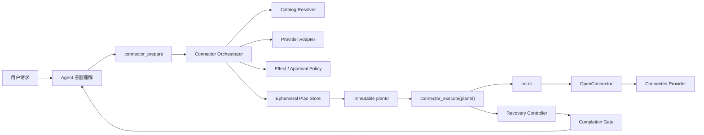
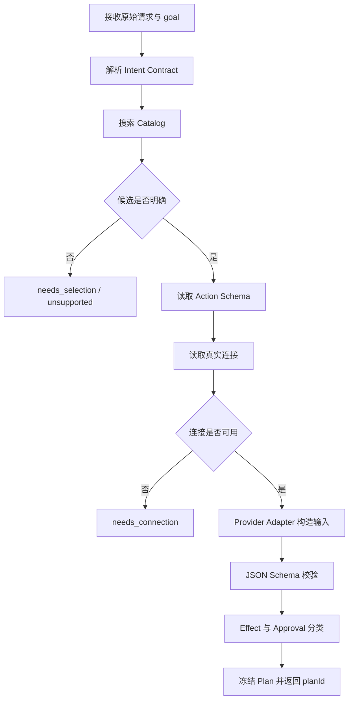
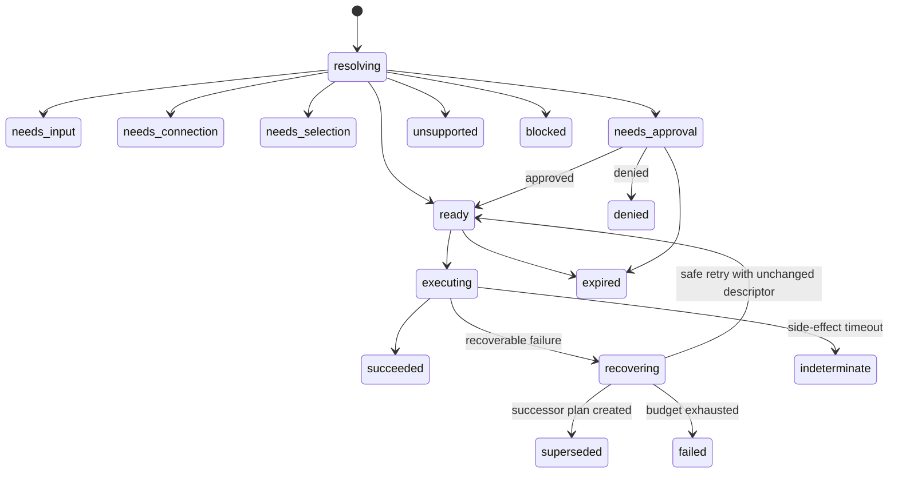
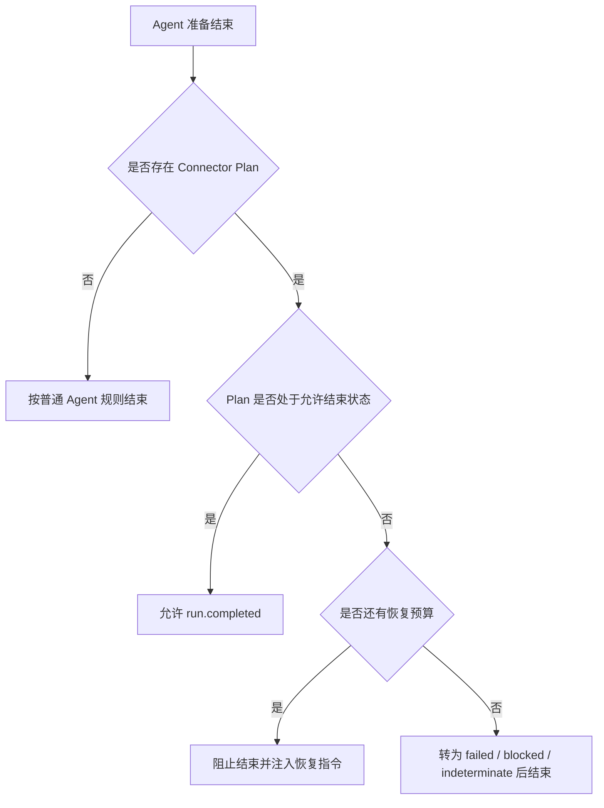

# Connector 确定性编排与 Agent 完成门设计

状态：Proposal

适用范围：EverRoom Desktop、NxCore Gateway、Pi Agent Runtime、OpenConnector、`oo-cli`

## 1. 背景

当前 Agent 直接使用以下底层工具：

```text
connector_search
connector_schema
connector_apps
connector_run
```

这条链路把搜索词、Action 选择、Schema 理解、连接选择、参数构造和失败恢复都交给模型。OpenConnector Catalog 是动态目录，不同 Provider 的 Action 名和参数命名不统一，因此即使每个底层工具都能正确工作，模型仍可能出现以下问题：

- 猜测不存在的 Action，例如 `gmail.list_messages`。
- 选择真实但语义不符的 Action，例如用 `list_drafts` 查询最近邮件。
- 使用不存在的 `connectionName`。
- 遗漏时间范围、数量、目标账号等用户硬约束。
- 把“不要标记为已读”误解成 `is:unread`。
- 工具失败后直接结束，而不是执行可恢复步骤。
- 对可能已经产生外部副作用的超时请求盲目重试。

现有结构化失败恢复能够缓解工具失败后的过早结束，但不能从根本上阻止模型生成错误执行计划。目标方案是在 Agent 与 `oo-cli` 之间增加确定性 Connector Orchestrator，并增加类似 Claude Code Stop Hook 的 Completion Gate。

## 2. 设计目标

1. 模型负责理解意图，不负责自由拼装底层执行参数。
2. Action 必须来自当前 Catalog，连接必须来自当前连接列表。
3. 所有输入必须通过所选 Action 的 Schema。
4. 用户原始约束必须进入不可变执行计划，模型不能在执行时改写。
5. 读取、写入、删除和状态不确定操作采用不同安全策略。
6. 可恢复失败至少执行一次规定的恢复动作，不能直接结束。
7. 相同失败不能无限循环，恢复预算必须可计算、可观测。
8. Runtime Token、Provider Token 和敏感连接信息不进入 Renderer。
9. 编排器支持逐步接入 Provider Adapter，不要求一次覆盖全部连接器。

## 3. 非目标

- 不在第一阶段实现任意多步骤跨 Provider 工作流。
- 不允许模型绕过编排器直接执行 Provider HTTP API。
- 不以升级模型替代确定性约束。
- 不保证所有自然语言都能自动消歧；高风险或语义不明确时应询问用户。
- 不对外部副作用状态不确定的请求进行自动重复提交。

## 4. 总体架构



目标架构只向 Agent 暴露两个业务工具：

```text
connector_prepare
connector_execute
```

`connector_search`、`connector_schema`、`connector_apps`、`connector_run` 变为 Orchestrator 内部能力，不再作为常规模型工具暴露。开发诊断模式可以保留底层工具，但必须通过 Feature Flag 显式开启。

## 5. Agent 工具契约

### 5.1 `connector_prepare`

输入：

```json
{
  "goal": "list recent Gmail messages",
  "serviceHint": "gmail"
}
```

说明：

- `goal` 是模型生成的简短英文检索目标，只用于 Catalog Discovery。
- Gateway 同时读取本轮未经改写的用户原始请求，原始请求才是约束权威来源。
- Agent 不能传入 Action、connectionName 或最终 Provider 参数。
- `serviceHint` 可省略；不能根据弱线索猜测 Provider。

成功返回：

```json
{
  "status": "ready",
  "planId": "cp_01J...",
  "summary": {
    "service": "gmail",
    "action": "fetch_emails",
    "accountLabel": "user@example.com",
    "effect": "read",
    "inputPreview": {
      "query": "newer_than:7d subject:\"会议\"",
      "maxResults": 10,
      "detail": "summary"
    }
  },
  "expiresAt": "2026-08-18T15:10:00.000Z"
}
```

非 Ready 返回状态：

```text
needs_input       缺少不可安全推断的必填值
needs_connection  服务未连接或 OAuth 已失效
needs_selection   多个账号或多个 Action 均合理，必须由用户选择
needs_approval    高风险计划已经生成，但执行前需要确认
unsupported       Catalog 中没有满足目标的能力
blocked           权限、策略或网络阻塞
```

### 5.2 `connector_execute`

输入：

```json
{
  "planId": "cp_01J..."
}
```

执行工具不能接收以下字段：

```text
service
action
connectionName
input
endpoint
headers
```

因此模型无法在 Prepare 之后更换 Action、账号或参数。执行前 Orchestrator 必须重新验证 Plan 归属、过期时间、Schema 指纹、连接状态和 Approval 状态。

## 6. 意图契约

Orchestrator 将用户请求转换为受约束的 Intent Contract：

```json
{
  "operation": "search",
  "object": "email",
  "service": "gmail",
  "constraints": {
    "timeRange": { "relativeDays": 7 },
    "subjectContains": "会议",
    "limit": 10,
    "fields": ["sender", "subject", "timestamp"]
  },
  "effectExpectation": "read",
  "forbiddenEffects": ["mark_read", "modify", "delete"]
}
```

Intent Contract 可以由模型协助提取，但必须满足以下规则：

- 原始用户请求始终随 Plan 保存并作为审计依据。
- Provider Adapter 对关键约束进行确定性校验和补全。
- 模型提取结果与原始请求冲突时，以更保守的解释为准。
- 无法确定收件人、目标账号、删除范围或共享范围时返回 `needs_input` 或 `needs_selection`。
- 禁止将否定副作用约束转换为查询过滤器，例如“不要标记为已读”不能变成 `is:unread`。

## 7. Prepare 流程



详细规则：

1. 使用 `goal` 搜索，但不得从搜索结果直接执行。
2. 候选 Action 必须同时满足 Provider、操作对象、效果类型和输出契约。
3. Catalog 排名只是候选信号，不是最终授权。
4. 必须获取最终候选的 Schema，并以 Schema 构造输入。
5. 必须读取真实连接；单连接或明确默认连接可以自动选择。
6. 多个非默认连接且用户未指定账号时返回 `needs_selection`。
7. Provider Adapter 将通用约束转换为 Provider 参数。
8. 输入必须通过 JSON Schema，未知字段一律移除或报错，不能透传。
9. 未知效果按 Mutation 处理，不能默认归为 Read。
10. 最终 Plan 计算 Schema Hash 和 Plan Digest 后写入 Plan Store。

## 8. Connector Plan

建议的数据模型：

```ts
interface ConnectorPlan {
  planId: string
  rootPlanId: string
  supersedesPlanId?: string
  supersededByPlanId?: string
  sessionId: string
  runId: string
  originalRequest: string
  discoveryGoal: string
  intent: ConnectorIntent
  capability: {
    service: string
    action: string
    description: string
    schemaHash: string
  }
  connection: {
    connectionName: string
    accountLabel: string
    statusSnapshot: string
  }
  input: Record<string, unknown>
  outputProjection?: string[]
  effect: 'read' | 'create' | 'send' | 'update' | 'delete' | 'share' | 'unknown'
  approval: {
    required: boolean
    approvalId?: string
    status: 'not_required' | 'pending' | 'approved' | 'denied'
  }
  state: ConnectorPlanState
  recovery: {
    totalAttempts: number
    fingerprints: Record<string, number>
  }
  idempotencyKey: string
  digest: string
  createdAt: string
  expiresAt: string
}
```

Plan 必须是不可变执行描述。状态、Approval 和 Recovery 计数可以更新，但 Capability、Connection、Input、Effect、Schema Hash 和 Digest 在 Prepare 后不能被模型修改。

恢复过程中如果需要改变 Capability、Connection、Input 或 Schema Hash，必须创建新的 successor Plan，并将旧 Plan 标记为 `superseded`；禁止原地“修复”执行描述。新旧 Plan 通过 `supersedesPlanId` / `supersededByPlanId` 关联，Completion Gate 始终检查当前 Plan 链中的活动 Plan。

## 9. Plan 状态机



终止状态：

```text
succeeded
failed
indeterminate
denied
unsupported
blocked
expired
superseded
```

`indeterminate` 表示外部请求可能已经执行，但客户端没有收到确定响应。该状态必须禁止自动重试，并向用户展示核查建议。

## 10. Effect 与 Approval 策略

| Effect | 默认行为 | 失败后自动重试 |
|---|---|---|
| `read` | 可直接执行 | 仅在确认请求未到 Provider 时有限重试 |
| `create` | 用户目标明确且字段完整时执行，否则确认 | 默认不重试 |
| `send` | 必须明确收件人、内容和账号 | 不重试状态不确定请求 |
| `update` | 展示目标与变更摘要后确认 | 不重试状态不确定请求 |
| `delete` | 必须显式确认 | 禁止自动重试 |
| `share` | 必须确认对象、范围和权限 | 禁止自动重试 |
| `unknown` | 按高风险 Mutation 处理 | 禁止自动重试 |

Approval 使用现有 Agent Event 语义：

```text
approval.requested
approval.resolved
```

`connector_execute` 可以在 Gateway 内等待 Approval Promise。Renderer 通过受鉴权的 Approval API 提交允许或拒绝；模型不能自行构造 Approval Token。超时、取消或 Gateway 重启使 Approval 与 Plan 失效。

## 11. 执行流程

1. 根据 `planId` 从 Plan Store 读取 Plan。
2. 校验 Plan 绑定的 `sessionId`、`runId` 和当前工具调用上下文。
3. 校验 TTL、Plan Digest 和状态必须为 `ready`。
4. 重新获取 Action Schema；Schema Hash 变化时使 Plan 失效并重新 Prepare。
5. 重新检查 Connection 是否仍然 Active。
6. 检查 Approval 状态。
7. 原子地将 Plan 从 `ready` 更新为 `executing`，拒绝并发重复执行。
8. 使用冻结的 Service、Action、Connection 和 Input 调用 `oo-cli`。
9. 成功后写入 `succeeded`，只向 Agent 返回经过 Output Projection 的结果。
10. 失败后交给 Recovery Controller 分类，禁止模型直接改变 Plan。

## 12. 幂等与重复执行

- 每个 Plan 生成独立 `idempotencyKey`。
- `connector_execute(planId)` 对同一 Plan 只能从 `ready` 成功进入一次 `executing`。
- 并发或重复调用返回同一个状态，不重复执行 Provider Action。
- Provider 支持原生 Idempotency Key 时由 Adapter 注入。
- Provider 不支持幂等时，本地状态只能防止 EverRoom 重复提交，不能消除网络边界上的不确定性。
- Mutation 请求发生连接中断或超时时进入 `indeterminate`，不自动生成新 Plan 重试。

## 13. Provider Adapter

Provider 差异应集中在 Adapter，不应散落在 Agent Prompt 和工具实现中：

```ts
interface ConnectorProviderAdapter {
  service: string
  scoreCandidate(intent: ConnectorIntent, action: ActionSummary): number
  supports(intent: ConnectorIntent, schema: ActionSchema): boolean
  buildInput(intent: ConnectorIntent, schema: ActionSchema): Record<string, unknown>
  classifyEffect(action: ActionSummary, schema: ActionSchema): ConnectorEffect
  projectOutput(result: unknown, fields?: string[]): unknown
  classifyFailure(error: unknown, plan: ConnectorPlan): ConnectorFailure
}
```

首批 Adapter：

1. Gmail：查询语法、邮件字段投影、已读状态副作用。
2. GitHub：当前账号、仓库搜索、Owner/Repo 输入关系。
3. Google Calendar：时间范围、时区、创建与更新确认。
4. Generic JSON Schema Adapter：只支持高置信度映射；无法确认语义时返回 `needs_input` 或 `unsupported`。

Adapter 不保存 Token，也不能绕过 `oo-cli`。

## 14. 失败分类与恢复控制器

统一失败结构：

```json
{
  "category": "invalid_input",
  "recoverable": true,
  "recommendedStep": "rebuild_from_schema",
  "fingerprint": "gmail.fetch_emails:invalid_input:schemaHash",
  "attempt": 1,
  "maxAttempts": 1,
  "message": "Input contains an undeclared field"
}
```

建议分类：

| Category | 恢复动作 | 自动预算 |
|---|---|---|
| `action_not_found` | 重新 Discovery 与 Schema，创建 successor Plan | 1 |
| `schema_changed` | 旧 Plan 失效，重新 Prepare successor Plan | 1 |
| `invalid_input` | Adapter 根据 Schema 重建输入并创建 successor Plan | 1 |
| `connection_invalid` | 刷新 Connections；连接变化时创建 successor Plan | 1 |
| `connection_ambiguous` | 请求用户选择 | 0 |
| `transient_discovery_network` | 重试 Search/Schema/Apps | 1 |
| `rate_limited` | 遵循 Retry-After，且仅限安全步骤 | 1 |
| `authentication_required` | 请求连接或重新授权 | 0 |
| `permission_denied` | 展示缺失 Scope | 0 |
| `missing_input` | 询问用户 | 0 |
| `execution_indeterminate` | 进入 `indeterminate` | 0 |
| `unsupported` | 说明 Catalog 缺失 | 0 |

恢复指纹使用：

```text
rootPlanId + category + failedStep + schemaHash/connectionName
```

相同指纹默认只允许一次自动恢复；单条 Plan 链的总恢复预算默认 2，硬上限 3。恢复必须产生新证据，例如新的 Schema Hash、连接列表或重建后的输入，否则视为重复失败并终止。

只有已确认请求尚未到达 Provider、且执行描述完全不变的安全重试，才能让同一 Plan 从 `recovering` 回到 `ready`。任何字段重建都生成 successor Plan；恢复预算沿 Plan 链继承，不能通过不断创建新 Plan 绕过上限。

## 15. Completion Gate

Pi Runtime 当前在 `agent_settled` 后结束运行。目标实现是在结束前增加 Completion Gate：



允许结束的条件：

- Plan 为 `succeeded`。
- Plan 为 `superseded`，且其 successor Plan 已进入允许结束状态。
- Plan 需要用户输入、账号连接、账号选择或 Approval。
- Plan 为终止阻塞、拒绝、过期、不支持或状态不确定。
- 可恢复错误已经执行规定恢复动作且预算耗尽。

禁止结束的条件：

- Plan 为 `resolving`、`ready`、`executing` 或 `recovering`。
- 最后一个失败为 `recoverable=true`，但尚未执行规定恢复动作。
- Agent 声称成功，但没有 `connector_execute` 成功事件。
- Agent 只输出“接下来将调用工具”而没有实际工具调用，且 Plan 仍未完成。

Completion Gate 每个 Run 最多阻止结束两次。内部指令必须带 `stopGateAttempt`，避免 Stop Hook 自身形成循环。达到上限后将 Plan 转为 `failed`，并要求 Agent准确报告未完成原因。

## 16. Plan Store

建议第一阶段使用 Gateway 进程内的 Ephemeral Plan Store：

- Plan 与当前 `sessionId`、`runId` 绑定。
- 默认 TTL 10 分钟。
- 使用容量受限的 LRU/TTL Map，默认最多 500 个 Plan。
- Gateway 重启后所有 Plan 失效，客户端重新 Prepare。
- Plan 不进入 Renderer，不包含 Runtime Token 或 Provider Token。
- Renderer 只接收脱敏后的 Plan Summary 和 Approval Summary。
- 完成、拒绝、取消或过期后立即删除敏感输入，保留最小诊断元数据。

如果未来需要跨重启 Approval，再引入加密持久化；不应直接把邮件正文、附件内容或发送内容明文写入 SQLite。

## 17. 事件与可观测性

第一阶段可继续使用通用工具事件，在 Payload 中增加：

```text
planId
planState
effect
failure.category
failure.recoverable
failure.recommendedStep
failure.attempt
failure.maxAttempts
stopGateAttempt
```

建议记录以下指标：

- Prepare 成功率与平均耗时。
- Catalog 搜索后 Action 消歧率。
- Schema、Connection、Input 各阶段失败率。
- 每类失败的恢复成功率。
- Completion Gate 阻止结束次数。
- 重复失败指纹数量。
- Plan 过期、Approval 拒绝和 `indeterminate` 数量。
- Provider Adapter 覆盖率与 Generic Adapter 回退率。

日志不得记录 Token、OAuth Code、邮件正文、附件内容和完整 Mutation Payload。

## 18. 安全边界

- 只有 Gateway 可以访问 Plan Store 和 Runtime Token。
- Agent 只持有短期 `planId`，且 `planId` 不作为单独授权凭据。
- Execute 必须同时验证当前 Session、Run 和 Plan Digest。
- 模型不能覆盖 Effect 分类或 Approval 结论。
- 未知 Action、未知 Effect 和未知输出默认采用保守策略。
- Proxy API 只能作为经过 Schema 与 Policy 审核的显式能力，不能作为自动兜底。
- Provider Adapter 不能接收或返回明文凭据。
- Mutation 的网络超时不能自动切换到另一个 Action 重试。

## 19. 迁移计划

### Phase 0：现有基础

- 保留当前结构化 `tool.failed`。
- 保留有限 steering 恢复和错误指纹。
- 补齐错误分类与日志字段。

### Phase 1：Completion Gate

- 在 Pi Runtime `agent_settled` 前增加 Integration Completion Policy。
- 对未处理的 Recoverable Failure 阻止结束一次。
- 增加 Stop Gate 循环上限和集成测试。

### Phase 2：只读 Prepare/Execute

- 实现 Ephemeral Plan Store。
- 新增 `connector_prepare`、`connector_execute`。
- 首先支持 Gmail、GitHub 只读 Action。
- 旧底层工具在 Feature Flag 下保留，用于对照与诊断。

### Phase 3：Mutation 与 Approval

- 增加 Effect Policy、Approval API 和 Renderer 确认 UI。
- 支持 Send/Create/Update；Delete/Share 默认保持关闭，逐项开放。
- 增加 Provider Idempotency Key 支持。

### Phase 4：收口底层工具

- 默认不再向 Agent 注册四个底层 Connector 工具。
- 所有生产调用必须来自有效 Plan。
- 删除散落在 Prompt 和工具层的 Provider 特例，只保留 Adapter。

### Phase 5：多步骤编排

- 在单 Plan 稳定后支持有限 DAG，例如 Read → Local Transform → Write。
- 每个外部步骤拥有独立 Effect、Approval、Idempotency 和恢复状态。
- 不允许模型绕过 DAG 直接执行下游 Mutation。

## 20. 测试策略

### 单元测试

- Catalog Candidate 排序与语义不匹配拒绝。
- Schema Hash 与 Plan Digest。
- Connection 选择与歧义处理。
- Gmail/GitHub Adapter 参数映射。
- Effect 分类和未知效果保守策略。
- Failure Fingerprint 与恢复预算。
- Completion Gate 状态判定。

### 集成测试

- 猜测的 Action 永远不会进入 `oo connector run`。
- Plan 中的 Action、连接和输入不能被 Execute 覆盖。
- Schema 变化后旧 Plan 被拒绝。
- 跨 Session、跨 Run、过期 Plan 被拒绝。
- 可恢复失败后 Agent 不能直接结束。
- 推荐恢复动作成功后可以继续执行。
- 同一失败达到预算后不会无限循环。
- OAuth 失败不会重复调用。
- Mutation 超时进入 `indeterminate`，不会自动重试。
- Approval 拒绝后不会调用 `oo-cli`。
- 重复 `connector_execute(planId)` 不会重复产生副作用。

### 端到端测试

1. Gmail 最近邮件只读查询。
2. Gmail 带时间、主题和数量约束的搜索。
3. GitHub 当前账号仓库列表。
4. 多 Gmail 账号选择。
5. OAuth 过期后的重新授权提示。
6. 发送邮件 Approval 允许与拒绝。
7. 错误 Action、错误连接、错误输入的自动恢复。
8. Agent 尝试提前结束时 Completion Gate 阻止结束。

## 21. 验收标准

- 生产 Agent 不能直接提交任意 Action、Connection 或 Provider Input。
- 每次 `oo connector run` 都能追溯到唯一、有效、未过期的 Plan。
- Read 场景中不存在 Action 404、猜测连接名和 Schema 外字段执行。
- Recoverable Failure 未尝试规定恢复动作前，Run 不得完成。
- 相同失败不会被自动恢复超过预算。
- Authentication、Permission 和 Indeterminate Execution 不会盲目重试。
- Mutation 在没有所需 Approval 时不会到达 `oo-cli`。
- Renderer 不持有 Runtime Token、Provider Token 或完整敏感 Plan。
- Gateway、Desktop 和 Runtime 的类型检查、单元测试、集成测试、构建全部通过。

## 22. 推荐决策

1. 采用 `connector_prepare` + `connector_execute(planId)`，不继续扩展模型可写的底层 Run 参数。
2. Plan Store 第一阶段使用进程内 TTL Store，Gateway 重启后重新 Prepare。
3. Completion Gate 以 Plan State 为权威，Prompt 仅作为补充。
4. 每个失败指纹默认恢复一次，单条 Plan 链总预算 2，硬上限 3。
5. Mutation 超时统一进入 `indeterminate`，禁止自动重试。
6. Provider Adapter 从 Gmail、GitHub 开始，Generic Adapter 保持保守。
7. Phase 2 稳定后再默认隐藏四个底层 Connector 工具。
