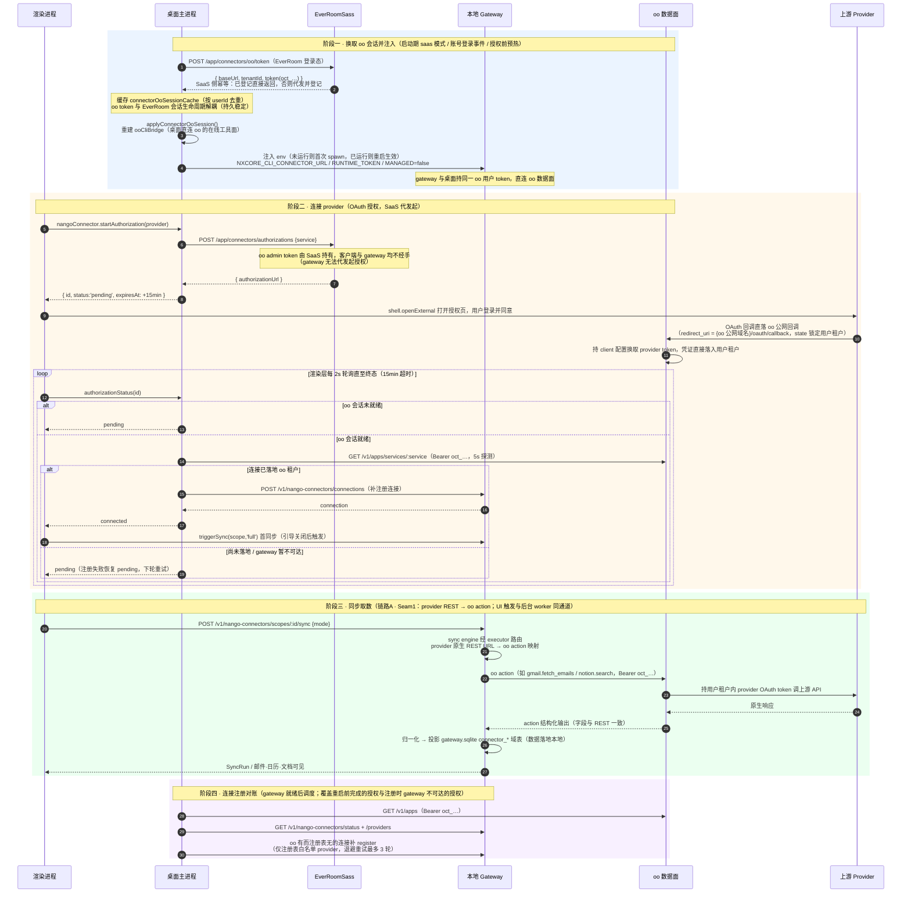

# 连接器栈 token 链路时序（connector-mode = 'saas'）

> 范围：仅连接器栈的 saas 连接层（默认模式），不含 local 模式、本地数据源与迁移导入。
> 代码依据：`apps/desktop/src/main/cloud/saas-client.ts`、`apps/desktop/src/main/gateway/saas-connector-bridge.ts`、`apps/desktop/src/main/index.ts`（connector-mode 段）、`submodules/everroom-connectors/gateway-module/open-connector-sync-executor.ts`。

## 参与者

| 参与者 | 说明 |
| --- | --- |
| 渲染进程 | SourcesPage / 连接器 UI（`window.nxcore.nangoConnector`） |
| 桌面主进程 | Electron main：`SaasConnectorBridge`、`SaasClient`、oo 会话缓存与 env 注入 |
| SaaS | EverRoomSass：登录态、oo 会话代发、OAuth 授权代发起（经 oo admin 面），持有 oo admin token |
| 本地 Gateway | NxCore gateway（子进程）：连接注册表、sync engine、同步 worker，经 env 持 oo 用户 token |
| oo | OpenConnector 多租户数据面：托管 provider OAuth token（用户租户内），暴露 action 取数 |
| 上游 Provider | Gmail / Outlook / Google Calendar / Google Docs / Notion |

## 时序图

## token 分层

| token | 谁持有 | 用途 |
| --- | --- | --- |
| EverRoom SaaS 会话（refresh token） | 主进程 SaasClient | 登录态；换 oo 会话；代发起授权 |
| oo 用户 runtime token（`oct_…`） | 主进程缓存 + 注入 gateway env（两者共用） | 桌面探测 oo（授权落地/对账）；gateway 数据面取数；租户锁定在 token 内 |
| provider OAuth token | 仅 oo 用户租户 | oo 调上游 provider 用；客户端与 gateway 全程不经手 |
| gateway 本地 token | 主进程 ↔ 本地 gateway | `/v1/nango-connectors/*` 等本地内部通道，与 oo 无关 |

## 关键端点

| 方向 | 端点 | 用途 |
| --- | --- | --- |
| 桌面 → SaaS | `POST /app/connectors/oo/token` | 换 oo 用户会话（幂等） |
| 桌面 → SaaS | `POST /app/connectors/authorizations` | 代发起 OAuth，返回授权页地址 |
| 桌面 → oo | `GET /v1/apps/services/:service` | 授权落地探测（轮询） |
| 桌面 → oo | `GET /v1/apps` | 对账用账号清单 |
| 桌面 → Gateway | `POST /v1/nango-connectors/connections` | 连接补注册 |
| Gateway → oo | oo action（gmail/notion/google-calendar/google-docs/outlook 五族映射） | 链路A取数 |
