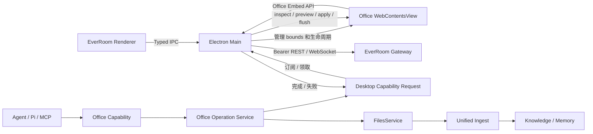
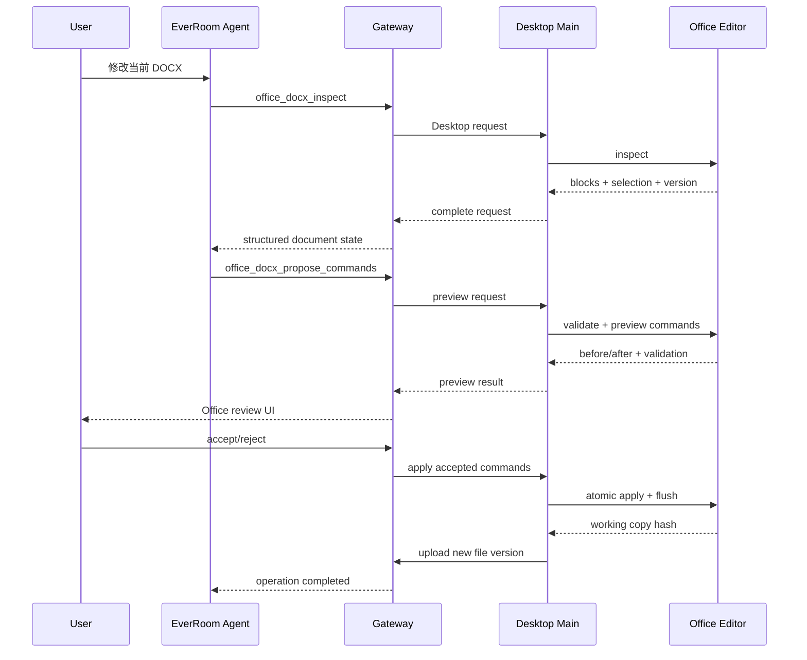

# GenOffice 编辑能力集成 EverRoom 实施方案

> 状态：阶段 A 技术探针已实现，阶段 B 待实施  
> 日期：2026-08-28  
> 目标工程：`/Users/rlacat/projects/Everroom`  
> 上游基线：`genspark-ai/genoffice@583a045212f871943afb8ca4503fcb5ddf99a23f`

## 1. 方案结论

EverRoom 采用 Fork GenOffice 的方案，并参照当前 Nango 的集成方式，以 Git submodule 固定 Fork 源码版本。EverRoom 的准备脚本从 submodule 构建并裁剪运行时，正式发行包只携带裁剪后的 Office runtime。EverRoom 只复用 GenOffice 的 Office 格式引擎、编辑器 UI、结构化命令和事务执行能力，继续作为唯一产品 Shell，并继续拥有 Agent Runtime、文档操作审阅、文件版本、知识摄取、账号、更新和发布体系。

不创建新的 PC 工程，不嵌入完整 GenOffice Shell，不复制 GenOffice 的 `agent-core`，也不引入第二套 Agent 对话面板、模型配置、审批或审计系统。

目标形态：

```text
EverRoom BrowserWindow
├── EverRoom React Renderer
│   ├── TopBar
│   ├── 左侧导航
│   ├── 普通 workspace 页面
│   └── 右侧 AgentPanel
└── workspace-main 对应区域
    └── Office WebContentsView
        ├── DOCX Editor
        ├── XLSX Editor + Rust sidecar
        ├── PPTX Editor
        └── PDF Viewer
```

第一阶段只交付 DOCX 的完整闭环。XLSX、PPTX 和 PDF 按独立里程碑接入，不能为了格式数量牺牲文件版本、冲突检测、崩溃恢复和 Agent 审阅。

## 2. 背景和选型

### 2.1 为什么选 GenOffice Fork

本项目需要的不只是文档展示，而是：

1. 对 DOCX、XLSX、PPTX 的原生结构进行读取和修改；
2. 保留未触及的 OOXML 内容，避免简单“导入为内部模型再整体导出”造成格式丢失；
3. 为 Agent 暴露稳定、可验证、可回滚的结构化操作；
4. 嵌入 Electron，同时保留 EverRoom 自己的 Agent 面板和产品 Shell；
5. 使用可接受的开源协议，避免 OnlyOffice AGPL 对桌面端和 SaaS 组合分发带来的合规复杂度。

GenOffice 主体使用 Apache-2.0，已有 DOCX 段落 patch、XLSX 工作簿事务、PPTX element patch 和 dry-run/atomic transaction 等能力，适合作为 Office 技术底座。它并非完整替代 Microsoft Office 的成熟套件，因此仍需通过兼容性测试约束支持范围。

### 2.2 Fork 许可边界

- 只使用 GenOffice 主仓 Apache-2.0 范围内的代码。
- `ee/` 使用单独企业许可证，构建、同步和发布流程必须显式排除。
- 保留 Apache-2.0 LICENSE、NOTICE 和第三方许可证。
- 移除或替换 GenOffice、Genspark 名称、图标和商标资产。
- Fork 仓库必须维护上游 commit、补丁清单和第三方依赖清单。
- 正式发布前由法务或合规负责人复核实际打包产物；本文不是法律意见。

### 2.3 不选择完整 GenOffice Shell

完整 Shell 同时拥有文件关联、窗口生命周期、标签页、账号、云项目、AI Provider、Agent 面板和自动更新。直接嵌入会与 EverRoom 的下列能力形成重复真源：

- Agent 会话、工具调用、事件和审批；
- Context Room 和 Active Document Context；
- 文档 Operation、review、revision 和幂等命令；
- 文件库、Knowledge、Memory 和 ingest；
- Electron 单实例、签名、公证、更新与发布。

因此仅借鉴 GenOffice 的 `WebContentsView` 管理方式，并将各格式编辑器改造成可嵌入模块。

## 3. EverRoom 当前基线

本方案基于当前正式工程，而不是原型工程。

### 3.1 Desktop

- `apps/desktop` 使用 Electron、React、TypeScript 和 electron-vite。
- 当前只有一个主 `BrowserWindow`。
- Renderer 通过 CSS Grid 组织左侧导航、中间 `workspace-main` 和右侧 `AgentPanel`。
- 主窗口启用 `contextIsolation: true`、`nodeIntegration: false`、`sandbox: true`。
- Gateway Token 只保留在 Main Process，Renderer 通过 typed preload 和 IPC 访问服务。
- Renderer 已启用 COOP/COEP，可支持需要 `SharedArrayBuffer` 的编辑或渲染模块。

相关入口：

- `apps/desktop/src/main/index.ts`
- `apps/desktop/src/preload/index.ts`
- `apps/desktop/src/renderer/src/App.tsx`
- `apps/desktop/electron.vite.config.ts`

### 3.2 Agent 文档能力

EverRoom 已经具备：

- Agent 运行前 flush 当前文档；
- `roomId`、`documentId`、标题、版本和 cursor anchor 上下文；
- Capability Plugin Registry；
- Operation revision、幂等 command ID、状态机和事件审计；
- `atomic_review`、`incremental_review`、`preview_replace`、`streaming_commit`；
- review、apply、reject、conflict、cancel 和重启恢复；
- MCP 与 Pi Tool 共用 Capability Registry；
- Desktop Operation Store、Presenter Registry 和 Operation Center。

Office 集成必须扩展这些边界，不能在 Office Renderer 内重建第二套 Agent Runtime。

### 3.3 文件版本和解析

Gateway 已有内容寻址文件库：

```text
file_entries   文件逻辑身份和当前版本
file_versions  不可变版本、版本号和解析状态
file_blobs     SHA-256 内容寻址字节
```

DOCX、XLSX、PPTX、PDF 已经支持导入、解析和证据抽取，当前侧重“读取和理解”，尚未提供内嵌 Office 编辑。

Office 文件必须继续作为 versioned file artifact，不能写入 Tiptap `RoomDocument.contentJson`。

参考文档：

- [Office/PDF 多模态解析实施方案](./multimodal-document-parser-implementation-plan.zh-CN.md)
- [Agent 文档能力开发 SOP](./agent-document-development-sop.md)

## 4. 目标架构

### 4.1 总体结构



核心原则：

1. SQLite 是 Operation 和 Desktop Request 的权威状态。
2. WebSocket 只负责通知；断线后必须能通过 REST 恢复。
3. Office Renderer 不持有 Gateway Token，不直接访问文件库数据库。
4. Agent 只调用 Gateway 注册的 Office Capability，不直接调用 Electron IPC。
5. 文件提交成功以 Gateway 创建新 `fileVersion` 为准，不以 Renderer 显示成功为准。

### 4.2 Office View 的布局

Office View 是主窗口 `contentView` 的子 View，只覆盖 Renderer 中 `workspace-main` 的屏幕区域，不能覆盖 TopBar、左侧导航和右侧 Agent Panel。

Renderer 增加 `OfficeViewportReporter`：

1. 对 `workspace-main` 使用 `ResizeObserver`；
2. 读取 `getBoundingClientRect()`；
3. 在窗口 resize、Agent Panel 展开/折叠、导航宽度变化和页面切换时发送 bounds；
4. Main Process 将 DIP bounds 应用到活动 Office View；
5. 页面离开 Office artifact 时隐藏 View，而不是依靠 z-index；
6. EverRoom 打开模态框、全屏遮罩或新手引导时暂时隐藏 View。

Main Process 增加 `OfficeViewManager`：

```text
apps/desktop/src/main/office/
├── office-view-manager.ts
├── office-runtime.ts
├── office-working-copy.ts
├── office-capability-bridge.ts
└── office-navigation-policy.ts
```

职责包括：

- 创建、复用、激活、隐藏和销毁 View；
- 限制导航、弹窗、权限和外部 URL；
- 管理 artifact 与 `webContents.id` 的绑定；
- 管理工作副本和 dirty 状态；
- 把 Agent 命令定向发送给正确的编辑器；
- 应用关闭、标签关闭和切换文件时执行保存保护。

### 4.3 GenOffice Embed Runtime

Fork 中新增一个稳定嵌入层，不让 EverRoom 直接依赖各应用内部实现：

```text
@everroom/genoffice-embed
├── createDocsView()
├── createSheetsView()
├── createSlidesView()
├── createPdfView()
├── inspectArtifact()
├── inspectSelection()
├── previewCommands()
├── applyCommands()
├── flushToWorkingCopy()
├── queryDirty()
└── closeArtifact()
```

嵌入 API 必须：

- 使用类型化请求和响应；
- 接受 `requestId` 和 `artifactId`；
- 对 mutation 支持幂等键；
- 返回结构化错误码；
- 不接收任意文件路径，只操作 Main Process 已授权的工作副本；
- 不调用 GenOffice 自带模型或登录；
- 支持编辑器重载后重新绑定 artifact。

## 5. Fork 范围

### 5.1 保留

- `packages/docx-engine`
- `packages/pptx-engine`
- `packages/pptx-render`
- Office 格式需要的 `packages/file-parse` 部分
- `apps/docs` 的 DOCX 编辑器和结构化 commands
- `apps/sheets` 的表格 UI、workbook transaction 和 Rust sidecar
- `apps/slides` 的渲染器、ops registry、dry-run 和 atomic executor
- `apps/pdf` 的查看、文本层、缩略图和必要批注能力
- 与编辑器直接相关的 i18n、字体、渲染和 Electron 工具

### 5.2 移除或禁用

- `packages/agent-core`
- `packages/ai-provider`
- GenOffice AI Panel 和内建工具循环
- Genspark 登录、积分、云项目和云生成接口
- GenOffice updater、遥测和外部推广入口
- GenOffice Shell 首页、账号和文件管理
- 品牌图标、商标和产品文案
- `ee/` 全部内容

如果编辑器代码当前在编译期直接依赖上述模块，Fork 应先通过接口注入或 feature flag 解耦，再产出 Embed Runtime。不能在 EverRoom 里用空实现长期掩盖耦合。

### 5.3 Fork 和 Submodule

团队维护 Apache-only Fork：

```text
NxcoreAI/genoffice
└── EverRoom embed patches
```

EverRoom 将 Fork 注册为 Git submodule，建议路径：

```text
apps/desktop/vendor/genoffice
```

`.gitmodules` 目标形态：

```ini
[submodule "apps/desktop/vendor/genoffice"]
	path = apps/desktop/vendor/genoffice
	url = https://github.com/NxcoreAI/genoffice.git
```

版本由 EverRoom 父仓记录的 submodule commit 固定，不依赖浮动 branch、运行时下载或最新 release。首个基线从上游 `583a045212f871943afb8ca4503fcb5ddf99a23f` 建立，后续上游同步先合入 Fork、通过兼容测试，再在 EverRoom 提交中更新 submodule pointer。

Fork 的远端配置、下游补丁、Embed 稳定契约、上游同步、验证、父仓 gitlink 更新及回滚步骤，统一维护在 [`apps/desktop/vendor/genoffice/UPSTREAM.md`](../apps/desktop/vendor/genoffice/UPSTREAM.md)。上游更新采用临时 `sync/upstream-YYYYMMDD` 分支和 PR，不重写 Fork `main` 历史；只有远端已存在的新 commit 才能更新 EverRoom 的 submodule pointer。

选择 `apps/desktop/vendor/genoffice` 而不是 `apps/desktop/src/**`，避免 GenOffice 源码进入 EverRoom Desktop TypeScript include、electron-vite 模块扫描和业务源码边界。该目录也不能加入根 `pnpm-workspace.yaml`；GenOffice 保持自己的依赖锁和构建工具。

开发者和 CI checkout 必须初始化 submodule：

```bash
git submodule update --init --recursive
```

缺少 submodule 时，准备脚本应立即返回包含上述恢复命令的明确错误，不能静默下载上游源码。

### 5.4 与 Nango 一致的构建供应链

参考 `apps/desktop/scripts/prepare-nango-runtime.mjs`，新增：

```text
apps/desktop/scripts/prepare-genoffice-runtime.mjs
```

脚本从固定 submodule 构建，而不是从网络获取预构建包：

1. 验证 submodule 的 `package.json`、LICENSE 和期望目录存在；
2. 读取并记录当前 submodule commit；
3. 验证 `ee/`、登录、云服务和 updater 不会进入构建 allowlist；
4. 在 submodule 自己的包管理边界内安装锁定依赖；
5. 构建 docs/sheets/slides/pdf 的 renderer、preload 和必要 main/embed 模块；
6. 构建当前目标平台的 XLSX sidecar；
7. 复制运行时闭包和静态资产到 staging 目录；
8. 删除源码、测试、source map、开发依赖、其他平台 native binary 和禁用模块；
9. 生成 runtime manifest、文件 hash 和第三方许可证；
10. 原子替换 `apps/desktop/build/genoffice-runtime`。

输出布局：

```text
apps/desktop/build/genoffice-runtime/
├── docs/
├── sheets/
├── slides/
├── pdf/
├── native/<platform>-<arch>/xlsx-sidecar[.exe]
├── THIRD-PARTY-NOTICES.txt
└── manifest.json
```

`manifest.json` 至少记录：

- GenOffice upstream commit；
- EverRoom Fork commit；
- runtime protocol version；
- 支持的格式；
- Electron ABI 要求；
- sidecar hash；
- 第三方许可证清单版本。

与 Nango 一样，开发态和打包态使用不同的解析位置：

```text
开发态：apps/desktop/vendor/genoffice/apps/*/out
打包态：process.resourcesPath/genoffice/*
```

开发态允许准备脚本在 submodule 内生成构建输出；正式包不携带 submodule 源码。Office Runtime 是嵌入式 `WebContentsView` 资源和 native sidecar，不需要像 Nango Server 那样额外监听端口或启动 HTTP 服务。其窗口/View 生命周期仍由 `OfficeViewManager` 托管，sidecar 生命周期由 Main Process 托管。

建议 Desktop scripts 调整为：

```json
{
  "scripts": {
    "prepare:genoffice": "node scripts/prepare-genoffice-runtime.mjs",
    "dev": "node scripts/prepare-open-connector.mjs && node scripts/prepare-oo-cli.mjs && node scripts/prepare-genoffice-runtime.mjs --dev && node scripts/dev.mjs",
    "build": "node scripts/prepare-nango-runtime.mjs && node scripts/prepare-genoffice-runtime.mjs && electron-vite build"
  }
}
```

实际实现时应把多个 prepare 命令收口为可缓存的统一入口，避免每次 `dev` 都无条件重建所有 Office 模块。缓存键至少包含 submodule commit、lockfile hash、目标平台/架构、Electron major 和准备脚本版本。

## 6. Artifact 和 Active Context

### 6.1 统一活动对象合同

现有 `AgentActiveDocumentContext` 只表达 Tiptap 文档。建议新增判别联合，不直接改变旧字段语义：

```ts
export type AgentActiveArtifactContext =
  | {
      kind: 'context-doc'
      roomId: string
      documentId: string
      title: string
      version: number
      defaultAnchor: 'end'
      cursorAnchorCandidate?: AgentDocumentCursorAnchor
    }
  | {
      kind: 'office-file'
      roomId: string
      fileEntryId: string
      fileVersionId: string
      contentHash: string
      title: string
      format: 'docx' | 'xlsx' | 'pptx' | 'pdf'
      selection?: OfficeSelection
    }
```

第一阶段 `OfficeSelection`：

```ts
export type OfficeSelection =
  | { kind: 'docx'; blockIds: string[]; text?: string }
  | { kind: 'xlsx'; sheetId: string; range: string }
  | { kind: 'pptx'; slideIds: string[]; elementIds: string[] }
  | { kind: 'pdf'; pageNumbers: number[]; text?: string }
```

Agent 启动前执行：

1. flush 当前编辑器；
2. 如果 dirty，则提交一个新文件版本；
3. 从 Gateway 读取并验证最新 `fileVersionId + contentHash`；
4. 从编辑器读取当前 selection；
5. 将确定的 active artifact 绑定到本次 run。

运行过程中不能静默切换到更新版本。用户或其他操作推进版本后，旧 Agent Operation 必须冲突或重新读取。

### 6.2 Room 归属

当前 `file_entries` 不应被直接增加单一 `roomId`，因为同一文件未来可能关联多个 Room。建议增加：

```text
office_artifacts
- id
- file_entry_id UNIQUE
- format
- created_at
- updated_at

room_office_artifact_links
- room_id
- artifact_id
- created_at
- PRIMARY KEY (room_id, artifact_id)
```

Agent mutation 必须有明确 Room。全局文件页面打开但未关联 Room 时，可以人工编辑，但 Agent 写操作应要求用户选择或关联 Room。

## 7. 文件打开、工作副本和保存

### 7.1 为什么使用工作副本

`file_blobs` 是内容寻址的不可变对象，不能把其存储路径直接交给编辑器写入。否则内容 hash、历史版本和下游解析都会失真。

Main Process 为每个打开的 artifact 创建受控工作副本：

```text
<EverRoom userData>/office-working-copies/<artifactId>/<sessionId>/
├── document.docx
└── state.json
```

`state.json` 记录：

- `fileEntryId`
- `baseFileVersionId`
- `baseContentHash`
- `workingCopyHash`
- `dirty`
- `lastFlushedAt`
- `editorRuntimeVersion`

工作副本路径只在 Main Process 和对应 Office preload 内可见，不返回给 EverRoom 主 Renderer 或 Agent。

### 7.2 保存新版本

Gateway 新增专用版本提交接口：

```http
POST /v1/file-entries/:fileEntryId/versions
Content-Type: multipart/form-data

metadata = {
  "baseFileVersionId": "fver-...",
  "baseContentHash": "...",
  "idempotencyKey": "...",
  "officeOperationId": "optional",
  "roomId": "optional",
  "pipelines": { "room": true, "wiki": true, "memory": true }
}
file = <bytes>
```

服务端在一个事务边界内：

1. 校验 `fileEntryId` 当前版本仍等于 base version/hash；
2. 流式计算新 SHA-256；
3. 内容未变化时返回当前版本并标记 `deduped=true`；
4. 内容变化时创建 blob 和递增 `fileVersion`；
5. 更新 `fileEntry.currentVersionId`；
6. 登记现有 `file.ingest` job；
7. 如果由 Agent Operation 触发，同时原子更新 operation/command 状态；
8. 提交后通知 Desktop 刷新文件和操作快照。

发现 base version 过期时返回 `409 OFFICE_FILE_VERSION_CONFLICT`，禁止 last-write-wins。

### 7.3 写回用户原文件

默认保存仅生成 EverRoom 文件库新版本，不覆盖用户原文件。

“写回原文件”是额外能力，必须满足：

- source 是用户明确授权的本地文件；
- 写入前重新计算磁盘 source hash；
- source hash 与导入或上次同步时一致；
- 使用同目录临时文件、fsync 和原子 rename；
- 冲突时保留 EverRoom 新版本，并要求用户选择另存或重新同步；
- Agent 不得自动批准覆盖外部文件。

## 8. Agent Capability 和 Desktop Capability Bridge

### 8.1 为什么需要持久化桥

Gateway Agent 运行在独立子进程，Office 编辑器运行在 Electron `WebContentsView`。Gateway 无法直接调用 Renderer，现有 document WebSocket 又是 Gateway 到 Desktop 的失效通知流。

因此增加持久化 `Desktop Capability Request`。IPC 只负责传输，SQLite 记录请求、领取、结果、错误、超时和恢复。

### 8.2 请求模型

```text
desktop_capability_requests
- id PRIMARY KEY
- capability
- artifact_id
- file_version_id
- operation_id NULL
- idempotency_key UNIQUE
- payload_json
- status: queued | claimed | completed | failed | cancelled | expired
- claimed_by_device_id NULL
- claim_expires_at NULL
- result_json NULL
- error_json NULL
- created_at
- updated_at
- completed_at NULL
```

第一阶段 capability：

```text
office.artifact.inspect
office.selection.inspect
office.commands.preview
office.commands.apply
office.artifact.flush
```

### 8.3 Transport

推荐增加一个受鉴权 WebSocket：

```text
GET /v1/desktop-capabilities/stream?deviceId=...
```

WebSocket 只发送 request ID 和失效通知。实际请求通过 REST 领取：

```text
POST /v1/desktop-capability-requests/:id/claim
POST /v1/desktop-capability-requests/:id/heartbeat
POST /v1/desktop-capability-requests/:id/complete
POST /v1/desktop-capability-requests/:id/fail
GET  /v1/desktop-capability-requests?status=queued&deviceId=...
```

恢复规则：

- Desktop 重连后先 GET queued/claimed 基线；
- claim 有租约，Desktop 崩溃后可重新领取；
- complete/fail 按 request ID 幂等；
- Renderer 重载时 Main Process 保留 request，并在目标 View ready 后重发；
- artifact 未打开时返回 `OFFICE_ARTIFACT_NOT_OPEN`，第一阶段不创建隐藏执行器；
- Agent run 取消时取消仍未执行的请求；
- apply 已开始但结果未知时，先 inspect `idempotencyKey`，不能盲目重放。

### 8.4 Office Capability

Gateway 新增：

```text
apps/gateway/src/modules/office/
├── artifacts/
├── operations/
├── capabilities/
├── desktop-requests/
├── routes.ts
└── tools.ts
```

DOCX 第一阶段提供小而明确的工具：

```text
office_docx_inspect
office_docx_read_blocks
office_docx_propose_commands
office_operation_status
```

禁止增加接受任意 `action + payload` 的万能工具。命令 schema 必须来自 Fork 中稳定、版本化的 command contract。

### 8.5 Agent 协作流程



## 9. Office Operation

### 9.1 数据模型

现有 `document_operations.document_id` 外键指向 Tiptap `documents`，item 的 before/after 又固定为 Tiptap JSON，不能直接承载 Office artifact。

新增独立表：

```text
office_operations
- id
- capability_id
- capability_version
- presenter_key
- interaction_mode
- room_id
- artifact_id
- file_entry_id
- base_file_version_id
- base_content_hash
- agent_session_id
- run_id
- status
- revision
- summary
- input_json
- result_json
- conflict_file_version_id NULL
- error_json NULL
- expires_at NULL
- created_at
- updated_at
- completed_at NULL

office_operation_items
- id
- operation_id
- sequence
- command_type
- target_json
- before_json
- after_json
- content_hash
- status
- applied_file_version_id NULL
- created_at
- updated_at

office_operation_commands
- id
- operation_id
- expected_revision
- type
- payload_json
- result_json NULL
- created_at
- completed_at NULL

office_operation_events
- id
- operation_id
- revision
- type
- payload_json
- created_at
```

数据库表独立，但状态迁移、revision 校验、幂等命令和事件发布必须复用或抽取现有 Document Operation Kernel 的公共纯函数。禁止复制后形成两套行为不一致的状态机。

### 9.2 状态和审阅

沿用现有语义：

```text
created
  -> running
  -> awaiting_review
  -> applying
  -> completed

任意合法中间状态
  -> rejected | conflicted | failed | cancelled | expired
```

DOCX 第一阶段采用 `atomic_review`：用户可以逐项接受/拒绝，但最终将接受项作为一个原子 command transaction 应用，并只创建一个新文件版本。

审阅 UI 优先显示在 Office 编辑器内，因为它掌握真实分页和结构锚点；EverRoom `DocumentOperationCenter` 扩展为 Artifact Operation Center，负责跨文件发现、状态、错误和导航。两者使用同一 Gateway 快照，不能各自维护 operation 状态。

Presenter key：

```text
office-docx-diff
office-xlsx-diff
office-pptx-diff
```

## 10. 分格式实施

### 10.1 P0：嵌入基础设施

目标：不接 Agent，先证明编辑器可以安全嵌入。

- Fork、裁剪和构建 `apps/docs` runtime；
- `OfficeViewManager` 和 bounds 同步；
- 文件库 blob 到工作副本；
- 打开、编辑、dirty、flush、关闭保护；
- 提交新的 `fileVersion`；
- 新版本进入现有解析和 ingest；
- macOS 开发和打包产物可运行。

### 10.2 P1：DOCX Agent 闭环

- Active Artifact Context；
- Desktop Capability Request；
- DOCX inspect/read/propose tools；
- command preview 和结构化 diff；
- atomic review、apply、reject；
- base version/hash 冲突；
- Agent 取消、超时、Desktop 重启恢复；
- Operation Center 导航到对应 Office artifact。

### 10.3 P2：XLSX

- 引入 sheets renderer 和 Rust `xlsx-sidecar`；
- 工作表、range、formula、displayed value 上下文；
- preview/apply 的 CAS 和事务 ID；
- 大文件流式路径和性能预算；
- macOS arm64、macOS x64/universal 和 Windows x64 sidecar 构建；
- sidecar 签名、公证、退出回收和崩溃恢复。

### 10.4 P3：PPTX

- 引入 slides renderer、PPTX engine 和 render；
- slide/element ID 进入 selection；
- dry-run、atomic executor 和布局检查；
- 页面级 before/after 缩略图；
- 字体、媒体、图表和复杂元素兼容测试。

### 10.5 P4：PDF

第一阶段只做查看和 Agent inspect，不承诺原地内容编辑：

- PDF.js/PDFium 查看；
- 文本选区和页码上下文；
- 与现有解析 artifact 的证据引用对齐；
- 批注或表单修改作为独立 operation 类型；
- PDF 转 DOCX 是派生新 artifact，不覆盖原 PDF。

## 11. 构建、Electron 版本和发布

EverRoom 当前 Electron 39，GenOffice 基线使用 Electron 43；React 分别为 18 和 19。

第一阶段策略：

- Office renderer 作为独立 bundle 和独立 `WebContentsView`，避免 React singleton 冲突；
- 优先让 Embed Runtime 兼容 EverRoom Electron 39；
- 不因 Office 集成直接升级整个 EverRoom Electron；
- 如果 GenOffice 确实依赖 Electron 40-43 API，单独提交 Electron 升级 RFC，并完成全应用回归。

EverRoom `apps/desktop/package.json` 增加：

```text
extraResources:
  apps/desktop/build/genoffice-runtime/docs -> resources/genoffice/docs
  apps/desktop/build/genoffice-runtime/sheets -> resources/genoffice/sheets
  apps/desktop/build/genoffice-runtime/slides -> resources/genoffice/slides
  apps/desktop/build/genoffice-runtime/pdf -> resources/genoffice/pdf
  apps/desktop/build/genoffice-runtime/native/<platform>-<arch> -> resources/genoffice/native
  apps/desktop/build/genoffice-runtime/THIRD-PARTY-NOTICES.txt -> resources/genoffice/THIRD-PARTY-NOTICES.txt
```

发布前必须检查：

- asar/extraResources 路径在 dev、unpacked 和 packaged 三种模式一致；
- preload 使用正确的 CJS/ESM 输出；
- sidecar 不从用户可写目录执行；
- macOS hardened runtime、entitlements、签名和 notarization；
- Windows x64 sidecar、NSIS 和杀毒误报；
- runtime manifest 和文件 hash；
- 不包含 `ee/`、Genspark 凭证、测试账号和上游 updater 配置。

## 12. 安全边界

- Office View 使用 `contextIsolation: true`、`nodeIntegration: false` 和 `sandbox: true`，除非某格式存在经过评审的最小例外。
- 每个 Office preload 只暴露版本化 Embed API。
- Renderer 不能访问 Gateway Token、任意本地路径或 child process。
- Main Process 只授权当前 artifact 的工作副本和必要临时资产。
- 禁止执行宏、外部数据连接、OLE 脚本、嵌入可执行文件和任意公式插件。
- Office 外部 URL 默认交给系统浏览器，编辑 View 禁止任意导航和新窗口。
- 压缩包解析需要限制单 entry 大小、总解压大小、entry 数和路径穿越。
- Agent command 必须经过 schema 校验、目标锚点校验、base version/hash 校验和用户审阅。
- 日志不得记录完整文档内容、工作副本路径、Gateway Token 或敏感公式值。
- 工作副本退出后按策略清理；异常退出遗留副本要在下次启动验证和恢复，不能直接覆盖文件库。

## 13. 测试策略

### 13.1 Fork 引擎测试

- 上游原有 unit/fixture/compat 测试持续运行；
- EverRoom Embed API contract test；
- 禁用 AI、登录和云服务后编辑功能不回归；
- 同一 command id 重试不重复修改；
- inspect/preview 不改变文件；
- apply 失败可完整回滚。

### 13.2 Gateway 测试

- 文件新版本提交和 hash 去重；
- base version/hash 冲突；
- operation 状态机、revision 和 command 幂等；
- request claim 租约、超时、重新领取和取消；
- Agent run 与 Room/artifact 权限校验；
- apply 与 `fileVersion` 创建的原子性；
- ingest job 登记及 Knowledge/Memory 恢复。

### 13.3 Desktop 测试

- bounds 不覆盖 TopBar、Sidebar 和 Agent Panel；
- Agent Panel 展开/折叠后 View 立即重排；
- modal、页面切换和窗口最小化正确隐藏 View；
- dirty 文件关闭保护；
- View crash/reload 后 artifact 和 request 恢复；
- 多文件切换不会把命令发给错误 `webContents`；
- Gateway 重启和 WebSocket 断线后 REST 基线恢复。

### 13.4 格式兼容基准

每个格式维护：

- 最小功能 fixture；
- 复杂真实样本；
- Microsoft Office 打开无修复提示；
- LibreOffice/WPS 兼容抽查；
- 未编辑内容的结构或字节保留检查；
- 编辑前后渲染截图对比；
- Agent 操作后的目标正确性和非目标区域不变性。

DOCX P1 至少覆盖：标题、段落、列表、表格、图片、页眉页脚、脚注、批注、超链接、分节、样式继承、中文字体和大文档。

## 14. 验收标准

### 14.1 P0 验收

- 从 EverRoom 文件页打开 DOCX，无独立 GenOffice 窗口。
- Office View 只占中间工作区，Agent Panel 始终可见可用。
- 人工编辑保存后创建同一 `fileEntryId` 的新版本。
- 原 blob 不变，新版本能重新解析并进入 ingest。
- 未保存关闭、应用退出和 Renderer crash 均不会静默丢数据。
- 打包后的 macOS 应用完成签名、公证并能在干净机器运行。

### 14.2 P1 验收

- Agent 能读取当前打开 DOCX 的确定版本和当前选区。
- Agent 只能产生 schema 允许的 DOCX commands。
- preview 不修改权威文件版本。
- 用户接受后原子应用并创建一个新文件版本；拒绝不创建版本。
- 人工编辑推进版本后，旧 Agent 操作返回冲突且不覆盖。
- Agent 取消、Desktop/Gateway 重启后不产生悬挂 applying 状态。
- Operation Center 可发现待审阅操作并导航回正确文件。
- Agent 修改后的版本正常进入 Knowledge 和 Memory 更新链路。

## 15. 主要风险和控制

| 风险 | 影响 | 控制措施 |
| --- | --- | --- |
| GenOffice 上游成熟度不足 | 复杂 Office 文件损坏或格式丢失 | 固定基线、真实 fixture、Office 打开验证、逐格式放量 |
| Fork 长期漂移 | 安全修复和功能难以上游同步 | 小补丁层、upstream merge CI、Fork patch 清单 |
| Electron 39/43 差异 | 构建或运行时不兼容 | 先做兼容探针；升级 Electron 必须独立 RFC |
| WebContentsView 层级限制 | 覆盖 Agent Panel 或 modal | 只覆盖 workspace bounds；modal 时主动隐藏 |
| Renderer 崩溃 | Agent 请求悬挂或修改结果未知 | 持久化 request、claim 租约、幂等 command、恢复 inspect |
| 文件版本竞态 | 覆盖人工或外部修改 | `fileVersionId + contentHash` CAS，不允许 last-write-wins |
| 两套 Operation 行为漂移 | 审阅和恢复不一致 | 抽取公共状态机、revision、幂等和事件 helper |
| XLSX sidecar 发布复杂 | macOS/Windows 无法运行 | 分平台 CI、hash、签名、公证、启动健康检查 |
| Apache 范围误带入 EE | 许可证风险 | 构建 allowlist、产物扫描、NOTICE、发布前合规复核 |

## 16. 实施顺序和改动清单

### 阶段 A：技术探针

1. 建立 Apache-only Fork。
2. 在 `apps/desktop/vendor/genoffice` 添加指向 Fork 固定 commit 的 submodule。
3. 建立 Apache-only 构建 allowlist 和 `prepare-genoffice-runtime.mjs` 最小版本。
4. 构建无 AI 的 Docs Embed Runtime。
5. 在 Electron 39 创建 `WebContentsView` 并打开固定 DOCX fixture。
6. 验证编辑、flush、dirty、关闭和打包。
7. 根据探针结果决定是否需要 Electron 升级 RFC。

当前结果（2026-08-28）：

- Fork 已加入 `apps/desktop/vendor/genoffice` submodule，并增加无启动副作用的 Docs embed entry。
- `prepare-genoffice-runtime.mjs` 已能以固定源码构建、裁剪、缓存并生成 SHA-256 manifest。
- 产物通过 `extraResources` 分发到 `resources/genoffice`，当前 DOCX runtime 约 25 MiB。
- EverRoom 已增加 `OfficeViewManager`，通过 `ResizeObserver` 只覆盖 `.workspace-main`。
- Electron 39 已成功启动 GenOffice DOCX `WebContentsView` 并打开固定 fixture，无需先升级 Electron。
- EverRoom embed 构建不注册或分发 GenOffice AI/Genspark、standalone updater 和 standalone main entry。
- 开发态通过左侧“Office 测试”入口打开 runtime 内置 `simple.docx`；离开页面隐藏 Office View。尚未接入正式文件页导航、工作副本、版本提交或 Agent command contract。
- Fork 的本地 embed 提交尚待推送到 `NxcoreAI/genoffice`；父仓不能提交远端不可达的 submodule gitlink。

### 阶段 B：EverRoom P0

1. 完成可缓存的 GenOffice submodule runtime 裁剪和 `extraResources`。
2. 增加 `OfficeViewManager` 和 typed IPC。
3. 文件页支持“在 EverRoom 中打开”。
4. 增加工作副本管理。
5. 增加文件版本提交 API 和 CAS。
6. 新版本接回 Files/ingest。
7. 完成 P0 Desktop/Gateway 测试和 macOS 打包验证。

### 阶段 C：EverRoom P1

1. 增加 Artifact/Room link 和 Active Artifact contract。
2. 增加 Office Operation schema/service/routes。
3. 增加 Desktop Capability Request service 和 bridge。
4. 将 DOCX command contract 暴露为 Gateway Capability。
5. 增加 Office review presenter 和 Operation Center 导航。
6. 打通 Agent inspect、preview、accept/reject、apply、save、ingest。
7. 完成冲突、幂等、取消和崩溃恢复测试。

### 阶段 D：后续格式

按 XLSX、PPTX、PDF 顺序推进；每个格式单独通过兼容、Agent、恢复和发布门禁后再进入下一格式。

## 17. 明确禁止的实现方式

- 不新建另一个 `nexcore-pc` 或 GenOffice 套壳应用。
- 不以源码复制、包管理 workspace 成员或浮动网络依赖的方式接入 GenOffice；只允许固定 commit 的 submodule。
- 不把 GenOffice `agent-core` 接到 EverRoom Agent 旁边。
- 不让 Office Renderer 直接访问 Gateway 数据库、Token 或任意文件路径。
- 不让 Gateway 以内存 Promise 等待不可恢复的 Renderer IPC。
- 不把 Office 文件转成 Tiptap 后当作权威 Office 数据。
- 不直接修改 `file_blobs` 的内容寻址文件。
- 不在无 CAS 的情况下覆盖当前文件版本或用户原文件。
- 不用 WebSocket 事件代替 SQLite 权威状态和 REST 恢复基线。
- 不在第一阶段同时实现 DOCX、XLSX、PPTX 和 PDF 编辑。
- 不打包 GenOffice `ee/`、登录、云项目、内建 Provider 或 updater。

## 18. 决策记录

| 决策 | 选择 | 原因 |
| --- | --- | --- |
| PC 工程 | 直接修改 EverRoom `apps/desktop` | 这是正式 Electron 产品和 Agent Shell |
| Office 引擎 | Fork GenOffice Apache 部分 | 避免重造 OOXML 编辑引擎和 AGPL 风险 |
| 源码供应链 | Fork + Git submodule | 与 Nango 一样由父仓固定版本、可审计更新 |
| 构建供应链 | 本地 prepare 脚本裁剪为 `extraResources` | 开发和 CI 不依赖浮动预构建下载，正式包不携带源码 |
| UI 嵌入 | 中间区域 `WebContentsView` | 隔离 React/依赖，同时保留 Agent Panel |
| 文件真源 | `file_entries/file_versions/file_blobs` | 复用现有不可变版本、解析和 ingest |
| Agent 真源 | EverRoom Capability/Operation | 避免双 Agent Runtime、审批和审计 |
| Renderer 调用 | 持久化 Desktop Capability Request | 支持断线、超时、取消、崩溃恢复和幂等 |
| 首发格式 | DOCX | 验证完整链路且不引入 Rust sidecar |
| 外部文件写回 | 默认关闭，显式确认 + source hash CAS | 防止覆盖用户在其他应用中的修改 |
