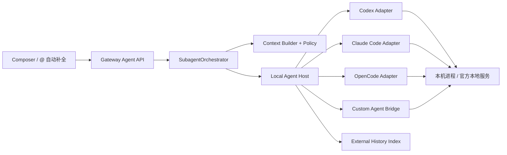

# EverRoom 本机 Agent 发现、`@` 历史会话引用与上下文查询简案

> 状态：Proposal
> 日期：2026-08-25
> 范围：Codex、Claude Code、OpenCode，以及用户自定义的本机 Agent

## 1. 结论

1. Codex、Claude Code、OpenCode 不应作为新的聊天后端直接接管 EverRoom 会话。用户始终与 Main Agent 对话；本机 Agent 的历史会话作为只读上下文子 Agent 被 Main 查询。
2. Composer 行首输入 `@` 用于搜索并引用一段已导入的 Agent 历史会话。Renderer 提交结构化 `referencedConversationId`；它不修改 `targetAgentId`、不切换 `activeAgentId`，也不 resume 被引用 Agent 的原生线程。
3. 上下文按“最小必要、结构化快照、显式授权”注入。默认只给任务正文、当前工作区、最近对话摘要和用户当前选中的文档/附件，不复制全部主会话，也不自动注入其他已导入聊天。
4. 本机聊天记录可以自动发现和建立只读索引，但“导入用于浏览”和“授权给某次调用”是两件事。只有当前映射会话或用户明确选择的历史才进入上下文。

## 2. 总体架构



- Renderer 只负责 mention 交互，不拼接系统 Prompt，也不执行本机命令。
- Gateway 继续负责 Agent 注册、权限、Invocation、父子关系、取消、超时和审计。
- Local Agent Host 负责进程发现、协议适配和事件归一化。长期应是独立进程；MVP 可先作为 Desktop Main 的受控服务实现。
- Provider Adapter 把不同 Agent 的线程、流式事件、审批和取消转换成统一协议。

统一接口建议如下：

```ts
interface LocalAgentAdapter {
  detect(): Promise<DetectedInstallation[]>
  getCapabilities(installationId: string): Promise<LocalAgentCapabilities>
  listThreads(cursor?: string): Promise<ExternalThreadPage>
  readThread(threadId: string, cursor?: string): Promise<ExternalMessagePage>
  invoke(input: LocalAgentInvocationInput): Promise<LocalAgentRun>
  cancel(runId: string): Promise<void>
}
```

接入优先级固定为：官方本地 daemon / SDK / API > CLI 的 JSON 流协议 > 只读解析本地历史文件。不要抓取 TUI 文本，也不要把某个版本的私有 SQLite/JSONL 格式当成稳定调用协议。

## 3. 自动发现和用户自定义

### 3.1 自动发现

启动后和用户点击“重新扫描”时执行：

1. 在 Desktop Main 获取登录 Shell 的 `PATH`，按已知可执行文件名查找候选项。
2. 对真实路径去重，并以无交互、短超时的 `--version` 或 provider probe 验证。
3. 检查已知配置目录，仅用于判断“可能存在历史”；目录存在不等于 Agent 可调用。
4. 保存安装记录：`provider`、`executablePath`、`version`、`capabilities`、`lastSeenAt` 和 `status`。
5. 新发现的 Agent 默认显示为“待启用”。用户确认工作目录和权限模式后才可被 `@` 调用。

所有进程都使用 `executable + args[]` 直接启动，禁止经过 Shell，避免 alias、命令替换和参数注入。每次启动还要设置超时、输出上限和允许继承的环境变量白名单。

### 3.2 自定义本机 Agent

提供两种自定义方式：

- **别名配置**：用户给已发现的安装创建多个 Profile，例如 `@codex-review`、`@codex-readonly`，分别绑定模型、工作目录规则和权限策略。
- **自定义 Bridge**：任意 Agent 实现 `everroom-local-agent/1` 的 stdio NDJSON 协议，并通过 `everroom-agent.json` 注册。协议至少提供 `capabilities`、`invoke`、`cancel`，可选提供 `threads.list` 和 `threads.read`。

不要在首版支持用户填写任意“命令模板 + 正则解析输出”。这种方式无法可靠处理转义、流式事件、取消、审批和历史版本差异。

## 4. `@` 的历史引用语义

### 4.1 路由规则

- Composer 输入开头的 `@` 触发历史会话 Picker；选中后生成“已引用会话”上下文条，并保存稳定 `referencedConversationId`。
- 每条消息最多引用一段历史会话；正文中的普通 `@名字` 不参与路由。
- 无论是否存在引用，请求都发送给 `main`。Gateway 仅把引用 ID 放入当前 Main run 的受控上下文，不直接注入整段历史。
- Main 在需要理解“这版”“之前的实现”等指代时调用 `agent_conversation_query`。该工具只能查询本轮引用的会话，不能自行选择其他 thread；查询结果返回 Main，由 Main 直接回复用户。

```text
用户 -> @历史会话 + 任务
     -> Gateway 创建 Main Run（referencedConversationId）
     -> Main 判断是否需要补齐上下文
     -> agent_conversation_query（只读历史子 Agent）
     -> 历史片段返回 Main
     -> Main 回复用户
```

因此，被 `@` 的对象是供 Main 调用的上下文子 Agent，而不是新的对话对象。界面不显示“当前 Agent”切换状态，历史会话也不会直接产生面向用户的回答。

如果主 Agent 在普通对话中主动委派独立任务，仍使用现有 `agent_catalog` / `agent_dispatch`。`@` 历史查询是另一条只读上下文路径，不创建外部本机 Agent run。

### 4.2 会话连续性

每次引用只作用于当前 Main run：

- `referencedConversationId` 不写入会话的 `activeAgentId`，不改变标题，也不建立原生 thread 映射。
- 同一个 EverRoom 会话可在不同轮次引用不同历史；每轮工具只能访问该轮显式选择的 thread。
- 引用条在消息发送或切换 EverRoom 会话后清除，避免后续消息意外继承。

## 5. 上下文如何自动注入

### 5.1 Context Bundle

Gateway 在调度前生成不可变 `ContextBundle`：

```ts
interface ContextBundle {
  task: { originalText: string }
  conversation: {
    summary?: string
    recentTurns: Array<{ role: "user" | "assistant"; text: string }>
    afterMessageId?: string
  }
  workspace?: { root: string; repo?: string; branch?: string }
  resources: Array<{
    type: "document" | "selection" | "attachment" | "room" | "external_thread"
    id: string
    title?: string
    content?: string
  }>
  grant: {
    permissions: Array<"read" | "propose_write" | "execute">
    expiresAt: string
  }
  provenance: Array<{ source: string; id: string; digest: string }>
}
```

默认注入规则：

1. 原样任务正文，去掉路由 mention。
2. 最近 6 至 10 个对话 turn；超出预算时使用已有会话摘要。
3. 当前 active document、选区、附件和明确选中的 Room 资源。
4. 编码 Agent 才注入当前 workspace root、仓库和分支；不自动暴露其他目录。
5. 仅注入本次 `ContextGrant` 允许的内容。历史消息里的路径或资源 ID 不构成授权。

不要默认注入全部 EverRoom 会话、Memory、Knowledge 或所有外部聊天历史。相关内容应由 Gateway 先检索，再把少量带来源片段加入 `resources`。

### 5.2 Fresh 与 Resume

- **Fresh thread**：发送完整的本次 Context Bundle。
- **Resume thread**：只发送上次 watermark 之后的新 turn、资源变更和本次任务，避免上下文重复。
- 保存 `contextDigest`、`lastParentMessageId` 和注入清单，便于重试、审计和去重。
- Provider 支持独立 system/developer context 时分层传递；只支持单 Prompt 时，由 Adapter 使用固定 envelope 编码，并明确把历史和文档标记为不可信数据。

外部 Agent 自己可能从工作区读取文件，因此 Prompt 授权不是完整安全边界。Local Agent Host 还必须用进程级工作目录、sandbox/approval 参数和文件系统范围落实权限；默认 Profile 建议为只读或“写入需审批”。

## 6. 聊天记录导入

导入采用“只读镜像 + 增量同步”，不把外部消息伪装成 EverRoom 原生消息：

```text
external_agent_threads
  provider, installation_id, external_thread_id, title, workspace, timestamps, sync_cursor

external_agent_messages
  thread_id, external_message_id, role, content, tool_summary, created_at, content_digest
```

同步策略：

1. 优先调用 Provider 的线程列表和读取 API。
2. 没有 API 时，使用按 provider 版本维护的只读 importer；解析失败只标记该记录，不阻塞启动。
3. 以 `(installationId, externalThreadId, externalMessageId)` 幂等写入；没有稳定 message ID 时使用内容摘要去重。
4. 删除 EverRoom 镜像不删除 Provider 原始历史；外部记录消失时标记 `unavailable`，不立即级联删除。
5. 初次扫描只导入元数据和摘要，用户打开时再分页读取正文，避免启动时读取大量私密内容。
6. 设置中提供按 Provider 的导入开关、目录说明、最近同步时间和“清除本地索引”。

导入的历史可以用于浏览、搜索和显式引用，但不会自动混入每一次 Main Agent 的 Prompt。

## 7. 对现有实现的最小改造

当前已有 `SubagentRegistry`、`SubagentOrchestrator`、`SubagentRuntimeManager` 和 `agent_dispatch`，可以沿用。最小增量为：

1. `agent-contract`：为 run context 增加 `referencedConversationId`。
2. Gateway：增加 `agent_conversation_query`，并把引用 ID 限定在当前 Main runtime run。
3. Data Migration：提供不绑定、不改标题的只读历史检索入口。
4. Renderer：把 `@` Picker 改为历史会话搜索，并用“已引用会话”上下文条替代“当前 Agent”身份条。
5. 保留 `/continue` 作为兼容入口，但其结果也按一次性引用处理。

## 8. MVP 范围与验收

建议分两步：

**MVP 1：可发现、可 `@` 引用、可审计**

- 自动发现并导入 Codex、Claude Code、OpenCode 的历史会话。
- 支持 `@` 搜索历史、一次性引用和引用移除。
- Main 可按当前任务通过 `agent_conversation_query` 查询被引用会话。
- 被引用 Agent 不直接输出消息，也不改变当前 Main 会话身份。

**MVP 2：历史与自定义**

- 增加三类 Provider 的增量历史索引。
- 增加历史增量同步和更细粒度的消息区间引用。
- 发布 `everroom-local-agent/1` Bridge 协议与示例 Adapter。
- 增加写入审批、崩溃恢复和 Agent Host 隔离。

验收标准：

- `@` 选择后请求仍必定路由到 Main，`activeAgentId` 保持 `main`。
- Main 的查询工具只能读取本轮显式选择的稳定 thread ID。
- 同一 EverRoom 会话可逐轮更换引用，历史不会永久绑定或串线。
- Run 可复现任务、引用 ID、查询和最终结果。
- 未获授权的 Room、文档、目录及其他外部历史不会进入 Prompt 或可读范围。
- 导入和清除索引不会修改或删除 Provider 原始聊天记录。
