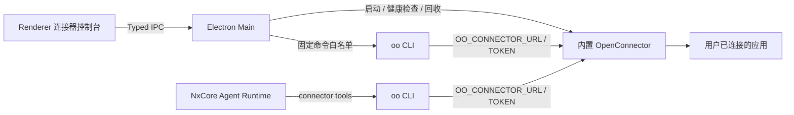

# OpenConnector 桌面端集成

EverRoom 随桌面发行包分发并托管 OpenConnector，通过 `oo` CLI 在 Agent 与本地网关之间建立统一桥接。默认安装后直接可用：不依赖 Docker、不在用户启动时下载代码，也不要求手工启动服务或配置 Token。渲染进程不持有 Runtime Token，也不能提交任意 CLI 参数。

本文描述当前桌面集成和运行基线。下一阶段将把 Agent 直接调用 `search/schema/apps/run` 的方式收口为 `connector_prepare` + `connector_execute(planId)`，并通过不可变 Plan、Provider Adapter 和 Completion Gate 约束 Action 选择、参数构造与失败恢复。完整方案见 [Connector 确定性编排与 Agent 完成门设计](./connector-orchestration-design.zh-CN.md)。

## 架构



主进程的 `OpenConnectorSupervisor` 先启动内置服务并通过 `/v1/health` 等待就绪，再把连接信息注入桌面 CLI bridge 和 NxCore Gateway。主进程提供 `search`、`schema`、`run`、`apps` 四类调用；Gateway 为 Pi Agent 提供 `connector_search`、`connector_schema`、`connector_apps`、`connector_run` 工具。`connector_run` 在真正执行前强制读取 Action Schema 和当前服务连接：不存在的 Action、空连接、不可用连接或猜测出的连接名都不会进入执行阶段；单连接或默认连接会使用 `connector_apps` 返回的真实 `connectionName`。两条路径使用相同的 CLI 契约和独立的 EverRoom 数据目录，不写用户全局 `connector.toml`。

## 默认启动与生命周期

1. Electron 窗口先显示，连接器页面进入“正在启动本地网关”状态。
2. Supervisor 从发行包 `resources/open-connector` 启动 OpenConnector，并强制绑定 `127.0.0.1`。
3. 首次启动生成 encryption key、Admin Token、Runtime Token；优先使用端口 `3000`，被占用时自动选择并持久化其他回环端口。
4. 鉴权健康检查通过后创建 `oo` bridge，并将同一组 URL/Runtime Token 注入 NxCore Gateway，Agent 工具随即就绪。
5. EverRoom 退出时先终止 CLI 子进程，再回收 OpenConnector sidecar。

托管 sidecar 会优先使用显式的 `HTTP_PROXY` / `HTTPS_PROXY` / `ALL_PROXY`；未配置环境变量时，通过 Electron 读取桌面系统代理，并自动为 Node/Undici 启用代理支持。`127.0.0.1`、`localhost`、`::1` 始终加入 `NO_PROXY`，避免本地健康检查和 CLI 调用绕到代理。OAuth Token 交换与后续第三方 API 请求因此遵循桌面网络环境。

持久数据位于：

```text
<EverRoom userData>/open-connector/
  managed-runtime.json  # 0600，密钥与选定端口
  runtime-data/         # 0700，连接器账号与 SQLite 数据
  oo-config/
  oo-data/
```

OpenConnector 启动失败不会阻止 EverRoom 其他功能启动；连接器页面会显示错误，Agent 不注册连接器工具。

## Agent 失败恢复

连接器工具失败会附带结构化恢复策略，包括错误类别、是否可恢复、推荐工具和单轮恢复预算。Pi Runtime 在可恢复失败后向当前运行注入内部 steering 指令，要求 Agent 立即执行推荐工具并继续原始请求；相同“工具 + 错误类别 + 目标”默认只自动恢复一次，最多不超过三次，避免无限循环。

- Action 或元数据不存在：回到 `connector_search`。
- 输入校验失败：回到 `connector_schema`。
- 连接名不存在或存在歧义：回到 `connector_apps`。
- Search、Schema、Apps 的临时网络错误：原步骤有限重试一次。
- OAuth 失效、缺少权限或没有活动连接：停止重试并要求用户处理授权。
- Action 执行阶段网络超时：不自动重试，因为外部副作用可能已经发生，状态不确定。

`tool.failed` 事件会保留 `failure.category`、`failure.recoverable`、`failure.recommendedTool`、`failure.recoveryAttempt` 和 `failure.maxAttempts`，便于 Renderer 展示与日志排查。

## 外部网关模式

只有明确关闭托管模式时，EverRoom 才不会启动内置服务：

```dotenv
NXCORE_CLI_CONNECTOR_MANAGED=false
NXCORE_CLI_CONNECTOR_URL=https://connector.example.com
NXCORE_CLI_CONNECTOR_RUNTIME_TOKEN=<runtime-token>
```

远程地址必须使用 HTTPS；HTTP 只允许 `localhost`、`127.0.0.1` 或 `::1`。外部模式的 Web 管理台使用系统浏览器打开，EverRoom 不保存或注入 Admin Token。

EverRoom 自身只接受 `NXCORE_CLI_CONNECTOR_*` 配置。调用 `oo` 子进程时，桥接层会在内部转换为以下 `oo` 原生环境变量；这些 `OO_*` 变量不是 EverRoom 的配置入口：

- `OO_CONNECTOR_URL`
- `OO_CONNECTOR_TOKEN`
- `OO_CONFIG_DIR=<EverRoom userData>/open-connector/oo-config`
- `OO_DATA_DIR=<EverRoom userData>/open-connector/oo-data`

打开侧栏“连接器”页面即可检查 Gateway/CLI 状态、搜索 Action、查看 Schema、选择连接、校验参数并执行。

本地托管模式的“Web 管理台”使用独立 Electron session 打开。主进程只对精确匹配的本地 OpenConnector origin 注入 Admin Bearer Token；跨域导航和弹窗交给系统浏览器，Token 不进入 Renderer JavaScript。

## 安全边界

- Token 只存在 Electron 主进程和 Gateway 子进程环境，不通过 IPC 返回。
- OpenConnector 仅监听回环地址；托管配置文件权限为 `0600`，数据目录权限为 `0700`。
- CLI 使用 `spawn(executable, args, { shell: false })`，Renderer 只能选择固定命令类型。
- Service/Action 使用标识符白名单，Action 输入限制为 JSON 对象且最大 256 KiB。
- 单次命令默认超时 120 秒，stdout/stderr 合计限制 4 MiB，并支持取消。
- 控制台日志将 `--data` 参数显示为 `<json>`，不回显 Action 输入。
- 远程 Gateway 必须使用 HTTPS；明文 HTTP 只用于本机回环地址。

## 打包

`pnpm dev` 与 `pnpm package:mac` 会在启动或打包前准备两项固定版本资源：

- `@oomol-lab/open-connector@1.3.5`，固定到 commit `5719a69468c698c7cb8108e062ff64ecef8a2e65`，预先生成 Catalog、构建 Web Console，并裁剪为 production runtime。
- `@oomol-lab/oo-cli@1.7.5`，复制当前平台二进制。

发行包布局：

```text
resources/open-connector/
resources/oo/<platform>-<arch>/oo[.exe]
```

Electron Builder 将它们作为 `extraResources` 分发。运行时不执行 npm install，也不访问 GitHub；CLI 优先解析随包二进制，再回退到 `PATH`，`NXCORE_CLI_CONNECTOR_CLI_PATH` 仅用于开发覆盖。跨平台发布流水线需要分别在目标平台准备 `oo` 二进制。
