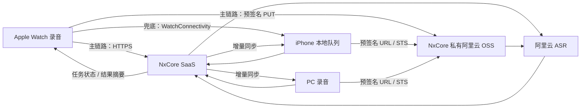
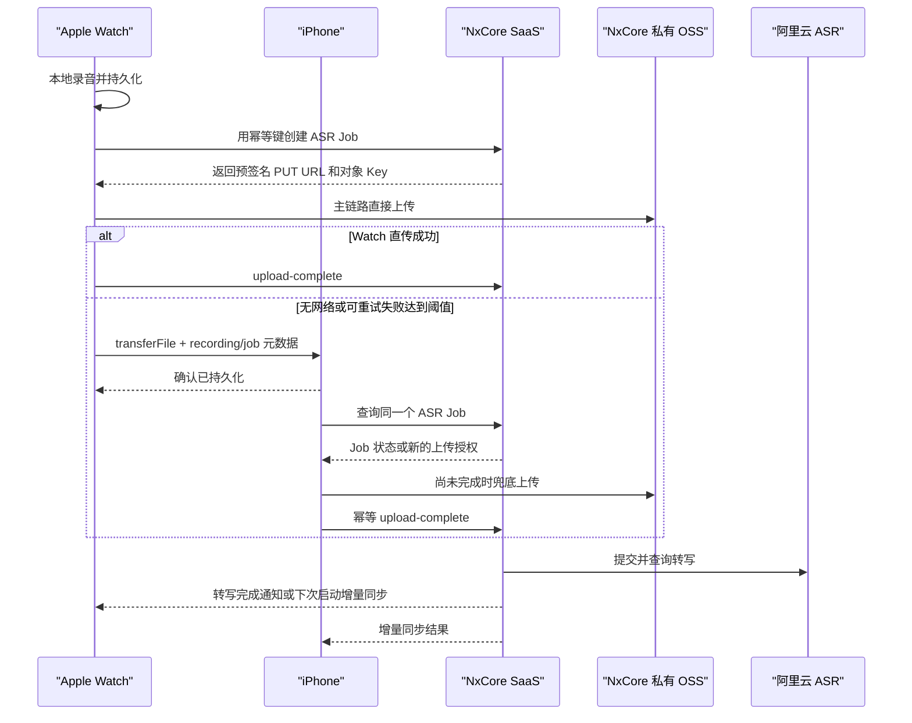

# NxCore PC、iOS 与 Apple Watch 转写方案

状态：方案草案  
目标：让用户在 PC、iPhone 和 Apple Watch 上可靠录音，并通过同一账号完成云端转写与跨端同步。  
依赖：[SaaS 后端与管理端方案](./saas-platform-plan.md)中定义的账号、订阅、ASR 和同步服务。  
官方能力核对：2026-08-15。

## 1. 产品目标

用户可以：

- 在 PC、iPhone 或 Apple Watch 发起录音。
- 录音结束后自动或手动提交转写。
- 在设备离线、应用被挂起或网络切换后继续恢复上传。
- 在任意已登录设备查看统一的任务状态和转写结果。
- 查看带时间轴和说话人区分的文本。
- 编辑标题、正文和标签，并同步到其他设备。
- 删除云端转写结果，并选择是否删除本地音频。

第一版不要求设备间实时共享录音流，也不要求边录边出字。

## 2. 核心决策

- 不使用 FRP。
- 音频从产生录音的客户端直接上传 NxCore 私有阿里云 OSS。
- 长期阿里云凭据只存在 NxCore SaaS。
- Apple Watch 优先独立联网直传；失败或当前无可用网络时，通过 WatchConnectivity 交给 iPhone 中继上传。
- PC、iOS 和 Watch 都使用同一套云端 ASR API 和幂等任务协议。
- SaaS 保存标准化转写结果，设备通过增量同步获取。
- 原始音频默认保存在录制设备本地，只在 NxCore 私有 OSS 中短期存在，不经过 NxCore API 服务器。

## 3. 总体链路



PC 关机不会阻止 iPhone 或 Watch 任务完成。Watch 到 iPhone 的连接只作为失败兜底，不是正常任务的必经路径。

## 4. 统一领域模型

### 4.1 Recording

Recording 表示一份本地录音资产：

```text
id
owner_user_id
origin_device_id
origin_platform          desktop | ios | watch
local_file_url
file_name
mime_type
file_size
content_hash
duration_ms
recorded_at
state
linked_asr_job_id
```

`local_file_url` 永远只存在本地数据库，不能同步成其他设备可访问的系统路径。

### 4.2 ASR Job

ASR Job 表示云端转写任务：

```text
id
recording_id
origin_device_id
status
upload_progress
language_hints
diarization_enabled
provider_task_id
estimated_duration_ms
actual_duration_ms
error_code
created_at
completed_at
```

### 4.3 Transcript

Transcript 是可跨端同步的用户数据：

```text
id
asr_job_id
title
raw_transcript
edited_transcript
segments
speakers
tags
revision
updated_by_device_id
created_at
updated_at
```

供应商原始文本和用户编辑文本分开保存，重新转写时不会覆盖用户修改。

## 5. 统一客户端状态机

```text
recording
  -> recorded
  -> hashing
  -> awaiting_policy
  -> uploading
  -> uploaded
  -> transcribing
  -> completed

可恢复状态
  -> paused | waiting_for_network | handing_off_to_phone | waiting_for_phone

终止状态
  -> failed | cancelled | deleted
```

原则：

- 每个状态持久化，不能只保存在 UI 内存中。
- 应用重启后扫描非终态任务并恢复。
- 上传使用幂等任务 ID 和内容哈希。
- 网络错误进入退避重试，不立即标记永久失败。
- 用户取消录音、取消上传和删除转写是不同操作。

## 6. PC 方案

### 6.1 适用平台

当前优先 macOS，后续可以扩展 Windows。录音逻辑应隔离成平台能力层，不放入 React Renderer。

建议边界：

```text
Electron Renderer
  -> Typed Preload API
  -> Electron Main Recording Service
  -> 本地录音文件与任务队列
  -> Cloud ASR Client
```

Renderer 只控制开始、暂停、停止和展示状态，不直接取得云端密钥或任意文件系统权限。

### 6.2 录音类型

MVP：

- 麦克风录音。
- 用户选择已有音频文件进行转写。

后续：

- 系统音频与麦克风混合录制。
- 会议软件音频捕获。
- 长录音分段和实时转写。

macOS 系统音频涉及额外系统权限和不同版本 API，建议与麦克风录音分阶段实施。

### 6.3 文件与队列

录音先写入应用数据目录的临时文件，停止后完成封装并计算 SHA-256。建议：

- 默认格式：M4A/AAC。
- 语音场景：单声道，16 kHz 或供应商推荐采样率。
- 文件名使用 UUID，不使用用户输入标题作为真实文件名。
- 元数据和上传状态存入本地 SQLite。
- 成功上传不立即删除本地文件，遵循用户保留设置。

长录音优先使用供应商支持的文件转写，而不是把整个文件读进内存。

### 6.4 PC 流程

1. 请求麦克风权限。
2. 创建本地 Recording 和临时文件。
3. 停止后完成文件、计算时长与哈希。
4. 向 SaaS 创建 ASR Job 并预占额度。
5. 获取自有 OSS 的短期上传授权和固定对象 Key。
6. PC 直接上传 NxCore 私有阿里云 OSS。
7. 通知 SaaS 上传完成。
8. 通过 WebSocket 或轮询展示任务状态。
9. 完成后把 Transcript 同步进本地 SQLite。

### 6.5 现有代码演进

当前本地 Gateway 的 ASR 模块接受 `recordings` 目录中的文件路径，并由本地 Provider 完成上传、提交和轮询。建议保留为 BYOK 路径，同时新增 Hosted 路径：

```text
LocalAliyunProvider    用户自己的 Key，本地直连
NxCoreHostedProvider  调用 SaaS 创建任务和获取结果
```

Hosted Provider 不应接收 SaaS 的阿里云长期 Key，只接收短期上传授权、固定对象 Key 和 NxCore Job ID。

## 7. iOS 方案

### 7.1 客户端模块

```text
Authentication        登录、Token 刷新、设备注册
Recording             AVAudioSession 与录音生命周期
UploadQueue           后台上传和断点恢复
ASRJobs               任务状态与失败处理
SyncEngine            游标同步与本地数据库
WatchBridge           WatchConnectivity 消息与文件接收
```

### 7.2 录音

- 使用 `AVAudioSession` 配置录音场景。
- 使用 `AVAudioRecorder` 完成 MVP；需要波形或实时处理时再使用 `AVAudioEngine`。
- 明确请求麦克风权限并提供用途说明。
- 录音期间显示系统要求的可感知状态。
- 来电、音频路由变化和系统中断时保存当前状态。
- 每次录音先落本地文件，再进入上传队列。

不要依赖录音结束后应用仍在前台。上传任务必须能够在系统允许的后台时段继续，并在下次启动恢复。

### 7.3 上传

- 使用后台 `URLSession` 执行大文件上传。
- 上传授权过期时重新向 SaaS 申请，不复用旧签名或凭证。
- 网络从 Wi-Fi 切到蜂窝网络时保持可恢复。
- 提供“仅 Wi-Fi 上传”设置。
- 上传前检查 Job 是否仍有效、额度是否仍被预占。
- 上传完成后由客户端显式调用 `upload-complete`。

生产环境使用 NxCore 私有 OSS。普通录音优先使用预签名 PUT URL；需要分片或更强断点能力时再使用限权 STS 凭证。应在 PoC 阶段验证阿里云 OSS iOS SDK 与后台 `URLSession` 的恢复行为；即使需要更换客户端上传实现，也不能改成经过 NxCore API 服务器转发音频。

### 7.4 本地数据

iOS 使用本地数据库保存：

- Recording 元数据。
- 非终态 ASR Job。
- Transcript 最新快照。
- 同步游标和待提交 Mutation。
- Watch 文件接收状态。

云端是跨设备结果的同步来源，本地数据库是离线 UI 的读取来源。

## 8. Apple Watch 方案

### 8.1 推荐边界

Apple Watch 是能够独立联网的 SaaS 客户端，负责录音、创建设备会话、创建 ASR Job 和优先直传音频。iPhone 同时承担完整编辑体验和失败时的中继上传。

双链路设计：

- 主链路：Watch 使用设备会话访问 NxCore SaaS，获取绑定单个对象的预签名 PUT URL，再通过系统 `URLSession` 直接上传 OSS，不依赖 OSS SDK。
- 兜底链路：主链路在明确的可重试网络错误后仍未完成，Watch 使用 `WCSession.transferFile` 把录音交给 iPhone。
- 两条链路共享相同的 `recording_id`、`content_hash`、`asr_job_id` 和幂等键。
- iPhone 收到文件后先查询云端 Job，只有 Job 尚未上传完成时才继续上传。
- 服务端以条件更新接受第一个校验成功的上传，后到链路停止，不能重复提交 ASR 或重复扣费。

Watch 可以使用 Wi-Fi、蜂窝网络或系统选择的可用路径访问 HTTPS，但后台调度、功耗和网络状态仍受 watchOS 管理，因此独立直传不能成为唯一链路。

### 8.2 Watch 流程



### 8.3 Watch 本地队列

每条录音至少记录：

- 本地 UUID。
- 文件 URL。
- 创建时间和时长。
- 内容哈希和云端 Job ID。
- Watch 直传尝试次数、最后错误和上传授权有效期。
- 是否进入 iPhone 兜底链路。
- WatchConnectivity Transfer ID。
- iPhone 确认时间。

Watch 只有在云端确认上传完成，或 iPhone 明确确认文件已经持久化后，才能根据保留策略删除本地文件。`transferFile` 的调度时机由系统决定，因此进入兜底链路后 UI 应展示“等待手机接收”，不能承诺立即开始转写。

兜底只处理网络和执行时间不足等可重试问题。额度不足、账号失效、不支持的格式或文件损坏属于业务错误，不应把文件转给 iPhone 后盲目重试。

### 8.4 无配对手机场景

没有可用 iPhone 时，Watch 仍然优先尝试独立直传。若当前也没有可用网络：

- 录音保留在 Watch。
- 展示等待网络状态。
- 网络恢复后重新申请过期的预签名 URL 并直传。
- 后续发现 iPhone 可达时也可以进入兜底移交。

Watch 使用设备级 Refresh Token，不在小屏幕上实现复杂登录。首次绑定由 iPhone 或 Web 登录确认，Watch 将设备凭据保存在 Keychain，并独立刷新短期 Access Token。

### 8.5 Apple 官方能力依据

Apple 官方资料确认 watchOS 可以使用 URLSession 与服务器通信，并提供后台 URLSession 任务；WatchConnectivity 则用于与配对 iPhone 交换数据和传输文件。因此双链路在平台能力上成立，但调度时机不能由应用完全控制。

- [There and back again: Data transfer on Apple Watch](https://developer.apple.com/videos/play/wwdc2021/10003/)
- [Transferring data with Watch Connectivity](https://developer.apple.com/documentation/watchconnectivity/transferring-data-with-watch-connectivity)
- [SwiftUI URLSession background task](https://developer.apple.com/documentation/swiftui/backgroundtask/urlsession)
- [Keeping your watchOS app's content up to date](https://developer.apple.com/documentation/watchOS-Apps/keeping-your-watchos-app-s-content-up-to-date)

## 9. ASR 请求协议

### 9.1 创建任务

```http
POST /v1/asr/jobs
Idempotency-Key: <uuid>
Authorization: Bearer <access-token>
```

```json
{
  "recordingId": "local-recording-uuid",
  "originPlatform": "ios",
  "fileName": "recording.m4a",
  "mimeType": "audio/mp4",
  "fileSize": 1234567,
  "contentHash": "sha256:...",
  "estimatedDurationMs": 180000,
  "languageHints": ["zh", "en"],
  "diarizationEnabled": true
}
```

服务端返回 Job、额度预占和上传状态。

### 9.2 获取上传授权

```http
POST /v1/asr/jobs/:id/upload-authorization
```

生产响应根据平台和文件大小选择上传模式：Watch 默认获得预签名 PUT URL；PC/iOS 可以获得预签名 URL，或在需要分片上传时获得限权 STS 字段。响应同时包含 Bucket、Endpoint、固定对象 Key、必须携带的请求头和过期时间。客户端不能自定义对象 Key，完成通知中的 Key 必须与服务端签发记录完全匹配。

DashScope 自带的 `getPolicy` 与 48 小时临时 `oss://` URL 只用于本地开发或封闭 PoC。阿里云官方明确不建议将其用于生产环境；生产使用自有 OSS + 预签名 URL，按需使用 STS 分片直传。

### 9.3 完成上传

```http
POST /v1/asr/jobs/:id/upload-complete
```

```json
{
  "objectKey": "issued/object/key",
  "contentHash": "sha256:...",
  "fileSize": 1234567
}
```

该接口幂等。SaaS 验证后异步提交阿里云任务。

## 10. 结果标准化

供应商结果不能原样成为产品协议。SaaS Worker 转换为稳定结构：

```json
{
  "transcript": "完整文本",
  "segments": [
    {
      "id": "segment-1",
      "text": "第一段内容",
      "beginTimeMs": 0,
      "endTimeMs": 3200,
      "speakerId": "speaker-1"
    }
  ],
  "speakers": [
    {
      "id": "speaker-1",
      "label": "说话人 1"
    }
  ],
  "language": "zh",
  "durationMs": 180000
}
```

供应商字段和状态不能越过 Provider 边界进入 PC/iOS/Watch UI。

## 11. 跨端同步与冲突

同步内容包括：

- ASR Job 状态。
- Transcript 和 Segments。
- 标题、标签、说话人名称。
- 删除 Tombstone。
- 用户编辑 Revision。

不直接同步：

- 设备本地绝对文件路径。
- 麦克风权限状态。
- 上传授权和访问 Token。
- 原始音频，除非用户主动开启云端音频保存。

冲突策略：

- ASR 原始结果由服务端单写。
- 标题和标签可采用字段级最后写入优先。
- 正文编辑提交 `base_revision`，冲突时保留双方版本并提示用户。
- 说话人重命名使用稳定 `speaker_id`。
- 重复提交依靠 Mutation 幂等键去重。

## 12. 失败与恢复

| 场景 | 行为 |
| --- | --- |
| 录音时应用中断 | 完成或修复临时文件，进入可恢复状态 |
| Watch 暂时找不到 iPhone | 保留本地文件并等待系统调度 |
| 上传授权过期 | 重新申请预签名 URL 或 STS 凭证后重试 |
| 上传中断 | 由后台队列恢复；无法续传时幂等重传 |
| SaaS 暂时不可用 | 本地排队，指数退避 |
| 阿里云提交失败 | Worker 重试，未成功计费则退回预占 |
| 转写失败 | 展示稳定错误码，并允许用户重新提交 |
| PC/iOS 长期离线 | 云端完成任务，设备上线后按游标补齐 |
| 用户额度不足 | 保留本地录音，允许升级或 BYOK |

错误信息应区分可重试、需用户操作和永久失败，不能只显示“转写失败”。

## 13. 权限与隐私

### PC

- 麦克风权限。
- 后续系统音频能力所需的系统权限。
- 本地录音目录访问限制。
- SaaS Token 和 BYOK Key 存入系统安全存储。

### iOS / Watch

- 麦克风用途说明。
- 明确的录音状态和停止入口。
- 后台能力只声明实际使用的模式。
- Watch 到 iPhone 的文件与确认消息使用随机 ID，不包含 Token。

### 云端

- 不代理原始音频流。
- 不在日志记录正文、Policy 或完整供应商响应。
- 转写结果支持删除和数据导出。
- 明确告知用户音频会发送给阿里云处理。
- 管理员默认无法查看录音和完整正文。

## 14. UI 最小范围

### PC / iOS

- 录音按钮、时长、暂停和停止。
- 本地录音列表。
- 上传和转写进度。
- 失败原因与重试。
- Transcript 阅读、搜索和编辑。
- 说话人重命名。
- 删除本地录音、删除云端结果两个独立操作。
- 本月额度和升级入口。

### Watch

- 开始、暂停、停止录音。
- 当前时长。
- Watch 直传、等待网络、转交手机、转写中、已完成、失败状态。
- 最近几条录音。
- 不在第一版实现完整 Transcript 编辑器。

## 15. 实施阶段

### Phase 1：PC 托管 ASR

- 复用现有录音和 ASR 领域模型。
- 实现 Hosted Provider 与 SaaS 任务 API。
- PC 直传阿里云。
- 云端结果同步回本地。

### Phase 2：iOS

- 登录、设备注册和本地数据库。
- iOS 录音与后台上传队列。
- Job 状态和 Transcript UI。
- 与 PC 双向增量同步。

### Phase 3：Apple Watch

- Watch 本地录音。
- Watch 设备登录、独立创建任务和 OSS 直传。
- WatchConnectivity 失败兜底与文件确认。
- 跨链路幂等、竞态终止和单次计费。
- Watch 简化状态同步。

### Phase 4：体验增强

- 系统音频与会议录制。
- 摘要、章节、行动项和关键词。
- 云端加密和可配置保留策略。
- 长音频分片、实时转写和多供应商容灾。

## 16. MVP 验收标准

- PC 和 iPhone 可以分别录制并提交同一账号下的任务。
- 原始音频不经过 NxCore API 服务器。
- 客户端不能获得阿里云长期 Key。
- 断网、应用重启和上传授权过期后可以恢复。
- Apple Watch 录音能在 iPhone 暂时不可达时安全保留。
- Apple Watch 有网络时可以不经过 iPhone 独立完成上传。
- Watch 独立直传失败时可以把同一任务移交 iPhone 上传。
- 两条 Watch 链路竞争时只产生一个供应商任务和一笔用量。
- Watch 文件只有在云端确认直传完成，或 iPhone 确认兜底文件已持久化后才能自动删除。
- 任一设备完成的转写可以在其他设备上线后同步。
- 重复请求不会重复提交任务或重复扣减额度。
- 用户能够分别删除本地录音和云端转写。

## 17. 需要尽早验证的技术点

1. OSS 预签名 PUT 与 STS 分片上传在 iOS/watchOS 后台 `URLSession` 下的恢复行为。
2. 阿里云返回的实际时长是否足够稳定地作为计费依据。
3. 长录音上传中断后的续传能力；不支持时的重传成本。
4. Watch 录音格式与阿里云模型支持范围。
5. Watch 独立上传的后台时间、蜂窝功耗、失败判定阈值和凭证刷新。
6. WatchConnectivity 在 iPhone 应用未运行时的文件到达和回执行为。
7. macOS 麦克风录音、系统音频录制的权限和签名要求。
8. `qwen-audio-3.0-asr-flash-filetrans` 读取私有 OSS 签名 URL 的区域、有效期和重试要求。
9. 用户编辑 Transcript 时的 revision 冲突体验。
