# 智能感知数据进入 Wiki 链路

## 目标

智能感知数据不新建一套 Wiki 写入逻辑，而是复用文件模块已经采用的统一理解引擎：先把源数据确定性转换为 Markdown，再经过策略、Room 路由和 Wiki ingest。

## 链路

```mermaid
flowchart LR
  A[智能感知 reality_events] -->|用户确认完成| B[RealityService]
  B -->|ref: reality-event| C[IngestService]
  C --> D[转成会议纪要 Markdown]
  D --> E[content hash + parsed_contents]
  E --> F[meeting-minutes 策略快照]
  F --> G[KnowledgeService.submitEnvelope]
  G --> H[实体抽取与 Room 路由]
  H --> I[Room Wiki raw/write]
  I --> J[KS ingest]
```

文件和智能感知从 `IngestService` 开始共用同一条下游链路：

| 阶段 | 文件 | 智能感知 |
| --- | --- | --- |
| 源引用 | `file` | `reality-event` |
| Markdown 生成 | 按扩展名转换 | transcript + insights 组装会议纪要 |
| 数据类型 | document / office-doc 等 | meeting-minutes |
| 幂等键 | sourceId + contentHash | sourceId + contentHash |
| Room/Wiki | 共用 Knowledge 路由和 KS ingest | 共用 Knowledge 路由和 KS ingest |

## 触发规则

1. ASR 完成但仍处于 `pending_confirmation` 时不入 Wiki，避免半成品污染知识库。
2. 用户确认后状态变为 `completed`，自动异步投递，不阻塞确认接口。
3. 已确认内容再次编辑转写，按新内容版本重新投递。
4. marker、important 等不改变 Wiki 正文的元数据更新不触发投递。
5. 已确认事件收到更高版本的同步结果时重新投递。
6. `POST /v1/reality/events/:id/knowledge-ingest` 提供人工补投；只接受完成态事件。

## Markdown 契约

智能感知转换器按固定顺序输出：标题、摘要、要点、决议、行动项、逐字稿。逐字稿优先使用带说话人和时间戳的 `transcriptSegments`，无分段时回退到 `transcript`。

转换产物写入 `parsed_contents`，`ingest_events` 记录源版本、内容指纹、策略快照、Memory 结果和 route job。Wiki 是否写入由 `meeting-minutes` 的生效策略决定，默认开启 Room、Wiki 和 Memory 三条链路。

## 幂等与失败处理

- 同一事件同一内容由 `sourceId + contentHash` 命中 ingest 台账后直接返回，不重复解析和扇出。
- 自动投递失败只记录 `reality knowledge ingest failed` 日志，不回滚现实事件确认状态。
- 手动补投复用相同幂等规则，可以安全重试。
- Room router 或 Wiki 未启用时不绕过策略直接写 KS；修复配置后用补投接口恢复。
- Wiki 下游任务继续沿用 `knowledge.route`、`knowledge.ingest` 的状态和重试机制。

## 边界

Reality 模块只决定何时投递并提供源 ID，不直接引用 KnowledgeService。bootstrap 注入适配器，避免 Reality、Ingest、Knowledge 之间形成环依赖。Markdown 转换、策略、台账、路由和 Wiki 写入仍由现有模块分别负责。
