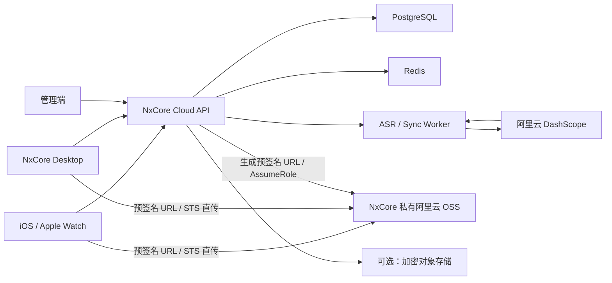

# NxCore SaaS 后端与管理端方案

状态：方案草案  
目标：为 NxCore/Everroom 增加统一账号、设备管理、订阅、ASR 任务管理和多端数据同步能力。  
适用范围：桌面端、iOS 客户端和 Apple Watch 配套能力。  
官方能力核对：2026-08-15。

## 1. 结论

第一版采用中心化 SaaS 架构，不引入 FRP：

- SaaS 负责账号、设备、订阅、额度、ASR 任务和同步。
- 音频通过 SaaS 签发的预签名 PUT URL 或限权 STS 凭证直传 NxCore 的阿里云 OSS，不经过 NxCore API 服务器。
- 阿里云长期密钥只保存在 SaaS 服务端。
- SaaS 服务端提交和查询 ASR 任务，并保存标准化后的转写结果。
- PC、iOS、Apple Watch 通过 HTTPS 增量同步，通过 WebSocket 或推送接收变更通知。
- 原始音频只在专用私有 OSS Bucket 中短期保存，ASR 完成或过期后由生命周期规则删除。

该方案优先保证实现简单、设备离线可恢复和可计费性。远程调用用户电脑上的本地 Agent 不属于本阶段目标。

## 2. 与现有项目的关系

现有项目由 Electron 桌面端和本地 Fastify Gateway 组成，数据默认保存在本机 SQLite 与内容对象目录中。现有 Gateway Bearer Token 是 Electron 主进程和本机 Gateway 之间的临时凭据，不能作为 SaaS 用户登录凭据。

保留现有边界：

- `apps/desktop`：桌面 UI、系统权限、录音和本地数据展示。
- `apps/gateway`：本地 Agent、本地数据与离线能力。
- `apps/gateway/src/modules/asr`：保留 Provider 抽象和 BYOK 模式。

新增边界：

```text
apps/
  cloud-api/          SaaS API 与后台任务
  admin-web/          运营管理端

packages/
  cloud-contract/     SaaS API 类型与错误码
  auth-client/        登录、令牌刷新和设备注册客户端
  sync-contract/      多端同步协议和领域事件
```

桌面端同时持有两种不同凭据：

- SaaS Session：代表用户和设备，用于访问云端。
- Local Gateway Token：代表当前 Electron 进程，用于访问本机 Gateway。

两种 Token 不互换、不复用。

## 3. 总体架构



建议技术栈：

| 模块 | 建议 |
| --- | --- |
| Cloud API | Node.js 22、Fastify、TypeBox |
| 数据库 | PostgreSQL、Drizzle ORM |
| 缓存与任务 | Redis，初期可用 BullMQ |
| 管理端 | React、TypeScript |
| ASR 临时存储 | NxCore 私有阿里云 OSS Bucket，短生命周期 |
| 业务对象存储 | S3 兼容服务，仅存可选附件或密文 |
| 部署 | 容器化 API 与 Worker，托管 PostgreSQL/Redis |
| 监控 | OpenTelemetry、结构化日志、错误追踪 |

## 4. 服务边界

第一版可以采用模块化单体，不必提前拆微服务：

```text
cloud-api
  auth             登录、刷新、注销、验证码
  users            用户资料与注销流程
  devices          设备注册、密钥和远程下线
  subscriptions    套餐、权益和支付状态
  usage            ASR 用量预占、结算和退回
  asr              上传凭证、任务提交、状态与结果
  sync             变更日志、游标、拉取与确认
  admin            管理员 RBAC 和审计

cloud-worker
  asr-submit       提交阿里云任务
  asr-poll         查询任务并标准化结果
  cleanup          清理过期上传和临时结果
  notifications    APNs、WebSocket 事件
```

API 和 Worker 共用领域代码与 PostgreSQL，但独立进程部署。

## 5. 账号与设备体系

### 5.1 登录方式

MVP 推荐：

- 手机号验证码登录，或邮箱验证码登录。
- iOS 登录后将 Refresh Token 存入 Keychain。
- PC 使用系统浏览器完成登录回调。
- 可选：PC 展示二维码，由已登录手机确认设备绑定。
- 管理员使用独立登录入口，并强制 MFA。

### 5.2 会话模型

- Access Token：短期有效，例如 10 至 15 分钟。
- Refresh Token：按设备签发、轮换使用、服务端保存哈希。
- 每台设备拥有独立 `device_id` 和密钥对。
- 用户可以查看设备最后在线时间并单独撤销设备。
- 修改密码、账号冻结或风险事件可以撤销全部会话。

### 5.3 核心表

```text
users
user_identities
devices
device_keys
sessions
login_challenges
organizations             后续团队版使用
organization_memberships
admin_users
admin_roles
admin_audit_logs
```

所有业务表必须显式包含 `user_id` 或 `organization_id`，Repository 层禁止无租户条件查询。

## 6. 简单订阅方案

第一版只定义两档，具体分钟数在阿里云成本压测后确定：

| 套餐 | 权益 |
| --- | --- |
| Free | 少量月度 ASR 体验额度、有限设备数 |
| Pro | 较高月度 ASR 额度、更多设备、跨端同步 |

后续可增加分钟包和团队套餐。MVP 不建议一开始实现复杂的按量后付费。

### 6.1 权益模型

```text
plans
plan_entitlements
subscriptions
subscription_events
usage_ledger
usage_reservations
```

典型权益：

- `asr_seconds_per_period`
- `asr_concurrent_jobs`
- `max_devices`
- `sync_retention_days`
- `encrypted_attachment_bytes`

### 6.2 ASR 计费原则

1. 创建任务时按客户端预计时长预占额度。
2. 上传完成后验证文件元数据并提交任务。
3. 成功后按可信的实际时长结算。
4. 任务失败、取消或上传过期时释放预占。
5. 所有额度变化写入不可变 `usage_ledger`。
6. 以秒为内部计量单位，UI 可以换算为分钟。

不能只维护一个可覆盖的 `used_minutes` 字段，否则退款、补偿、重试和财务对账难以审计。

### 6.3 BYOK

桌面端可以保留用户自带阿里云 Key 的本地模式：

- 请求直接由本地 Gateway 发起。
- 不消耗 NxCore 托管 ASR 额度。
- Key 只保存在系统安全存储中。
- BYOK 任务可选择只保存在本地，不进入 SaaS。

## 7. ASR 云端任务

### 7.1 推荐状态机

```text
created
  -> awaiting_upload
  -> uploaded
  -> queued
  -> submitting
  -> transcribing
  -> completed

任意非终态
  -> failed | cancelled | expired
```

每次状态变化记录时间、原因和操作者。任务提交必须支持幂等键，避免客户端重试产生重复计费。

### 7.2 数据模型

```text
asr_jobs
  id
  user_id
  source_device_id
  idempotency_key
  provider
  provider_task_id
  status
  file_name
  mime_type
  file_size
  content_hash
  estimated_duration_ms
  actual_duration_ms
  language_hints
  diarization_enabled
  error_code
  error_message
  created_at
  completed_at

asr_results
  job_id
  revision
  transcript
  segments_json
  speakers_json
  provider_payload_ref
  created_at

asr_uploads
  job_id
  bucket
  object_key
  upload_mode
  credential_expires_at
  uploaded_at
  verified_at
```

`provider_payload_ref` 只用于短期排障，不能无限期保存完整供应商响应。

### 7.3 API 草案

```text
POST   /v1/asr/jobs
POST   /v1/asr/jobs/:id/upload-authorization
POST   /v1/asr/jobs/:id/upload-complete
GET    /v1/asr/jobs/:id
GET    /v1/asr/jobs
POST   /v1/asr/jobs/:id/cancel
GET    /v1/asr/jobs/:id/result
DELETE /v1/asr/jobs/:id
```

生产默认由 SaaS 为单个固定对象生成短时效预签名 PUT URL，客户端只需发起标准 HTTPS PUT，尤其适合不希望依赖 OSS SDK 的 Watch。PC/iOS 需要分片或断点能力时，可以改用 STS `AssumeRole`，签发仅允许写入单个任务前缀的临时访问凭证。上传授权必须限制：

- 用户与任务绑定的对象目录。
- 最大文件大小。
- 有效期。
- 允许的文件类型。
- 禁止覆盖已有对象。

客户端只能上传，不能获得阿里云长期 API Key，也不能自行提交付费 ASR 任务。

### 7.4 阿里云上传能力确认

阿里云提供两种容易混淆的临时上传机制：

1. DashScope 临时文件空间：调用 `GET /api/v1/uploads?action=getPolicy&model=...`，返回 `oss_access_key_id`、`signature`、`policy`、`upload_dir` 和 `upload_host`，上传后得到 48 小时有效的 `oss://` URL。
2. 自有 OSS 临时授权：服务端可生成绑定 PUT 方法、固定对象 Key 和有效期的预签名 URL；也可通过 STS `AssumeRole` 获取限权临时凭证，让客户端使用 OSS SDK 上传到业务自己的 Bucket。

DashScope 第一种机制在技术上确实支持短期上传凭证，但官方明确说明：

- 临时 URL 有效期为 48 小时。
- 凭证接口按“阿里云主账号 + 模型”限制为 100 QPS，且不支持扩容。
- 临时空间不可查询、修改或下载。
- 官方注明不应用于生产环境和高并发场景，生产环境建议使用自有 OSS。

因此环境策略确定为：

| 环境 | 上传方式 |
| --- | --- |
| 本地开发、封闭 PoC | 可以复用 DashScope `getPolicy`，验证 ASR 链路 |
| 测试、预发布、生产 | NxCore 私有 OSS + 预签名 PUT URL；大文件按需使用 STS + 客户端直传 |

生产链路中，Worker 为阿里云 ASR 生成足够覆盖任务读取时间的临时只读 URL，或者使用该模型明确支持的 OSS 引用方式。必须在 PoC 中验证当前 `qwen-audio-3.0-asr-flash-filetrans` 对私有 OSS 签名 URL、URL 有效期和区域的具体要求。

官方依据：

- [上传本地文件获取临时 URL](https://help.aliyun.com/zh/model-studio/get-temporary-file-url)
- [使用预签名 URL 上传文件](https://help.aliyun.com/zh/oss/user-guide/upload-files-using-presigned-urls)
- [在客户端直接上传文件到 OSS](https://help.aliyun.com/zh/oss/user-guide/uploading-objects-to-oss-directly-from-clients/)
- [使用 STS 临时访问凭证访问 OSS](https://help.aliyun.com/zh/oss/developer-reference/use-temporary-access-credentials-provided-by-sts-to-access-oss)

## 8. 多端同步

同步对象以不可变变更日志为基础，不同步整个 SQLite 文件。

```text
sync_changes
  sequence
  user_id
  entity_type
  entity_id
  operation
  revision
  payload_ref
  origin_device_id
  created_at

device_sync_cursors
  user_id
  device_id
  last_sequence
  updated_at
```

API 草案：

```text
GET  /v1/sync/changes?after=<sequence>&limit=200
POST /v1/sync/ack
POST /v1/sync/mutations
GET  /v1/sync/snapshot
```

同步要求：

- 变更具有全局递增游标。
- Mutation 带幂等键、实体 revision 和来源设备。
- 客户端可以重复拉取和重复确认。
- WebSocket/APNs 只负责通知“有变化”，最终状态以拉取 API 为准。
- 转写文本允许用户编辑，编辑后的 revision 与供应商原始结果分开保存。
- 删除使用 Tombstone，所有活跃设备确认后再物理清理。

## 9. 管理端

MVP 页面：

1. 用户：状态、注册时间、套餐、设备数、剩余额度。
2. 设备：平台、版本、最后在线、远程解绑。
3. 订阅：套餐、周期、支付状态、权益快照。
4. ASR 任务：状态、耗时、失败码、计费秒数、供应商任务号。
5. 用量：按日、用户、模型和设备统计。
6. 供应商：成功率、延迟、错误率和成本估算。
7. 审计：管理员操作、额度调整、账号冻结。

管理端默认不展示原始音频和完整转写正文。确需排障时应采用用户授权、限时访问和完整审计。

## 10. 隐私与安全

- NxCore API 服务器不接收或中转原始音频数据流。
- 原始音频只存在客户端和 NxCore 私有 OSS 的 ASR 任务生命周期内。
- OSS Bucket 必须私有，禁止公共读；对象以任务级随机前缀隔离。
- ASR 完成后主动删除对象，并配置 Bucket 生命周期规则处理漏删和异常任务。
- SaaS 保存转写结果时提供明确的保留和删除策略。
- 数据库、备份和对象存储全部加密。
- 设备 Refresh Token 与设备私钥保存在系统安全存储。
- 阿里云 Key 存在云端 Secret Manager，不进入日志或客户端。
- 日志禁止记录 STS 凭证、上传 Policy、Token、正文和供应商完整返回。
- 登录、上传凭证和任务创建分别限流。
- 用户删除账号时进入可审计的异步清理流程。

后续可增加端到端加密模式。该模式下 SaaS 仅保存密文，但会增加全文搜索、Web 编辑和服务端摘要的实现复杂度，不建议阻塞 MVP。

## 11. 可观测性

核心指标：

- 登录成功率和验证码发送失败率。
- 活跃设备数与同步延迟。
- ASR 创建、上传、提交、完成各阶段耗时。
- ASR 成功率、错误码和供应商超时率。
- 额度预占与最终结算差异。
- 每小时上传授权签发量、未使用率和 STS AssumeRole 失败率。
- 每用户和全局并发任务数。
- API P50/P95/P99 延迟。

所有请求、任务和供应商调用应通过 `request_id`、`job_id` 和 `provider_task_id` 关联，但不能把用户正文作为追踪属性。

## 12. 实施阶段

### Phase 1：账号与设备

- Cloud API 基础工程、PostgreSQL migration。
- 手机/邮箱登录、Token 轮换和设备注册。
- 桌面端登录与安全存储。
- 简单用户、设备管理页面。

### Phase 2：托管 ASR

- 额度预占和 Usage Ledger。
- 阿里云短期上传凭证。
- 客户端直传、云端提交和轮询。
- 标准化结果和失败退额。
- ASR 管理页面。

### Phase 3：跨端同步

- 变更日志、游标和幂等 Mutation。
- PC/iOS 增量同步。
- WebSocket 与 APNs 变更通知。
- 删除、冲突和离线重试。

### Phase 4：商业化与治理

- 支付通道、订阅事件和权益快照。
- 分钟包、退款与财务对账。
- 隐私设置、数据导出和账号删除。
- 成本、风控和告警体系。

## 13. MVP 验收标准

- 同一账号可以在一台 PC 和一台 iPhone 登录。
- 用户可以查看并撤销设备。
- 客户端在不获得长期阿里云密钥的情况下直传音频。
- ASR 任务完整经历上传、提交、转写和完成状态。
- 成功任务正确扣减额度，失败任务正确释放额度。
- iPhone 创建的转写在 PC 离线后仍可完成，并在 PC 上线后同步。
- 管理员可以定位失败任务，但不能默认看到用户正文。
- 删除任务后，云端结果和同步 Tombstone 按策略完成清理。

## 14. 当前非目标

- FRP 或其他家庭网络穿透。
- 手机远程调用本地 Agent。
- 团队协作和复杂组织权限。
- 自研语音识别模型。
- 原始音频长期云盘。
- 复杂按量后付费与多供应商自动竞价。
