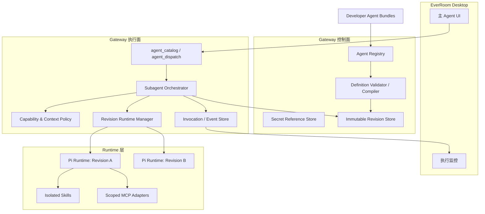
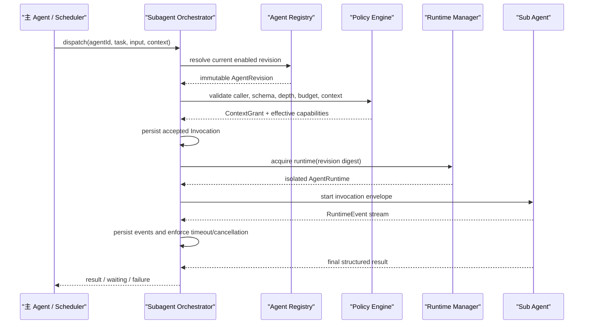

# EverRoom 桌面端子 Agent 框架架构与设计方案

> 状态：Implemented（统一 Agent Resolver + 文件驱动子 Agent）
> 日期：2026-08-20
> 范围：EverRoom Desktop、NxCore Gateway、`agent-contract`、`agent-runtime`、Pi Runtime、MCP 与 Skill 管理

## 1. 背景

EverRoom 当前已经具备一条完整的主 Agent 链路：Renderer 通过 Electron IPC 调用 Gateway，Gateway 的 `AgentService` 持久化会话、Run、消息和事件，再通过 `AgentRuntime` 接口驱动 Pi Runtime。Pi Runtime 已支持自定义工具、Memory、Knowledge 和 `pi-mcp-adapter`。

本文件前半部分保留了最初用于指导子 Agent 框架落地的设计约束。当前实现已经进一步把 Gateway 内所有生成式模型场景收口到统一 Agent Resolver，不再是“单一主 Agent 配置”。

## 1.1 当前统一运行架构

Gateway 业务模块不能自行选择模型端点或调用生成式模型 API，而是使用稳定 Agent ID 从 `AgentResolver` 获取 `AgentRuntime`：

```text
业务场景 -> AgentResolver.resolve(agentId) -> AgentRuntime -> Model Provider
```

当前内建 Agent：

| Agent ID | 场景 |
| --- | --- |
| `main` | 用户主对话与子 Agent 调度 |
| `connector-sync` | Connector 后台同步 |
| `transcription-summary` | 转写结构化总结 |
| `cursor-completion` | 编辑器光标补全 |
| `knowledge` | Knowledge 实体抽取、同一性判定与转正登记（按 Skill 分工） |
| `web-search` | 搜索 Provider 推理与结果归纳 |

每个内建 Agent 强制使用独立运行目录：

```text
<dataDir>/agent/runtimes/<agent-id>/
├── config/
├── sessions/
└── workspace/
```

所有 Agent 定义都随仓库根目录 `agents/<agent-id>/agent.yaml` 打包。`kind: builtin` 定义由 Gateway 的内置运行时注册并提供系统提示词、能力声明和工具清单；`dispatch_only` 定义经校验后固化为不可变 Revision，并注册到同一 Resolver。构建会把该目录复制到 Gateway 的 `dist/agents`，Desktop 打包后位于 `resources/gateway/agents`。`NXCORE_SUBAGENTS_DIR` 只用于开发和测试覆盖 dispatch-only 子 Agent。内建 ID 是保留名，不能被开发者 Bundle 覆盖。对话接口只绑定 `main`；dispatch-only Agent 仍然只能通过 `SubagentOrchestrator` 调度。

`OpenAiCompletionAgentRuntime` 是搜索和 Knowledge 所需 OpenAI-compatible 扩展字段的底层 Provider Adapter。`/chat/completions` 只允许出现在 Runtime Provider 实现中，Knowledge 和 Web Search 等业务模块不再持有模型密钥或直接发起模型请求。Embedding 属于向量基础设施调用，不生成语言结果，继续由 `EmbeddingClient` 管理，不参与 Agent 调度。

最初识别的问题包括：

- `PiAgentRuntime` 的系统提示词在 Runtime 内硬编码。
- Gateway 启动时创建一个主 Pi Runtime，所有普通会话共享同一套 Runtime 配置。
- MCP 从全局 `mcp.json` 加载；更新后只对新建 Pi 会话生效，不能按 Agent 隔离。
- Pi 的 `DefaultResourceLoader` 使用 `noSkills: true`，尚未开放 Skill。
- `AgentSession` 没有 Agent 定义或版本字段，不能把一次执行绑定到不可变配置。
- 当前 REST/IPC 会话接口面向用户聊天，不适合作为子 Agent 的调用入口。

因此，本需求不应只是在现有会话上增加一个 `agentId`，而应引入独立的子 Agent 控制面和调度执行面。

## 2. 目标

1. 开发者可以通过新增目录和修改配置文件创建、启用、停用和版本化子 Agent。
2. 每个子 Agent 可以拥有独立的系统提示词、Skill 集合、MCP 集合和工具权限。
3. 子 Agent 不能直接接收用户消息，只能由主 Agent、后台工作流或受信任的内部服务调度。
4. 每次调度都绑定不可变的 Agent Revision，运行中修改定义不影响已开始的任务。
5. 子 Agent 只能获得本次任务显式授予的上下文和能力，不能默认继承主 Agent 全部上下文。
6. 复用现有 `AgentRuntime` 和 `RuntimeEvent` 协议，不把框架绑定死在 Pi。
7. 调度过程可取消、可审计、可恢复、可限额，并能形成父子调用链。

## 3. 非目标

- 第一版不允许用户在 UI 中打开子 Agent 聊天窗口。
- 第一版不支持子 Agent 自由创建或修改其他 Agent。
- 第一版默认不允许子 Agent 再调度子 Agent；后续可通过策略显式开放。
- Agent 定义不是任意 Node.js 插件，不允许直接获得数据库、Electron 或 Gateway 内部对象。
- Skill 不是权限。Skill 中写了“调用某工具”不代表该工具已获授权。
- 不让子 Agent 通过 MCP 绕过现有 Document Operation、Connector Orchestrator 和审批策略。

## 4. 核心设计原则

### 4.1 调度限制由服务端保证

“不直接与用户对话”必须是结构性约束：

- 用户聊天 API 只能创建 `primary` 会话。
- 子 Agent 没有 `POST /sessions/:id/runs` 一类的 Renderer 可调用入口。
- 子 Agent 只能通过 Gateway 内部 `SubagentOrchestrator.dispatch()` 创建 Invocation。
- Renderer 只可查看经授权的执行摘要和状态，不能向子 Agent 追加消息。
- 子 Agent 需要补充信息或审批时进入 `waiting_input` / `waiting_approval`，由调用者处理，不能自行向用户发消息。

系统提示词仍会说明其角色，但不承担安全边界。

### 4.2 定义与执行分离

- `AgentDefinition` 表示稳定身份，例如“邮件研究员”。
- `AgentRevision` 是一次不可变发布，包含 Prompt、Skill、MCP 和策略快照。
- `AgentInvocation` 是对某个 Revision 的一次调度。
- Run 开始后始终使用固定 Revision；编辑 Agent 会生成新 Revision。

### 4.3 默认最小权限

子 Agent 默认：

- 无 Bash、文件写入和任意网络访问。
- 无主 Agent Memory、Knowledge、Room 和 Connector 能力。
- 无 MCP；只有 Revision 明确绑定的服务器和工具可见。
- 无父会话全文；只接收任务和显式 Context Grant。

### 4.4 平台策略不可被开发者提示词覆盖

最终系统提示词按以下顺序组成：

```text
EverRoom 不可覆盖策略
+ 子 Agent 身份与调度协议
+ Agent Revision 的开发者系统提示词
+ 当前 Skill 索引与能力说明
+ 当前 Invocation 的上下文授权和输出契约
```

开发者只能编辑“Agent Revision 的开发者系统提示词”部分，不能替换平台安全策略。

## 5. 总体架构



控制面负责“这个 Agent 是什么”，执行面负责“谁可以在什么上下文中调用它”。两者不能混在 Pi Session 文件中。

## 6. Agent 定义格式

以目录 Bundle 作为唯一开发者编辑格式，以数据库 Revision 作为运行时权威状态。开发者新增目录或修改文件后重启 Gateway 即可加载；开发模式下 Gateway watch 重启会自动完成加载。不提供桌面编辑页面。

```text
agents/
└── mail-researcher/
    ├── agent.yaml
    ├── SYSTEM.md
    ├── skills/
    │   ├── search-mail/
    │   │   └── SKILL.md
    │   └── synthesize/
    │       └── SKILL.md
    └── schemas/
        ├── input.schema.json
        └── output.schema.json
```

`agent.yaml` 示例：

```yaml
schemaVersion: 1
id: mail-researcher
name: 邮件研究员
description: 检索指定邮箱范围，并返回带来源的归纳结果
mode: dispatch_only

systemPrompt: ./SYSTEM.md

skills:
  - ./skills/search-mail
  - ./skills/synthesize

mcp:
  - server: gmail
    includeTools:
      - search_messages
      - get_message

inputSchema: ./schemas/input.schema.json
outputSchema: ./schemas/output.schema.json

policy:
  allowedCallers: [primary-agent, scheduler]
  maxConcurrency: 2
  timeoutSeconds: 300
  maxToolCalls: 40
```

编译发布时执行以下处理：

1. 校验 manifest schema、ID、路径、Skill 和 MCP 引用。
2. 解析所有相对路径，拒绝逃逸 Agent Bundle 根目录。
3. 计算 Prompt、Skill、Schema、MCP Binding 和 Policy 的内容摘要。
4. 将内容复制到不可变 Revision 存储目录，而不是在运行时继续读取开发目录。
5. 保存 Revision 清单和总 digest。
6. 只有校验通过的 Revision 才能设为 `current_revision_id`。

Secret、Token 和 MCP Header 不写入 Bundle 或 Revision JSON，只保存 `secretRef`，运行前由 Gateway 主进程侧解析。

## 7. 核心领域模型

### 7.1 AgentDefinition

```ts
interface AgentDefinition {
  id: string
  slug: string
  name: string
  description: string
  mode: 'dispatch_only'
  enabled: boolean
  currentRevisionId: string | null
  createdAt: string
  updatedAt: string
}
```

### 7.2 AgentRevision

```ts
interface AgentRevision {
  id: string
  agentDefinitionId: string
  version: number
  digest: string
  runtime: RuntimeDescriptor
  systemPrompt: string
  skillSnapshot: SkillSnapshot[]
  mcpBindings: McpBinding[]
  toolPolicy: ToolPolicy
  executionPolicy: ExecutionPolicy
  inputSchema: Record<string, unknown> | null
  outputSchema: Record<string, unknown> | null
  createdAt: string
}
```

Revision 发布后不可更新，只能新建下一版。

### 7.3 AgentInvocation

```ts
type InvocationStatus =
  | 'accepted'
  | 'running'
  | 'waiting_input'
  | 'waiting_approval'
  | 'completed'
  | 'failed'
  | 'cancelled'
  | 'interrupted'
  | 'timed_out'

interface AgentInvocation {
  id: string
  agentRevisionId: string
  source: 'primary_agent' | 'scheduler' | 'internal_workflow'
  parentInvocationId: string | null
  parentSessionId: string | null
  parentRunId: string | null
  parentToolCallId: string | null
  task: string
  input: unknown
  contextGrant: ContextGrant
  status: InvocationStatus
  depth: number
  budget: InvocationBudget
  result: AgentInvocationResult | null
  errorCode: string | null
  createdAt: string
  startedAt: string | null
  completedAt: string | null
}
```

### 7.4 ContextGrant

子 Agent 不继承父 Agent Prompt 和会话历史。调用者提交的是资源引用，Gateway 校验后签发短期 Grant：

```ts
interface ContextGrant {
  roomIds: string[]
  documentIds: string[]
  sourceIds: string[]
  permissions: Array<'read' | 'propose_write' | 'execute'>
  issuedAt: string
  expiresAt: string
  revision: number
}
```

工具执行时必须重新校验 Grant。Prompt 中出现资源 ID 不等于获得权限。

## 8. 调度协议

### 8.1 主 Agent 工具

主 Agent 不为每个子 Agent 动态注册一个工具，避免 Agent 新版本发布后必须重建所有主 Agent Session。第一版提供两个稳定工具：

```text
agent_catalog
agent_dispatch
```

`agent_catalog` 返回当前调用者可见的 Agent ID、描述、输入要求和能力摘要，不返回系统提示词、Secret 或 MCP 连接细节。

`agent_dispatch` 输入：

```json
{
  "agentId": "mail-researcher",
  "task": "查找最近七天与预算评审有关的邮件并归纳结论",
  "input": {
    "days": 7,
    "topic": "预算评审"
  }
}
```

`agentId` 必须来自 Registry；`input` 必须通过目标 Revision 的 Input Schema。

第一版工具同步等待终态并把结构化结果返回主 Agent。异步调度在阶段 3 增加，届时返回 `invocationId`，由后台任务中心继续观察，但不增加向子 Agent 发送自由文本的接口。

### 8.2 执行序列



传给 Runtime 的任务信封应明确区分平台上下文和任务正文，不能通过字符串拼接让子 Agent 把父 Agent 生成的内容误认为用户原话。

### 8.3 输入、输出和补充信息

- Input Schema 可选；配置后必须在启动前校验。
- Output Schema 可选；配置后对最终输出做校验，不匹配时以 `invalid_output` 失败。
- 无 Output Schema 时统一返回 `{ summary, text, artifacts, citations }`。
- 子 Agent 需要信息时发出 `input.requested` 领域事件，Invocation 进入 `waiting_input`。
- 主 Agent 可以把问题转述给用户；用户回复后应创建新的 continuation command，而不是伪装成用户直接进入子 Agent 会话。
- 高风险操作进入 `waiting_approval`；批准必须绑定 Invocation、工具调用、参数摘要和有效期。

## 9. Runtime 与隔离设计

### 9.1 Revision Runtime Manager

新增 `SubagentRuntimeManager`，以 `revision.digest` 为键创建和缓存 Runtime：

```text
Revision digest
  -> RuntimeDescriptor
  -> isolated agentDirectory
  -> isolated sessionsDirectory
  -> isolated workingDirectory
  -> scoped skills
  -> scoped MCP config
  -> configured system prompt
```

Runtime 空闲后按 LRU 和 TTL 释放；应用退出时统一 `dispose()`。同一 Revision 可以复用 Runtime 实例，但不同 Revision 不能共享 Pi Session、ResourceLoader 或 MCP Adapter。

当前 `PiAgentRuntime.id` 固定为 `pi`，需要改为可配置且包含 Revision 身份，例如 `pi:subagent:<revisionId>`，否则持久化 Session 无法可靠判断配置是否匹配。

### 9.2 Pi Runtime 的必要改造

在 `PiAgentRuntimeConfig` 增加：

```ts
interface PiAgentRuntimeConfig {
  runtimeId?: string
  systemPrompt?: string
  platformPrompt?: string
  skills?: { roots: string[]; enabled: boolean }
  mcp?: { mcpServers: Record<string, unknown> }
  builtinTools?: string[]
  includeBashTool?: boolean
}
```

并做以下调整：

- 将当前硬编码 Prompt 拆成平台 Prompt 与可注入 Agent Prompt。
- 主 Agent 保持现有默认行为；子 Agent 必须显式传入配置。
- 子 Agent ResourceLoader 使用专属 `agentDir`，仅在有 Skill 快照时设置 `noSkills: false`。
- `builtinTools` 对子 Agent 默认空数组，`includeBashTool` 默认 `false`。
- MCP Adapter 只接收该 Revision 解析后的服务器子集和 Tool allowlist。
- `AgentRuntime` 接口继续保持 Runtime 无关；Agent 定义解析不能进入 Pi 包。

### 9.3 Skill 隔离

Skill 分为两层：

1. Skill 内容层：`SKILL.md`、模板、参考文件和脚本资源。
2. 能力授权层：Gateway Tool、MCP Tool、文件或网络权限。

发布时复制 Skill 快照并限制：

- 单文件、单 Skill 和 Revision 总体积上限。
- 拒绝符号链接逃逸和绝对路径引用。
- 记录每个文件 hash。
- 每个 `SKILL.md` 必须包含 Agent Skills 格式的 `name` 和 `description` YAML frontmatter。
- Runtime 只提供限制在 Revision Skill 快照目录内的 `read` 工具，不开放任意文件读取。
- Skill 引用的脚本不会自动获得执行权；只有授权 Bash 或受控工具才能执行。
- 已开始 Invocation 不读取开发目录中的后续变化。

### 9.4 MCP 隔离

现有全局 MCP 设置可以继续作为“服务器注册表”，但 Agent Revision 只能绑定服务器 ID 和工具白名单：

```ts
interface McpBinding {
  serverId: string
  includeTools: string[]
  excludeTools?: string[]
  secretRefs: string[]
}
```

运行前将 Binding 与服务器注册表解析为临时 Pi MCP 配置。必须满足：

- HTTP MCP 限制协议、主机和重定向；敏感 Header 来自 Secret Store。
- stdio MCP 的可执行文件、参数、cwd 和环境变量经过策略校验。
- 环境变量按 allowlist 注入，不继承 Gateway 完整环境。
- MCP Tool 名单在运行开始时固化并记录 hash。
- MCP 调用经过超时、结果大小限制、审计和脱敏。
- Revision 被停用或 Secret 被撤销后，新 Invocation 拒绝启动；运行中的高风险连接可按策略立即取消。

## 10. 持久化设计

建议新增独立表，不直接把子 Agent 塞进现有 `agent_sessions`。当前 `AgentService` 已包含用户会话标题、Room 选择预检、用户消息保存和 Desktop WebSocket 语义；强行复用会引入大量 `kind === subagent` 分支，并容易把内部消息暴露给聊天 UI。

第一版表：

### `agent_definitions`

- `id`, `slug`, `name`, `description`
- `mode`，首版固定 `dispatch_only`
- `enabled`, `current_revision_id`
- `created_at`, `updated_at`

### `agent_revisions`

- `id`, `agent_definition_id`, `version`, `digest`
- `manifest_json`, `system_prompt`
- `skill_snapshot_json`, `mcp_bindings_json`
- `input_schema_json`, `output_schema_json`
- `created_at`

对 `(agent_definition_id, version)` 和 `digest` 建唯一约束。

### `agent_invocations`

- 调用来源和父链字段
- `agent_revision_id`, `runtime_session_ref`
- `task`, `input_json`, `context_grant_json`, `budget_json`
- `status`, `result_json`, `error_code`, `error_message`
- `depth`, `idempotency_key`
- `started_at`, `completed_at`, `created_at`

对 `(source, parent_run_id, idempotency_key)` 建唯一约束。

### `agent_invocation_events`

- `id`, `invocation_id`, `seq`, `type`, `payload`, `created_at`

对 `(invocation_id, seq)` 建唯一约束。事件 Payload 必须经过尺寸限制和 Secret 脱敏。

### `agent_invocation_approvals`

- `id`, `invocation_id`, `tool_call_id`
- `risk`, `request_json`, `status`
- `expires_at`, `resolved_at`

Runtime Event 转换和终态处理应抽成共享的 `ExecutionEventConsumer`，但主 Agent 与子 Agent 使用各自 Repository，避免共享表语义混乱。

## 11. API 与桌面端边界

### 11.1 开发者配置边界

不提供创建、编辑、发布或删除 Agent 的 HTTP/IPC 接口。Gateway 启动时扫描随应用发布的 `agents` 目录（开发/测试可用 `NXCORE_SUBAGENTS_DIR` 覆盖）；一个通过校验的新内容摘要自动形成不可变 Revision，`enabled: false` 使该 Agent 不进入 Catalog。校验失败只记录结构化日志并跳过对应 Bundle，不阻塞其他 Agent 和 Gateway 启动。

### 11.2 执行面 API

第一版不向 Renderer 暴露创建 Invocation 的 HTTP/IPC 接口。执行入口是 Gateway 内部方法：

```ts
orchestrator.dispatch(callerContext, request)
orchestrator.cancel(callerContext, invocationId)
orchestrator.getResult(callerContext, invocationId)
```

任务中心可以获得只读接口：

```text
GET /v1/agent-invocations
GET /v1/agent-invocations/:invocationId
GET /v1/agent-invocations/:invocationId/events
POST /v1/agent-invocations/:invocationId/cancel
```

取消接口只允许原调用链、任务所有者或平台管理方使用，不允许提交新消息。

## 12. 状态机、并发与恢复

```text
accepted -> running | cancelled | failed
running  -> waiting_input | waiting_approval | completed | failed | cancelled | interrupted | timed_out
waiting_input -> running | cancelled | timed_out
waiting_approval -> running | cancelled | timed_out
```

规则：

- 所有状态迁移由纯函数校验，终态不可恢复运行。
- 全局、每 Agent、每调用者均有并发上限。
- 调用深度、Token、工具次数、运行时间和输出大小都纳入 Budget。
- 父 Run 取消时，默认级联取消尚未终态的子 Invocation。
- Gateway 启动时将遗留 `running` 标为 `interrupted`；只有 Runtime 明确支持 resume 且 Revision 仍可解析时才尝试恢复。
- 相同幂等键返回已有 Invocation，不重复产生外部副作用。
- 默认禁止循环调用；未来开放嵌套调度时，必须同时校验 `maxDepth`、调用图环路和剩余 Budget。

## 13. 安全与治理

1. Prompt 注入不能扩大权限；所有工具在执行点重新验证 Invocation、Grant 和 Policy。
2. 子 Agent 不获取 Gateway Bearer Token、数据库句柄、Electron IPC 或 Secret 明文。
3. 工具结果和 MCP 响应视为不可信数据，不允许其中的指令修改系统策略。
4. 写操作继续通过现有 Document Operation Kernel、Connector Plan 和 Approval 机制完成。
5. 日志默认记录 Agent ID、Revision、Invocation、工具名、耗时、状态和数据尺寸；不记录完整 Prompt、Secret 和大段工具结果。
6. 删除 Agent Definition 不物理删除历史 Revision 和 Invocation；先停用，再按保留策略清理资源。
7. 导入第三方 Agent Bundle 时显示其 Skill、MCP、Builtin Tool 和 Secret 权限摘要，并要求显式确认。

## 14. 可观测性

每个 Invocation 使用统一 Trace 字段：

```text
traceId
invocationId
parentInvocationId
parentSessionId
parentRunId
agentDefinitionId
agentRevisionId
runtimeId
toolCallId
```

Desktop 任务中心展示：状态、调用来源、运行时间、当前阶段、工具活动、结果摘要和错误。默认不展示内部 reasoning；开发模式可以查看经过脱敏的事件时间线。

建议指标：

- Invocation 成功率、取消率、超时率。
- 按 Agent/Revision 的 P50/P95 时延和 Token 用量。
- MCP 启动失败、连接失败、Tool 超时和 Schema 失败。
- Output Schema 校验失败率。
- 并发队列长度与等待时间。

## 15. 与当前代码的映射

| 当前模块 | 处理方式 |
| --- | --- |
| `packages/agent-contract` | 增加定义、Revision、Invocation、结果和事件 DTO；不改变现有聊天协议语义 |
| `packages/agent-runtime` | 保持核心接口；必要时补充标准终止原因和运行元数据 |
| `packages/agent-runtime-pi` | 支持可配置 Runtime ID、组合系统提示词、Skill roots 和按 Revision MCP |
| `apps/gateway/modules/agent/service.ts` | 继续只负责主 Agent 会话；不承载子 Agent 分支 |
| `apps/gateway/modules/agent/runtime-factory.ts` | 拆出可按 Revision 创建 Runtime 的 Factory |
| `apps/gateway/modules/agent/mcp-routes.ts` | 从单一配置文件管理演进为 MCP Server Registry；保留兼容导入 |
| Gateway 新 `modules/subagents` | Registry、Compiler、Orchestrator、Policy、Runtime Manager、Repository、Routes |
| Desktop Office/任务中心 | 只读展示 Invocation，不提供聊天 Composer |

## 16. 分阶段实施

### 阶段 0：契约与安全边界

- 定义 Agent Bundle schema、Revision 和 Invocation contract。
- 固化 `dispatch_only`、Context Grant、状态机和错误码。
- 决定 Secret Store 使用 Electron `safeStorage` 还是系统 Keychain 抽象。

验收：可以用纯函数测试证明 Renderer 用户消息无法形成子 Agent Invocation。

### 阶段 1：最小可运行框架

- 实现 Registry、Compiler、Revision Store 和数据库迁移。
- 改造 Pi Runtime 支持动态 Prompt、隔离目录、Skill 和 MCP。
- 实现 Runtime Manager 与同步 `agent_dispatch(wait=true)`。
- 只允许主 Agent 调度，子 Agent 无嵌套、无写权限。

验收：两个 Agent 使用不同 Prompt、Skill 和 MCP，同一任务不会串用能力；修改 Agent 后旧 Invocation 仍绑定旧 Revision。

### 阶段 2：文件工作流与任务观测

- 增加只读 Invocation 时间线、取消和错误诊断。
- 增加独立的 Bundle 校验命令和可选文件变更检测，不增加桌面编辑页面。

验收：开发者只新增目录和修改配置即可创建一个可被主 Agent 发现并调度的 Agent。

### 阶段 3：异步调度和审批

- 支持 Scheduler/Internal Workflow 调度。
- 增加 `waiting_input`、`waiting_approval` 和 continuation command。
- 增加崩溃恢复、队列、公平性和完整 Budget。

验收：长任务可以跨主 Agent Run 存续，重启后状态一致，副作用不重复。

### 阶段 4：受控多 Agent 图

- 在策略允许时开放子 Agent 调度子 Agent。
- 增加调用图、环检测、深度限制、父子 Budget 分配和级联取消。
- 评估并行 fan-out / gather，但不允许模型自行无限扩张任务图。

## 17. 测试策略

### 单元测试

- Manifest、路径、Schema、Skill 快照和 digest。
- 状态机、调用者策略、上下文子集、深度和 Budget。
- MCP Tool allowlist、SecretRef 解析与环境变量过滤。
- Prompt 组合顺序和平台策略不可覆盖。
- 输出 Schema 校验与错误映射。

### 集成测试

- 主 Agent -> `agent_dispatch` -> 子 Pi Runtime -> 结果回传。
- 两个 Revision 的 Prompt、Session、Skill 和 MCP 完全隔离。
- 父 Run 取消、超时、Gateway 重启和 Runtime dispose。
- MCP 异常退出、恶意超大结果、未知 Tool 和 Secret 脱敏。
- 同一幂等键不会重复执行。

### 端到端测试

- 新增合法 Agent Bundle 并重启 Gateway 后，主 Agent 可通过 Catalog 发现。
- 用户无法从 UI、IPC 或普通 Agent Session API 直接向子 Agent 发消息。
- 子 Agent 请求补充信息时，只有主 Agent 或任务中心能承接交互。
- Agent 被停用后新 Invocation 被拒绝，历史结果仍可查看。

## 18. 首版建议决策

为控制第一版复杂度，建议直接确定：

1. Agent 定义采用“目录 Bundle + 数据库不可变 Revision”的双层模型。
2. 子 Agent 使用独立 `agent_invocations` 存储，不复用用户聊天 `agent_sessions`。
3. 主 Agent 通过稳定的 `agent_catalog` / `agent_dispatch` 工具调度。
4. 首版只支持主 Agent 和内部 Scheduler 调度，禁止子 Agent 嵌套调度。
5. 首版默认无 Builtin Tool、无 Bash、无写权限；能力逐项授权。
6. Skill 使用 Pi 原生 ResourceLoader，但从 Revision 快照目录加载。
7. MCP 使用全局服务器注册表加 Revision 级 Binding，不在 Agent Bundle 中保存 Secret。
8. Invocation 默认无状态；跨任务长期状态继续通过受控 Memory/Knowledge 能力解决，不复用隐藏聊天线程。

## 19. 待确认问题

以下问题不阻碍阶段 0 和阶段 1，但在扩展分发能力前需要产品决策：

1. “开发者”是否仅指本机高级用户，还是未来包含团队分发和签名市场；后者需要 Publisher、签名和信任等级。
2. Agent Bundle 是否允许携带可执行脚本；建议首版允许资源文件但默认不授予执行能力。
3. 子 Agent 的结果是否默认对用户可见；建议仅主 Agent 最终答复可见，任务中心展示摘要与审计信息。
4. 是否需要按 Agent 独立模型配置；架构已预留 `modelProfile`，首版建议只允许继承主模型或后台模型，避免 Secret 和成本配置分散。
5. 异步任务需要保留多久，以及取消应用后是否继续运行；建议默认应用退出时取消未完成任务，Scheduler 任务除外。
