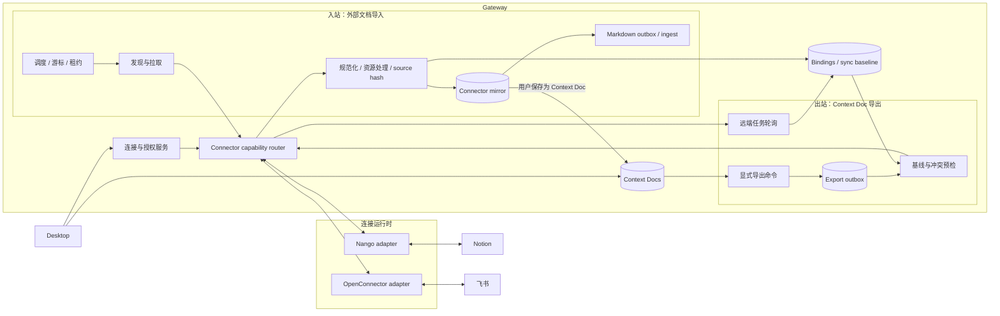

# 飞书云文档 + Notion 双向同步：调研与方案设计

> 修订日期：2026-09-02
> 目标：在不打断现有 Nango 连接体系的前提下，补齐飞书云文档接入，改善 Notion 文档同步，并为安全导出保留清晰的升级路径。

## 1. 决策摘要

1. **Nango 继续作为当前主连接架构。** Notion、Gmail、Outlook、Google Docs 等存量连接不立即迁移。OpenConnector 是并行执行能力，不是本期替代项目。
2. **新增统一文档适配层。** Gateway 只依赖稳定的文档连接接口；Notion 暂由 Nango adapter 实现，飞书优先复用现成的 OpenConnector provider。后续迁移只替换 adapter，不改同步、投影和摄取链路。
3. **首版不做自动双向合并。** “双向”拆成三个明确能力：外部文档导入、EverRoom 文档创建远端副本、显式开启的单向镜像更新。删除不跨平台传播，冲突不自动覆盖。
4. **外部文档镜像与 Context Doc 分离。** 连接器同步先生成只读来源记录和 Markdown 产物；只有用户明确选择“保存为 Context Doc”后，才创建可编辑文档和远端映射。
5. **先交付导入，再交付写回。** 第一阶段完成 Notion 导入修正与飞书导入；第二阶段提供两端“创建副本”；Notion 原页更新和连接迁移后置。

## 2. 仓库现状

| 能力 | 当前实现 | 主要缺口 |
| --- | --- | --- |
| 桌面入口 | 默认启用“数据源”页面，连接器页面由 `NXCORE_DESKTOP_PAGE_MODE=connectors` 单独开启 | 两个页面互斥，OpenConnector 生命周期被 UI 模式间接控制 |
| Notion 授权 | Nango OAuth 是主路径；另有手工 Token 和 ZIP 导入 | 同一平台存在多条行为不同的路径 |
| Notion Nango 同步 | `search` 后读取 blocks children，写入 `NormalizedDocument` | 搜索只取一页；块只读一层；固定旧版 API；复杂块丢失 |
| Notion OpenConnector 同步 | 已有全量校准、增量任务和 `retrieve_page_markdown` | 不是默认产品路径；尚未补拉 `unknown_block_ids` |
| 飞书同步 | `feishu-wiki` 直连试点使用 `appId:appSecret` 和 tenant token | UI 禁用；只读 Wiki；`raw_content` 丢结构；无增量游标 |
| 飞书 OpenConnector provider | 当前固定版本已包含用户 OAuth、Drive/Wiki 发现、文档读写和导入任务动作 | Gateway 未建立飞书托管文档任务和规范化 adapter |
| 本地处理 | 已有连接器领域表、内容哈希、Markdown outbox、摄取与清理链路 | 缺少 Context Doc 映射和远端导出 outbox |

当前代码事实：

- `sync-providers/notion.ts` 仍是 Notion 默认同步实现，使用 Nango 代理。
- `service.ts` 的 OpenConnector 托管文档任务只识别 Notion 和 Google Docs。
- `ConnectSourceMenu.tsx` 中飞书入口仍为禁用状态。
- 同步任务的 `allowedActions` 强制只读。Agent 能执行个别写动作，不等于存在可靠的导出管线。

因此，本方案不再把“迁移到 OpenConnector”写成近期前置条件。

## 3. 本期范围

### 3.1 必须交付

- Notion Nango 同步支持完整分页，并优先使用官方 Markdown 内容接口。
- Notion 大页面能识别截断；无法访问的子块形成可见告警，不静默丢失。
- 飞书支持用户级 OAuth、个人云空间和 Wiki 文档发现、结构化正文读取。
- 两个平台统一写入 `connector_documents`、Markdown 产物和 ingest 链路。
- 用户可以把来源记录显式保存为 Context Doc。
- Context Doc 可以导出为新的 Notion 页面或飞书文档。
- 授权失效、权限不足、限流、单文档失败和异步任务失败有可区分状态。

### 3.2 明确不做

- 不在本期退役 Nango。
- 不自动迁移 Notion 存量连接。
- 不自动合并两端同时发生的编辑。
- 不自动传播删除。
- 不承诺所有复杂块、评论、修订历史和嵌入内容视觉等价。
- 飞书首版不更新已有远端文档，只创建新副本。

## 4. 近期架构



这不是两个平行的数据系统，也不是把同一套任务反向运行。Nango 和 OpenConnector 只负责授权、凭据刷新和 Provider API 执行；入站与出站使用同一个能力路由和 adapter，但拥有独立的触发方式、状态机和持久化队列。以下能力必须只有一个 Gateway 所有者：

- 调度、租约、重试和检查点；
- 文档身份、规范化和内容哈希；
- 领域投影、Markdown 物化和 ingest；
- Context Doc 映射、冲突判断和导出状态。

### 4.1 入站与出站职责

| 方向 | 触发 | 数据权威 | 写入目标 | 状态所有者 |
| --- | --- | --- | --- | --- |
| 入站导入 | 定时、手动刷新 | 远端文档 | Connector mirror | 同步作业、游标、远端检查点 |
| 保存为 Context Doc | 用户显式操作 | 当前 mirror 快照 | 新 Context Doc | 文档服务、binding |
| 出站创建副本 | 用户显式导出 | Context Doc 指定修订 | 新远端文档 | export outbox、远端任务句柄 |
| 出站更新原页 | 用户显式开启；后续仅 Notion | Context Doc 与上次同步基线 | 已绑定远端文档 | binding、冲突状态、export outbox |

入站只能更新 mirror，不能覆盖用户编辑的 Context Doc。出站只能读取用户选定的 Context Doc 修订，不能把 mirror 当作可编辑文档写回。两条管线通过 binding 共享远端身份和同步基线，但不共用任务状态。

### 4.2 连接器能力接口

Gateway 新增内部接口 `DocumentConnectorPort`，按 `(provider, connectionKind)` 选择 adapter，而不是只按 Provider 选择。这样 Notion 在 Nango 与 OpenConnector 并存期间不会选错凭据或运行时。

```ts
type DocumentConnectorCapabilities = {
  discover: boolean
  readMarkdown: boolean
  createCopy: boolean
  updateExisting: boolean
  asyncWrite: boolean
}

interface DocumentConnectorPort {
  getCapabilities(connection: ConnectionRef): DocumentConnectorCapabilities
  listDocuments(input: ListDocumentsInput): Promise<DocumentPage>
  getDocumentMetadata(input: GetDocumentInput): Promise<RemoteDocumentMetadata>
  getMarkdown(input: GetMarkdownInput): Promise<RemoteMarkdown>
  createCopy(input: CreateRemoteCopyInput): Promise<RemoteWriteResult>
  updateExisting?(input: UpdateRemoteDocumentInput): Promise<RemoteWriteResult>
  getWriteStatus?(input: GetWriteStatusInput): Promise<RemoteWriteResult>
}
```

约束：

- adapter 不写业务表，只返回规范化前的 Provider 结果。
- 读结果必须包含稳定远端 ID、远端修订或编辑时间、正文、资源引用和结构降级告警。
- 写结果必须区分“已完成”和“已接受异步任务”；异步任务句柄必须先持久化，再开始轮询。
- 凭据不进入 Renderer、任务输入、日志或数据库业务字段。
- Provider 动作名不泄漏到同步状态机，避免未来迁移时批量改任务定义。
- `updateExisting` 和 `getWriteStatus` 是能力驱动的可选方法；首版飞书 adapter 不实现原页更新。

### 4.3 双向协调与防回环

Gateway 增加 `DocumentSyncCoordinator`，但不让它直接调用 Provider。它只负责编排 port、binding 和两个方向的状态机：

1. 入站任务按连接持有租约，分页发现文档并使用重叠水位；单文档完成规范化和 mirror 事务提交后，才推进检查点。
2. 出站任务先把 `localDocumentId + localRevision + payloadHash` 写入 outbox，再读取 binding 基线并拉取远端最新元数据。
3. `create_copy` 没有既有远端目标，成功后创建 `export_copy` binding；请求结果不确定时凭远端任务句柄续查，不直接重发。
4. `sync_update` 只有在本地修订和远端 hash 均符合基线时才写入；任一侧偏离基线都进入 `conflict`。
5. 同一 binding 的入站与出站操作共用互斥键和 fence token。出站处于 `processing` 或 `waiting_remote` 时，入站可以发现变化，但延迟提交该文档的 mirror 与基线。
6. 每次操作生成 `originOperationId`，用于关联 outbox、任务句柄和下一次入站结果。防回环最终仍以规范化后的 hash 与双端基线为准，不能依赖远端平台保留自定义标记。

### 4.4 当前运行时落位

| Provider | 当前 adapter | 入站读取 | 创建副本 | 更新原页 |
| --- | --- | --- | --- | --- |
| Notion | Nango，当前主路径 | 本期修正 | 本期新增 | 后续阶段，显式开启 |
| 飞书 | OpenConnector，新接入 | 本期新增 | 本期新增 | 首版不支持 |
| Notion | OpenConnector，并行能力 | 已有基础作业 | Provider 已有动作 | 迁移评估用，不切换存量连接 |

能力路由必须在连接建立时保存 `connectionKind`，不能根据当前可用 sidecar 临时改道。迁移 Notion 时应新建连接、双跑核对、切换 binding，不能在原连接上静默更换 adapter。

## 5. 导入设计

### 5.1 统一流水线

```text
发现远端文档
  -> 拉取元数据和正文
  -> 规范化 Markdown 与资源引用
  -> 计算 source hash
  -> 幂等写 connector_documents
  -> Markdown outbox
  -> ingest / Knowledge / Memory
```

稳定身份使用：

```text
(ownerId, provider, connectionName, remoteDocumentId)
```

正文未变化时，只更新远端检查点和最后确认时间，不重复物化或 ingest。

### 5.2 Notion：近期继续走 Nango

近期保留 Nango OAuth 和连接记录，修改 `sync-providers/notion.ts`：

1. `POST /v1/search` 按 `next_cursor` 完整分页；空查询表示枚举连接可见的全部页面。
2. 通过 Nango proxy 覆盖 `Notion-Version: 2026-03-11`，调用 `GET /v1/pages/:id/markdown`。
3. 保留 blocks API 作为降级路径，不再把它作为主路径。
4. 处理 `truncated` 和 `unknown_block_ids`：
   - 逐个补拉未知块子树；
   - `object_not_found` 记为权限缺口并保留 `<unknown>` 占位；
   - 补拉仍截断时停止递归并将文档标为 `partial`。
5. 增量仍使用 `last_edited_time` 水位和重叠窗口；全量校准负责发现权限丢失和删除。
6. 对 trash 内容使用独立枚举或全量缺失确认，不假设默认搜索一定返回已删除页面。

Notion 官方当前约束：

- Markdown 创建、读取、更新分别要求 `insert_content`、`read_content`、`update_content`。
- capabilities 可以修改，但公共连接修改后，存量用户需要重新授权；并非“创建后永久锁死”。
- 限流同时存在连接级和工作区级。连接级平均约 3 请求/秒，429 和 529 应遵循 `Retry-After`。
- 大约 20,000 个块时 Markdown 响应可能截断；`unknown_block_ids` 无法区分“超限”和“无权限”。
- 大写入的 HTTP 202 只表示任务进入后台处理，必须轮询到 `succeeded` 或 `failed`。
- `replace_content` 默认拒绝删除子页面和子数据库。同步更新不得设置 `allow_deleting_content=true`。

### 5.3 飞书：新接入使用 OpenConnector adapter

不为过渡期再复制一套飞书 Nango provider。当前 OpenConnector 固定版本已经提供用户 OAuth 和所需动作，飞书 adapter 复用这些能力：

- 发现：个人云空间与 Wiki 两条路径分别分页；只处理支持的文档类型。
- 正文：优先使用 `fetch_document` 的 Markdown 输出。
- 降级：未公开的 `docs_ai` 端点不可用时，使用官方 docx blocks 分页并确定性转 Markdown；`raw_content` 只用于明确标记的纯文本降级。
- 增量：以远端编辑时间为水位，固定重叠窗口；定期全量校准修复漏项。
- 资源：图片和附件由受控下载器落入本地文件系统，Markdown 改写为稳定资源 ID 后再计算哈希。

必须先完成一个运行时修正：OpenConnector sidecar 的启动不能继续依赖“连接器页面”模式。数据源页面保留为默认 UI 时，也应按飞书连接需求启动 sidecar，并把状态呈现在统一连接列表中。

`fetch_document` 当前依赖未公开的 `/docs_ai/v1/documents/...` 端点。它可以作为优化路径，不能成为唯一正确性路径。生产验收必须覆盖 blocks fallback。

### 5.4 规范化规则

规范化发生在计算哈希之前：

- 换行统一为 LF，移除行尾空白；
- 预签名 URL 替换为稳定资源 ID；
- Provider 临时时间戳不进入正文；
- 未支持块保留可定位占位和原文链接；
- 表格、列表、代码块和引用使用固定序列化规则；
- 不把评论、修订历史和权限元数据混入正文。

规范化器必须是纯函数，并使用 Provider 响应快照做字节级测试。

## 6. Context Doc 与导出

### 6.1 两种文档对象

| 对象 | 所有者 | 默认可编辑 | 用途 |
| --- | --- | --- | --- |
| Connector mirror | 外部平台 | 否 | 搜索、引用、Knowledge/Memory 摄取 |
| Context Doc | EverRoom | 是 | 用户创作、版本管理和显式导出 |

用户选择“保存为 Context Doc”时，创建本地文档快照并记录来源。后续来源更新先进入 Connector mirror，不直接覆盖已编辑的 Context Doc。

### 6.2 首版导出语义

首版只提供 `create_copy`：

- Notion：`POST /v1/pages` 创建新页面；大内容使用 `allow_async=true` 并轮询。
- 飞书：上传 Markdown 后提交 import task，轮询到远端文档创建完成。
- API 接收请求时固定本地修订并生成一次性导出命令 ID；同一命令重复提交返回原 outbox 记录，用户再次主动导出才创建新命令。
- worker 先检查连接能力并物化 Markdown 与资源清单，再调用 adapter；调用前不得把任务标为成功。
- 远端返回任务句柄时，先持久化句柄再进入 `waiting_remote`；进程重启后从句柄继续轮询。
- 每次成功写回远端 ID、远端 URL、基线 hash 和远端修订信息，并创建 `export_copy` binding。
- 请求状态不确定且没有可查询句柄时进入人工确认状态，不直接重发创建请求。
- 图片必须单独验证和处理，不能假设 Markdown 导入会自动搬运本地资源。

### 6.3 后续镜像更新

Notion 可在第二阶段提供 `sync_update`，但必须显式开启：

1. 拉取远端最新 `last_edited_time` 和 Markdown。
2. 比较远端 hash、本地修订和上次同步基线。
3. 只有远端未变化时才执行 `replace_content`。
4. 任一端同时变化则进入 `conflict`，不自动写入。
5. 冲突操作只提供“保留本地并另存远端副本”“采用远端并新建本地版本”“断开映射”。

飞书原地更新需要块级定位、修订号和媒体保护，首版不进入 `sync_update`。

### 6.4 删除规则

- 远端删除或失去访问权限：mirror 标记为不可用；本地 Context Doc 保留。
- 本地删除 Context Doc：远端副本保留；映射标记为 `orphaned`。
- 任何远端删除都需要单独、明确的用户操作，不由同步任务触发。

## 7. 状态与数据模型

新增两类持久化数据。

### 7.1 文档映射

`connector_document_bindings`：

```text
id, owner_id, provider, connection_name, connection_kind,
remote_document_id, connector_document_id, local_document_id,
relation(source_mirror|export_copy|sync_update),
status(active|partial|conflict|orphaned|disabled),
baseline_remote_hash, baseline_local_hash,
last_remote_revision, last_local_revision,
last_inbound_operation_id, last_outbound_operation_id,
last_pulled_at, last_pushed_at, created_at, updated_at
```

`remote_document_id` 在 binding 中始终存在。纯来源镜像尚未保存为 Context Doc 时，`local_document_id` 为空；导出副本尚未被后续入站发现时，`connector_document_id` 为空。`create_copy` 成功前只存在 outbox 记录，`binding_id` 可为空；取得远端 ID 后才创建完整 binding。约束使用：

```text
(owner_id, provider, connection_name, remote_document_id)
UNIQUE active sync_update
  ON (owner_id, local_document_id, provider, connection_name)
```

同一个 Context Doc 可以保留多个 `export_copy` 历史，不能用宽泛唯一键阻止用户再次创建副本；只有 `sync_update` 要限制为同一平台连接最多一个活动目标。

### 7.2 导出 outbox

`connector_export_outbox`：

```text
id, owner_id, binding_id, export_command_id,
provider, connection_name, connection_kind,
operation(create_copy|update_existing),
local_document_id, local_revision, payload_hash,
expected_remote_revision, expected_remote_hash, origin_operation_id,
status(pending|processing|waiting_remote|needs_confirmation|succeeded|failed|dead),
attempt_count, available_at, lease_owner, lease_until,
remote_task_id, remote_result, last_error, created_at, updated_at
```

状态迁移：

```text
pending -> processing -> waiting_remote -> succeeded
                    \-> needs_confirmation
                    \-> failed -> pending
                              \-> dead
```

`export_command_id` 对 API 重试幂等，`origin_operation_id` 关联本次远端写入与后续入站观测，两者不能混用。同一 binding 串行执行导入提交和导出写操作，避免导出期间又被导入覆盖。outbox 保证可恢复的至少一次执行；外部平台通常不保证创建操作 exactly-once，因此仍需任务句柄、命令幂等和人工确认状态共同减少重复副本。

## 8. 错误处理

| 分类 | 典型信号 | 系统行为 | 用户提示 |
| --- | --- | --- | --- |
| 授权失效 | 401、invalid token、refresh 失败 | 暂停该连接任务，保留本地数据 | 重新授权该账号 |
| 应用权限缺失 | 飞书应用 scope 不足、Notion capability 不足 | 不自动重试 | 管理员补权限；需要时重新授权 |
| 文档权限不足 | 403、404 object_not_found、飞书文档无权访问 | 单文档失败，不中断其他文档 | 指明文档和授权方式 |
| 限流 | 429、529、Provider 限流码 | 遵循 `Retry-After`，指数退避并加抖动 | 默认不打扰，详情页可见 |
| 临时服务错误 | 5xx、网络超时 | 只对幂等读取自动重试 | 超过上限后显示失败 |
| 内容不完整 | truncated、unknown block、结构降级 | 保存 partial 状态和占位 | 显示缺失原因与原文入口 |
| 异步写入失败 | 远端任务 failed 或句柄过期 | 不重发不确定的创建请求 | 允许确认远端状态后重试 |
| 冲突 | 本地和远端均偏离基线 | 停止写入 | 提供三种显式处理方式 |

飞书 token 的有效期必须使用响应里的 `expires_in` 和 `refresh_token_expires_in`，不能硬编码“7 天”或“30 天”。当前 lark-cli 实测账号显示 access token 约 2 小时、refresh token 约 7 天，只能作为样本。

飞书云文档“订阅事件”接口当前官方限额为 1000 次/分钟、50 次/秒；10 次/分钟是取消订阅接口的限制。首版仍使用轮询，事件订阅不进入关键路径。

## 9. 交付阶段

### P0：修正现有 Notion Nango 同步

- 搜索和正文完整分页；
- Markdown API 主路径、blocks fallback；
- 截断与权限型 unknown 处理；
- 统一错误分类和快照测试。

验收：超过 100 页、嵌套块、大页面和部分无权限页面不会静默漏数据。

### P1：飞书导入

- OpenConnector 生命周期与页面模式解耦；
- 飞书 OAuth 和统一连接状态；
- Drive/Wiki 发现、Markdown 主读、blocks fallback；
- 进入既有领域投影、Markdown 和 ingest 链路。

验收：重新启动后连接可恢复；单文档失败不阻断批次；结构降级可见。

### P2：安全副本导出

- Context Doc 来源映射；
- export outbox 和异步任务续跑；
- Notion/飞书 `create_copy`；
- 图片处理、重复副本提示和导出结果入口。

验收：崩溃恢复不会无条件重发；不覆盖已有远端内容；失败可重试。

### P3：Notion 镜像更新

- 基线、远端预检和冲突状态；
- `replace_content`，保持子页面删除保护；
- 冲突三选一 UI。

验收：两端同时编辑时不自动覆盖；删除不传播。

### P4：连接运行时收敛

- 统计 Nango 与 OpenConnector 的成功率、授权恢复率和 Provider 覆盖；
- 对单个 Provider 做双跑校验；
- 达到等价后再迁移存量连接；
- 最后删除对应 Nango 路径，不做一次性全栈替换。

## 10. 待验证事项

1. 数据源默认页面下启动 OpenConnector sidecar 的资源占用和故障降级。
2. 飞书 `fetch_document` 未公开端点的长期稳定性、限流和大文档表现。
3. 飞书 blocks 转 Markdown 对表格、分栏、白板和媒体的保真边界。
4. 飞书 Markdown import task 对图片、本地附件和超大内容的行为。
5. Notion Markdown 截断补拉后的顺序重建方式，不能简单追加到全文末尾。
6. Nango 与 OpenConnector 同时存在时的账号去重、断开连接和重授权 UX。
7. 当前导入记录与 Context Doc 之间采用复制还是持续跟随的产品文案。

## 11. 核验记录与参考

### 11.1 本次核验

- 使用 lark-cli 1.0.84 读取本方案飞书文档，文档 ID 为 `RLrpdlFGEoNhJExbkxucS3jhnMc`，首次读取时修订号为 55。
- lark-cli 全文 Markdown 回读成功；回读格式会规范化表格分隔线和空白，因此内容哈希必须在规范化后计算。
- 仓库相关测试：`feishu-wiki.test.ts`、`sync-providers.test.ts`、`managed-document-sync.test.ts`、`connector-agent-sync.test.ts`，共 23 个用例通过。

### 11.2 官方资料

- [Notion Markdown 内容 API](https://developers.notion.com/guides/data-apis/working-with-markdown-content)
- [Notion 连接 capabilities](https://developers.notion.com/reference/capabilities)
- [Notion Search API](https://developers.notion.com/reference/post-search)
- [Notion 请求与限流](https://developers.notion.com/reference/request-limits)
- [Notion 2026-03-11 升级指南](https://developers.notion.com/guides/get-started/upgrade-guide-2026-03-11)
- [飞书订阅云文档事件](https://open.feishu.cn/document/server-docs/docs/drive-v1/event/subscribe?lang=zh-CN)
- [飞书获取文档所有块](https://open.feishu.cn/document/server-docs/docs/docs/docx-v1/document/list?lang=zh-CN)
- [飞书创建导入任务](https://open.feishu.cn/document/server-docs/docs/drive-v1/import_task/create?lang=zh-CN)
- [飞书 OAuth 获取与刷新 user_access_token](https://open.feishu.cn/document/authentication-management/access-token/refresh-user-access-token?lang=zh-CN)

### 11.3 仓库依据

- `apps/gateway/src/modules/connectors/sync-providers/notion.ts`
- `apps/gateway/src/modules/connectors/sync-providers/feishu-wiki.ts`
- `apps/gateway/src/modules/connectors/document-sync.ts`
- `apps/gateway/src/modules/connectors/service.ts`
- `apps/desktop/src/renderer/src/components/pages/sources/ConnectSourceMenu.tsx`
- `apps/desktop/src/shared/page-mode.ts`
- 固定版本 `@oomol-lab/open-connector@5719a69468c698c7cb8108e062ff64ecef8a2e65`
