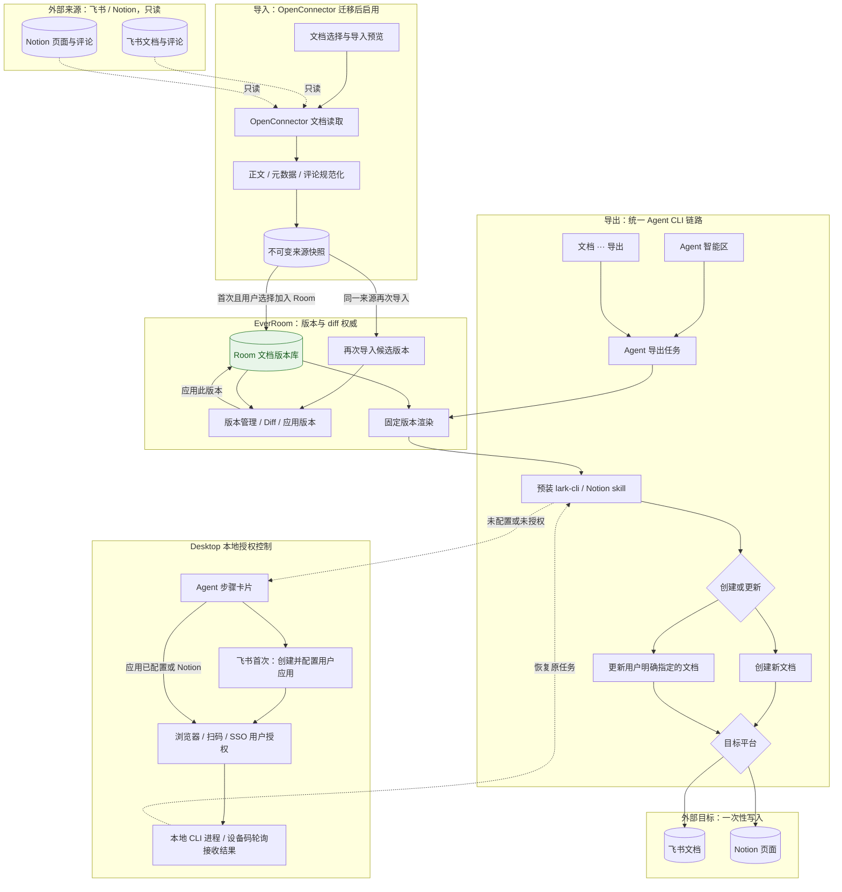
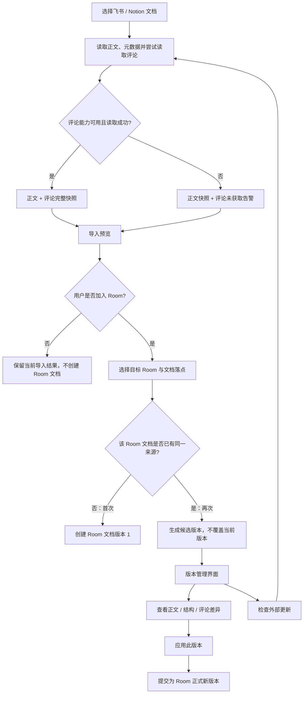
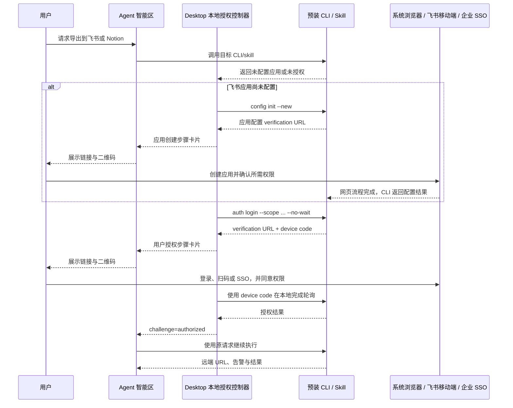

# 飞书 + Notion 文档导入与 Agent 导出方案

> 修订日期：2026-09-03
> 目标：以飞书和 Notion 为首批外部文档来源。导入等待 OpenConnector 迁移完成；导入后的文档由 EverRoom Room 原生维护版本与 diff。导出不做后台双向同步，改为 Agent 按用户请求调用 `lark-cli` / Notion CLI skill 完成一次性发布。

## 1. 决策摘要

1. **导入依赖 OpenConnector。** OpenConnector 迁移完成前，不在本方案中实现新的飞书/Notion 专用导入通道；迁移完成后，只开放飞书和 Notion 文档导入，不开放工作区全量镜像。
2. **首次导入沿用现有 Notion 体验。** 用户选择外部文档并完成预览后，自行决定是否加入 Room；选择加入时再指定目标 Room 和文档落点。系统把内容、来源信息、评论及可保留的附件元数据物化为 Room 文档及其附属注释。
3. **Room 是导入后的版本权威。** 导入生成 Room 文档的第一个版本，后续编辑、版本历史、恢复和 diff 全由 EverRoom `documentVersions` 管理；不把飞书或 Notion 的 revision 当作 Room 版本。
4. **评论随导入保存，但不伪装成正文。** 评论、回复、作者、时间、解决状态和锚点作为 Room 文档的注释/来源记录保存；无法稳定定位的评论进入“未定位评论”区并保留原文链接。
5. **导出是 Agent 一次性操作。** 用户可以在 Agent 智能区下达导出指令，也可以从文档“三个点”菜单选择导出；两个入口都创建同一种 Agent 导出任务，最终调用 `lark-cli` 或 Notion CLI skill。首版同时支持创建新文档和更新用户明确指定的已有文档。
6. **不做理想化双向同步。** 不建立远端 binding、双端基线、定时轮询、自动 push/pull、远端变更回流或远端冲突自动合并。外部文档变化需要用户再次发起导入，并在 EverRoom 内比较和决定如何修改。
7. **授权由本地 Agent 引导并接收结果。** CLI/skill 返回“未配置应用”或“未授权”时，Desktop 的本地引导适配器返回结构化 `AuthChallenge`。飞书首次使用先引导用户通过 `lark-cli config init --new` 创建并配置自己的飞书应用，再走用户 OAuth；浏览器/移动端完成操作后，由本地 CLI 进程或设备码轮询把结果交回 Desktop，不依赖 Gateway OAuth 回调。
8. **导出运行时预装 CLI 与 skill。** 产品发行包预装并锁定兼容版本的 `lark-cli`；Notion 导出 skill 随 Agent skill 包预装。用户不在导出过程中安装依赖；飞书首次使用只需完成一次应用初始化，之后按需完成账号授权。缺少依赖或版本不兼容时，先显示“导出环境未就绪”，由安装/升级流程处理。

## 2. 范围与边界

### 2.1 本期交付

- OpenConnector 迁移完成后的飞书、Notion 文档搜索、选择和导入。
- 导入标题、正文、层级结构、链接、图片/附件引用、来源 URL、作者和时间等信息。
- 导入飞书/Notion 可通过 OpenConnector 暴露的评论、回复、作者、创建/更新时间、解决状态和锚点信息。
- 首次导入由用户决定是否加入 Room；选择加入后创建 Room 文档和第一个本地版本。
- Room 文档继续使用现有文档版本服务，支持版本列表、历史查看、恢复和 EverRoom 内 diff。
- 外部来源快照和导入记录可追溯；重复导入不会静默覆盖当前 Room 文档。
- Agent 按请求把指定 Room 文档版本导出到飞书或 Notion。
- CLI/skill 缺少应用配置或账号授权时的步骤式引导、继续、取消、重新授权和失败恢复；飞书应用由用户在首次流程中创建并绑定。
- 产品发行包预装 `lark-cli`，Agent skill 包预装 Notion 导出 skill，并在启动和导出前做版本自检。

### 2.2 明确不做

- OpenConnector 迁移完成前的生产级飞书/Notion 文档导入。
- 飞书/Notion 工作区全量镜像、后台持续发现或自动订阅所有远端变更。
- 导入后与远端原文档建立持续 binding 或自动同步关系。
- 自动把远端新版本覆盖 Room 文档，或把 Room 修改静默写回远端。
- 三向基线、远端 revision 对齐、自动冲突合并、删除传播和回环抑制。
- 在飞书/Notion 中完整重建评论线程；首版只保存评论数据和可用锚点，不承诺评论可继续在原平台流转。
- 将评论直接拼入正文，或把不可定位的评论静默丢弃。
- 在用户触发导出时临时安装 `lark-cli` 或 Notion skill。
- 由 Gateway 代收飞书/Notion OAuth 回调，或在服务端保存 CLI 的应用密钥、设备码和用户 token。

## 3. 用户体验

### 3.1 导入飞书/Notion 文档

```text
Agent 智能区或 Room 文档入口
  → 选择“从飞书/Notion 导入”
  → OpenConnector 检查账号与能力
  → 搜索并展示可导入文档
  → 用户查看来源、更新时间、评论数量和结构告警
  → 预览正文、附件和评论导入结果
  → 用户选择“仅导入”或“加入 Room”
  → 如加入 Room：选择目标 Room 与文档落点
  → 创建 Room 文档版本 1
  → 显示来源信息、评论面板和 EverRoom 版本入口
```

首次导入的选择方式与当前 Notion 导入保持一致，不强制用户把内容加入 Room。加入 Room 时，预览必须显示“将在 Room 中创建本地文档”，不能暗示后续会自动跟随远端变化。相同来源再次导入到同一 Room 文档时，系统创建候选版本；用户在版本管理界面执行 diff，或从该界面发起“检查外部更新”，再决定是否“应用此版本”。

### 3.2 从 Room 导出到飞书/Notion

```text
用户从 Agent 智能区发指令，或从文档“三个点”菜单选择导出
  → 两个入口统一创建 Agent 导出任务
  → 确定 Room、文档、固定版本和目标平台
  → 选择“创建新文档”或“更新指定文档”
  → 更新模式必须由用户明确提供/选择已有文档
  → 读取固定版本并渲染 Markdown + 资源包
  → 检查预装 CLI/skill 的版本兼容性与账号状态
  → 环境异常：显示“导出环境未就绪”，不进入授权流程
  → 未配置/未授权：在 Agent 智能区展示 AuthChallenge 步骤卡片
  → 用户完成应用创建（仅飞书首次使用）及账号授权
  → 已授权：展示目标与写入摘要，更新模式需再次确认
  → Agent 继续原 CLI/skill 调用
  → 返回远端 URL、导出版本、告警和任务日志
```

导出完成后只记录“由哪个 Room 文档版本、何时、以何种 CLI/skill 调用导出到哪里”。这条记录不是 binding，也不触发下一次自动同步。

## 4. 总体架构

### 4.1 导入与导出分层



图中只有 OpenConnector 导入链路读取外部文档；导出由 Agent 使用本地预装工具单次写入。两条链路不共享远端 binding 或同步协调器。`document_import_sources` 只用于识别“同一来源再次导入”和保留来源审计，不代表持续同步关系。

`lark-cli` 和 Notion 导出 skill 属于发行时依赖，不是用户数据连接。预装、校验和升级由 Desktop/Agent runtime 负责。飞书首次使用还需要为用户创建应用；应用凭据、设备码和用户 token 留在本机安全存储，不经过 Gateway。

### 4.2 导入落地与 Room 版本流



再次导入只产生候选版本，不直接覆盖当前 Room 文档。“检查外部更新”负责生成新候选，“应用此版本”负责提交正式 Room 新版本，这两个动作必须分开。正文、结构和评论变化只在 EverRoom 中比较；任一侧评论状态为“未获取”时，评论 diff 显示“不可比较”，不能把缺失误判为全部删除。

### 4.3 Agent 授权引导状态



这里的“本地接收”是指 Desktop 管理 CLI 子进程、设备码和完成状态。当前 `lark-cli auth login` 使用设备授权流程，因此不应把实现写死为 `localhost` HTTP redirect；如果未来某个 Notion skill 使用回环回调，也由 Desktop 临时监听并接收，Gateway 仍不参与。

## 5. 导入设计

### 5.1 OpenConnector 能力契约

导入只接受 OpenConnector 返回的已注册 action，不猜测服务名或 action 名。首版需要为 `feishu` 和 `notion` 验证以下能力：文档搜索/列举、文档内容读取、文档元数据读取、评论/回复读取、附件或资源引用读取。正文读取是提交导入的硬条件；评论读取是可降级能力。某个平台缺少评论 action、权限不足或评论读取失败时，仍允许导入正文，但预览、导入结果和后续版本比较都必须明确显示“评论未获取”。系统不能用空数组代替未知状态，也不能因此阻断正文导入。

导入服务只依赖 OpenConnector 的读操作和连接状态，不复用 Connector SyncEngine 的后台镜像作业。每次导入保存 action、connection、请求参数摘要和结果能力快照，便于审计和重试。

导入连接与 Agent 导出授权是两套明确分开的凭据域：导入沿用迁移完成后的 OpenConnector connection，导出使用本地 CLI/skill 凭据。本方案不复制 token，也不默认两者可以共享授权。若同一用户同时使用导入和导出，首版可能分别完成一次“导入连接”和“Agent 导出授权”；界面必须用这两个名称区分，避免让用户误以为一次授权已经覆盖另一条链路。

### 5.2 Canonical Document Artifact

统一中间格式至少包含：

```ts
interface CanonicalDocumentArtifact {
  provider: "feishu" | "notion"
  remoteDocumentId: string
  sourceUrl: string | null
  title: string
  blocks: CanonicalBlock[]
  assets: CanonicalAsset[]
  comments: CanonicalComment[]
  commentsStatus: "complete" | "partial" | "unavailable" | "failed"
  sourceRevision: string | null
  sourceUpdatedAt: string | null
  warnings: ImportWarning[]
}
```

`CanonicalComment` 保存评论 ID、回复关系、作者显示信息、创建/更新时间、解决状态、评论正文、引用块或文本范围、来源 URL 和定位状态。评论是只读的独立记录，Room 正文只保留必要的注释标记或锚点；无法定位的评论统一进入右侧评论面板的“未定位评论”区域。只有两次快照的 `commentsStatus` 都是 `complete` 时，才计算新增、修改、解决和删除等评论差异。

### 5.3 Room 落地与版本规则

导入提交必须通过现有 Document Commit Service 创建 Room 文档和 `documentVersions`，不能直接写编辑器临时状态。版本 1 的来源标记为 `external-import:<provider>:<remoteDocumentId>`，同时保存 `importRunId` 和不可变外部快照引用。

后续 Room 编辑使用正常本地版本流程。恢复、版本比较和 diff 只读取 Room 的版本快照；外部平台 revision 只作为来源审计字段，不参与 Room 版本编号。

再次导入同一来源时：

1. 保存新的外部快照和导入候选记录。
2. 将候选内容物化为独立的候选 Room 版本或临时文档，不覆盖当前版本。
3. 在 EverRoom diff 中展示正文、结构和可可靠比较的评论变化；评论数据不完整时显示“不可比较”。
4. 用户点击“应用此版本”后，通过正常文档提交生成正式新版本；局部修改仍在 EverRoom 编辑器中完成。
5. 未采用的候选和评论仍保留在导入历史中，可追溯但不影响当前正文。

## 6. 导出设计

### 6.1 Agent 导出契约

Agent 导出工具接收固定的 `roomId`、`documentId`、`version`、目标平台和用户指定的目标信息。Agent 必须在执行前读取该版本快照，生成确定性的 Markdown、标题、资源清单和降级告警；任务开始后继续编辑 Room 不会改变本次 payload。执行前置条件是对应 CLI/skill 已由发行包预装且版本自检通过。

导出入口同时存在于 Agent 智能区和文档“三个点”菜单。菜单只负责收集平台、版本、`create`/`update` 模式和目标文档，不直接调用平台 API；它把结构化请求交给 Agent，和自然语言指令复用同一个 `Agent Export Run`、确认逻辑、CLI/skill 适配器、授权状态机和审计记录。

预装策略：

- `lark-cli` 随 Desktop/Agent 发行包提供，记录锁定版本、平台架构和校验值；启动时执行 `doctor`/版本检查，导出前再次做快速检查。
- Notion 导出 skill 随 Agent skill 包发布，manifest 声明版本、能力和兼容的 runtime；启动时加载并校验 manifest，不能在用户导出请求中临时拉取未知 skill。
- 升级由产品安装器、应用更新或受控 skill 更新流程完成；升级失败保留上一份可用版本，不能覆盖成半安装状态。
- 预装检查失败返回 `environment_not_ready`，与 `AuthChallenge` 分开。只有环境就绪后，CLI/skill 返回未授权才进入授权引导。

导出模式：

| 模式 | 默认行为 | 备注 |
| --- | --- | --- |
| `create` | 在用户选择的位置创建新文档 | 首版正式能力，不是降级或临时方案 |
| `update` | 更新用户明确提供的远端文档 | 必须展示目标 URL、变更摘要并确认 |
| `export_file` | 通过 CLI 导出为平台支持的文件 | 由具体 skill 能力决定 |

`create` 与 `update` 都是首版完整导出能力。`update` 不是同步：系统不保存远端基线、不监听远端变化、不自动重试不确定的写入，也不把后续 Room 版本自动推送到同一文档。用户再次导出时必须再次发起 Agent 请求。

### 6.2 飞书导出

Agent 使用 `lark-cli` 文档或 Markdown/Drive skill 中已验证的命令。工具选择、参数和权限以 CLI schema/skill 契约为准，不在业务代码中复制一套飞书 API。

`create` 模式要求用户选择目标文件夹/知识空间或接受个人空间默认位置，然后创建新文档并上传可支持的图片与附件。`update` 模式要求用户粘贴文档 URL，或从 CLI 搜索结果中明确选择一篇已有文档；Agent 不因“上次导出过”就自动选中旧目标。写入前先读取目标元数据、权限和最新 revision，展示目标标题、URL、Room 来源版本、写入范围及降级告警。

更新已有文档优先使用 `docs +fetch --detail with-ids` 配合 `str_replace`/`block_*` 做可定位的最小范围写入，并在 CLI 支持时携带刚读取的 revision 作为乐观并发条件。只有用户明确选择“用 Room 版本替换整篇文档”时才允许 `overwrite`；确认卡必须说明可能影响目标文档中的图片、评论和飞书特有 block。读取后目标 revision 发生变化、结果不确定或返回 partial success 时立即停止，不自动重发。

导出结果至少记录远端文档 URL/token（按安全策略脱敏）、Room 版本、目标写入前后 revision、CLI 命令摘要、告警和完成时间。这里的目标预检与并发保护不是远端 diff 或持续同步，用户仍只在 EverRoom 查看和处理文档 diff。

### 6.3 Notion 导出

Agent 使用预装的 Notion CLI skill 及其已注册读写能力，先获取 schema，再按用户指定的父页面或工作区位置创建/更新。`create` 模式必须明确父页面/工作区位置；`update` 模式必须明确目标 page URL/ID，且确认目标可编辑、不是不支持更新的页面类型。不能猜测 parent page/database ID，也不能根据历史导出记录自动选择目标。

更新前展示目标标题、URL、Room 来源版本、写入范围和不支持的 block/资源告警；由 skill 使用其稳定的 Markdown 更新能力完成单次写入。异步写入必须轮询到终态，不能把“任务已接受”当作成功。写入结果不确定时停止并标记 `needs_review`，禁止自动重试创建或更新。

### 6.4 两个入口的交互约束

文档“三个点”菜单提供“导出到飞书”和“导出到 Notion”，进入同一导出面板；用户选择文档版本、`create`/`update` 模式和目标。点击继续后，界面把结构化参数发给 Agent，并自动打开 Agent 智能区展示预检、授权、确认和执行进度。

Agent 智能区允许自然语言表达同样的请求。若平台、版本、模式或更新目标缺失，Agent 复用同一选择面板补齐参数。两个入口必须生成相同的 `request_id` 契约、状态枚举和审计字段，不允许菜单路径绕过 Agent 确认，也不允许 Agent 路径绕过更新目标校验。

## 7. Agent 授权引导适配器

### 7.1 触发条件

当预装环境检查通过后，CLI/skill 返回未登录、连接不存在、token 过期、缺少 scope 或需要应用授权时，工具层返回结构化挑战，不把底层错误直接当作最终答案：

```ts
interface AuthChallenge {
  id: string
  provider: "feishu" | "notion"
  operation: "export"
  phase: "environment" | "app_setup" | "user_auth"
  status: "required" | "pending" | "authorized" | "expired" | "failed"
  environment: "ready" | "environment_not_ready"
  title: string
  reason: "not_connected" | "missing_scope" | "expired" | "app_setup_required" | "environment_not_ready"
  steps: Array<{
    id: string
    title: string
    description: string
    action: "open_url" | "show_qr" | "wait_local_result" | "run_cli_check" | "user_confirm"
    url?: string
    completed: boolean
  }>
  localResumeHandle: string
  expiresAt: string
}
```

### 7.2 飞书步骤卡片

飞书不假设 EverRoom 提供一个所有用户共用的公共应用。首次使用由 Agent 调用预装 `lark-cli` 的应用初始化流程，用户在浏览器中完成自己应用的创建与权限配置：

```text
阶段 A：首次应用初始化（每个本地配置一次）
1. Agent 本地启动 `lark-cli config init --new`
2. 步骤卡片展示 CLI 返回的原始 verification URL 和二维码
3. 用户在浏览器中创建飞书应用，确认应用名称和所需权限
4. CLI 在本地收到完成结果，将 app 凭据写入系统安全存储

阶段 B：用户 OAuth（首次、过期或补 scope 时）
5. Agent 本地启动 `lark-cli auth login --scope ... --no-wait --json`
6. 步骤卡片展示授权 URL 和二维码
7. 用户使用飞书移动端扫码、账号登录或企业 SSO，并同意最小权限
8. Desktop 使用本地保存的 device code 驱动 CLI 完成轮询
9. 验证身份和 scope 后恢复原导出任务
```

应用初始化与用户 OAuth 是两个独立状态，不能合并成一个“扫码登录”步骤。已有可用应用配置时跳过阶段 A；缺少 scope 时只增量申请当前操作所需权限。URL 与二维码来自 CLI/飞书官方流程，EverRoom 不采集密码、验证码、app secret 或明文 token。

“本地接收授权”不等于一定启动 localhost 回调服务。当前 `lark-cli` 用户登录使用 device flow，Desktop 通过本地 CLI 的 `device_code` 轮询获得结果；应用初始化由本地 CLI 子进程等待浏览器流程完成。若 CLI 将来切换为 loopback redirect，只替换本地授权控制器实现，不改变 Agent 卡片和 Gateway 边界。

### 7.3 Notion 步骤卡片

Notion 未连接时，卡片调用预装 skill 声明的授权 action，引导用户打开 Notion OAuth 页面、选择工作区、同意页面创建/更新权限。授权结果同样由 Desktop 本地适配器接收：skill 使用 device flow 时本地轮询，使用 loopback redirect 时由 Desktop 临时监听；不把回调交给 Gateway。卡片只处理登录和授权，不提供安装入口，也不要求用户在聊天中粘贴 access token。

### 7.4 恢复与安全

- 原始 Agent 请求、Room 版本和目标信息保存在导出任务中；本地 challenge 只保存短期 `localResumeHandle`、CLI 子进程/设备码状态和导出任务引用。
- 用户取消、challenge 过期或授权失败时，原操作停止，不自动重试外部写入。
- 授权成功后先重新执行只读连接检查，再继续原操作；scope 仍不足时生成新的 challenge。
- app secret、access token 和 refresh token 只由 CLI/skill 写入本机系统安全存储；不得进入 Gateway、数据库、renderer、Agent 上下文或日志。
- Agent 卡片只展示账号、平台、权限范围和下一步；verification URL 可以展示，device code 仅由本地控制器短期持有。

## 8. 数据模型

### 8.1 外部来源与快照

`document_import_sources`：`id, owner_id, provider, remote_document_id, source_url, display_title, external_account_ref, last_seen_revision, created_at, updated_at`。

`document_import_snapshots`：`id, source_id, import_run_id, artifact_ref, content_hash, source_revision, comments_status, comments_hash, captured_at, warnings_json`。快照不可变，正文和评论内容存内容寻址资源，表中只留引用；`comments_hash` 仅在 `comments_status=complete` 时参与评论 diff。

### 8.2 导入任务

`document_import_runs`：

```text
id, request_id, owner_id, provider, source_id, remote_document_id,
target_room_id, target_document_id, action_refs_json,
snapshot_id, status(searching|reading|preview|committing|succeeded|failed|cancelled),
warnings_json, error_code, created_at, updated_at, completed_at
```

### 8.3 Room 关联与评论

`document_room_imports`：`id, room_id, document_id, import_run_id, snapshot_id, imported_version, relation(primary|candidate), created_at`。

`document_import_comments`：`id, snapshot_id, remote_comment_id, parent_remote_comment_id, author_json, body, quoted_text, anchor_json, status(open|resolved|unknown), source_url, location_status(located|unlocated|unsupported), created_at, updated_at`。

评论表不参与正文版本编号；当评论锚点随 Room 编辑失效时，标记为 `unlocated` 并保留原始引用。

### 8.4 Agent 导出与授权挑战

`agent_document_exports`：`id, request_id, owner_id, room_id, document_id, version, provider, mode(create|update|export_file), target_json, renderer_version, payload_hash, cli_skill_ref, status(preparing|awaiting_auth|awaiting_confirmation|running|succeeded|failed|cancelled), remote_result_json, warnings_json, created_at, updated_at, completed_at`。

授权 challenge 不建 Gateway 持久表。Desktop 本地控制器在内存中维护 `challengeId, exportRunId, provider, phase, reason, localResumeHandle, status, expiresAt`；必须跨应用重启恢复时，只把加密后的非 token 状态写入本机安全存储。应用密钥和用户 token 始终由 CLI/skill 自己管理。

## 9. API 与界面

### 9.1 导入 API

| API | 用途 |
| --- | --- |
| `POST /v1/document-import/search` | 通过 OpenConnector 搜索飞书/Notion 文档 |
| `POST /v1/document-import/preview` | 读取内容、元数据、评论并生成预览 |
| `POST /v1/document-import/runs` | 固定来源、快照和目标 Room，创建导入任务 |
| `GET /v1/document-import/runs/:id` | 查询进度、告警和评论导入结果 |
| `POST /v1/document-import/runs/:id/cancel` | 取消尚未提交的导入 |
| `GET /v1/rooms/:roomId/documents/:documentId/import-history` | 查看外部快照与候选导入 |

### 9.2 Agent 导出与授权 API

| API | 用途 |
| --- | --- |
| `POST /v1/agent/document-exports` | 创建一次性导出任务 |
| `GET /v1/agent/document-exports/:id` | 查询导出状态、目标和告警 |
| `POST /v1/agent/document-exports/:id/confirm` | 确认更新用户明确指定的已有文档 |

Gateway API 只管理导出任务和审计，不处理 OAuth 回调。Desktop 通过本地 IPC 提供 `agent-auth:start`、`agent-auth:resume`、`agent-auth:cancel` 和 `agent-auth:status`，驱动 CLI/skill 并向步骤卡片推送状态。Agent 工具只返回结构化结果和 challenge，不向模型上下文注入 token。外部写操作必须保留用户明确请求和必要的确认门槛。

## 10. 错误、重试与安全

| 场景 | 处理 |
| --- | --- |
| OpenConnector 未迁移/不可用 | 导入入口显示“等待 OpenConnector 能力”，不切换到隐藏的旧通道 |
| CLI/skill 未预装或版本不兼容 | 返回 `environment_not_ready`，引导产品更新/受控修复，不进入 OAuth 授权 |
| 飞书应用未配置 | 返回 `app_setup_required`，由本地 Agent 卡片启动 `config init --new` |
| 未授权/缺 scope | 返回 `AuthChallenge`，暂停原操作，授权后重新检查 |
| 文档读取不完整 | 导入失败或进入预览告警，不提交半份 Room 正文 |
| 评论接口不支持/读取失败 | 正文可继续导入；明确标记评论未获取，保留来源 URL，评论 diff 显示不可比较 |
| 本地授权超时/应用退出 | challenge 过期并停止原操作；恢复应用后重新发起，不复用旧 verification URL/device code |
| Room 版本提交冲突 | 使用现有 Document Commit Service 的乐观锁，重新选择目标版本；不覆盖用户新编辑 |
| CLI 写入结果不确定 | 标记导出任务为 `failed`/`needs_review`，禁止自动重发；由用户再次发起导出 |
| 降级节点/附件不可用 | 保留可见占位和 warnings，用户确认后才提交或导出 |
| 网络/限流 | 仅对明确无外部副作用的读取按 CLI/skill 契约重试；写操作不盲重试 |

安全边界：OpenConnector connection、CLI auth 和 Room 文档权限分开管理；Gateway 数据库只保存 OpenConnector 连接引用与导出审计。client secret、access token、refresh token、授权码、device code 和完整正文不进入 Gateway 日志、事件或 Agent 回复。

## 11. 实施阶段（Agent-first 估算）

排期按 Agent 有效执行时间和外部等待时间记录，不使用“人日”作为实现成本口径。

### M0：导入契约与 Room 落地骨架

- 验证 OpenConnector 飞书/Notion 文档、评论和附件 action schema；评论能力不可用时按降级契约返回明确状态。
- 实现 Canonical Document Artifact、快照、预览和导入任务。
- 接入现有 Document Commit Service 与 `documentVersions`。
- Agent 有效执行时间：约 0.5–1.5 天；外部依赖：OpenConnector action 可用。

### M1：评论与 EverRoom diff

- 评论/回复/作者/锚点导入与未定位评论面板。
- 候选重复导入、Room 内 diff、人工采用和版本审计。
- Agent 有效执行时间：约 1–2 天；外部依赖：两平台真实评论样本。

### M2：Agent 导出与授权引导

- 发行包预装并校验 `lark-cli` 与 Notion 导出 skill；实现两个导出入口、固定版本渲染以及 create/update 一次性导出记录。
- 实现 Desktop 本地授权控制器、飞书 `config init --new` 应用初始化、device flow/loopback 适配、`AuthChallenge` 步骤卡片和原任务恢复。
- Agent 有效执行时间：约 1–2 天；外部依赖：CLI skill schema 和授权应用配置。

### M3：真实账号回归与发布

- 飞书和 Notion 真实文档、评论、附件、权限失效和写入不确定性回归。
- 安全审计、脱敏检查、失败恢复和文档验收。
- Agent 有效执行时间：约 1–2 天；外部等待：管理员授权、应用审核和企业 SSO 配置。

## 12. 验收标准

1. OpenConnector 迁移完成后，导入入口只出现飞书和 Notion 文档，不依赖 Connector SyncEngine 的全量镜像。
2. 用户可以从搜索结果预览文档与评论，并自行决定是否加入 Room；选择加入后指定目标 Room，导入成功后 Room 文档拥有本地版本 1。
3. 导入记录保存来源 URL、远端 ID、来源 revision、作者/时间和内容 hash。
4. 飞书/Notion 可用的评论与回复被导入为只读注释记录，在右侧评论面板展示；正文不被评论文本污染，无法定位的评论统一进入“未定位评论”。
5. 评论能力不可用或读取失败时，正文仍可导入并明确显示“评论未获取”；评论 diff 显示“不可比较”，不能产生虚假的批量删除。
6. Room 后续编辑、版本列表、恢复和 diff 完全使用 EverRoom 文档版本服务。
7. 同一来源再次导入不会覆盖当前 Room 版本，而是生成候选版本；“检查外部更新”和“应用此版本”是两个独立动作。
8. Agent 智能区和文档“三个点”菜单都能导出指定 Room 文档版本，并复用同一 Agent CLI 链路；任务 payload 不随导出期间的后续编辑变化。
9. 首版同时支持创建新文档和更新用户明确指定的已有文档；更新前展示目标 URL 和变更摘要并确认。
10. 导出完成后不创建 binding、不启动定时同步、不监听远端变更，也不自动回写后续 Room 版本。
11. `lark-cli` 与 Notion 导出 skill 在发行时已预装并通过版本自检；缺失或不兼容时显示 `environment_not_ready`，不要求用户在导出时安装。
12. 飞书首次使用时，Agent 卡片通过 `lark-cli config init --new` 引导用户创建自己的应用；应用已配置时直接进入用户授权，不重复创建。
13. 飞书/Notion 授权由 Desktop 本地控制器接收和恢复，不依赖 Gateway OAuth 回调；凭据和 token 不进入 Gateway 或 Agent 上下文。
14. 授权取消、scope 不足、读取不完整、评论缺失、写入结果不确定和 Room 版本冲突都有独立状态与文案。

## 13. 预计代码落点

- `apps/gateway/src/modules/documents/import/`：OpenConnector 导入编排、canonical artifact、快照、Room 提交和评论导入。
- `apps/gateway/src/modules/documents/agent-export/`：固定版本读取、renderer、导出任务和审计记录。
- `apps/desktop/src/main/agent-auth/`：本地 `AuthChallenge`、CLI/skill 错误分类、飞书应用初始化、device flow/loopback 接收和恢复状态机。
- `apps/gateway/src/modules/agent/open-connector-tools.ts`：补充文档/评论导入工具的能力校验和结构化授权失败结果。
- `apps/desktop/src/renderer/src/components/agent/`：导入选择器、导出确认、应用初始化/用户授权步骤卡片和任务状态。
- `apps/desktop/src/renderer/src/components/context-room/`：文档“三个点”导出入口、版本选择、平台与 create/update 目标选择。
- `apps/desktop/src/main/open-connector/`：复用现有 CLI bridge、连接状态和安全凭据通道，不向 renderer 暴露 token。
- `apps/gateway/src/infrastructure/database/schema.ts`：导入来源、快照、评论、导入任务和 Agent 导出表；不新增服务端授权挑战/token 表。
- `apps/gateway/src/modules/documents/core/`：只复用现有版本提交、乐观锁、diff 和恢复能力，不引入远端同步状态机。

## 14. 参考

- [飞书 OAuth：获取 user_access_token](https://open.feishu.cn/document/server-docs/authentication-management/access-token/get-user-access-token)
- [飞书 OAuth：获取授权码](https://open.feishu.cn/document/uAjLw4CM/ukTMukTMukTM/reference/authen-v1/authen/get-authen-code)
- [`lark-cli` 官方仓库与 Agent 配置流程](https://github.com/larksuite/cli)
- [飞书云文档评论 API（CLI 已提供 list/batch query comments 能力）](https://open.feishu.cn/document/server-docs/docs/drive-v1/file-comment/)
- [Notion Markdown 内容 API](https://developers.notion.com/guides/data-apis/working-with-markdown-content)
- [Notion capabilities](https://developers.notion.com/reference/capabilities)
- [OpenConnector Desktop 集成现状](docs/open-connector-desktop-integration.zh-CN.md)
- 原调研文档：[飞书云文档 + Notion 双向同步：调研与方案设计](https://vyi-tech.feishu.cn/docx/RLrpdlFGEoNhJExbkxucS3jhnMc)
