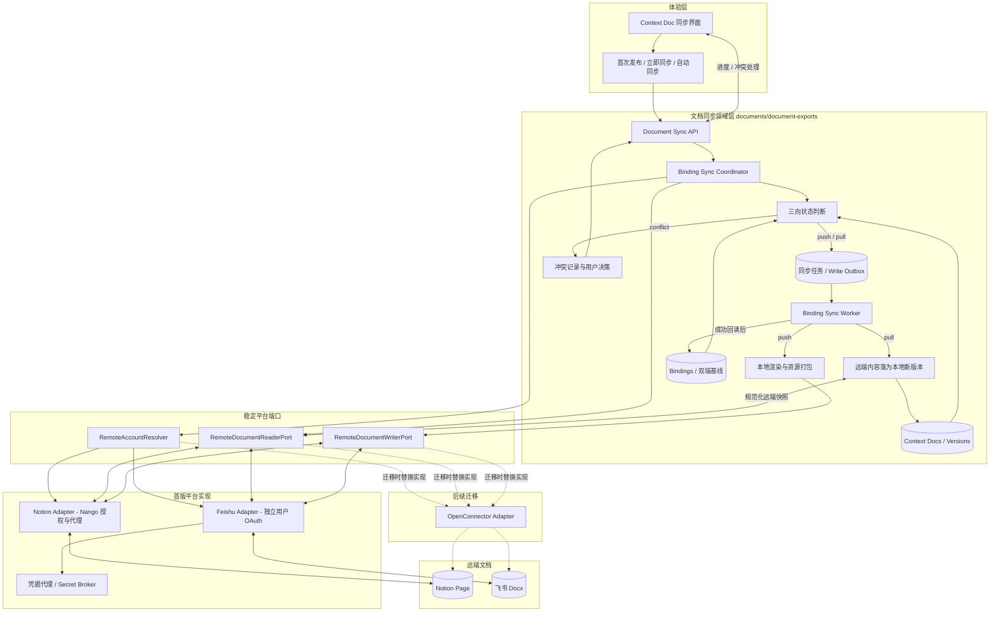
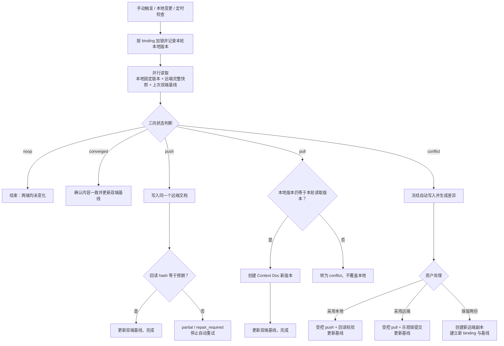

# 飞书 + Notion 文档导出与双向同步方案：独立于 Connector 迁移

> 修订日期：2026-09-02
> 目标：在 OpenConnector 尚未完成迁移的现状下，首版即交付 EverRoom Context Doc 与飞书、Notion 绑定文档之间的完整双向体验；该能力不依赖 Connector 全量发现和同步实现，并可在未来平滑替换授权与平台运行时。

## 1. 决策摘要

1. **导出是文档域能力，不是 Connector 同步作业。** 新模块归属 `documents/document-exports`，不调用 ConnectorManager、SyncEngine、同步 prompt 或 `allowedActions`；导出失败也不能影响已有导入任务。
2. **不等待 OpenConnector 迁移。** Notion 首期通过当前 Nango 连接执行官方写 API；飞书首期使用独立用户 OAuth 与官方导入任务 API。两者都藏在写入 adapter 后面。
3. **首版完成“首次发布 + 后续同步”。** 首次导出创建远端文档并建立 binding；此后本地单边变化推送到同一远端 ID，远端单边变化拉回为新的 Context Doc 版本，双端同时变化进入冲突处理。
4. **双向不等于静默覆盖。** 同步以双端基线做三向状态判断：只有单边变化才自动应用；双边变化不自动合并，删除不自动传播。
5. **授权后端可替换。** 文档同步域只认识 `remoteAccountId` 和平台能力，不认识 Nango、OpenConnector token 结构或 Provider 动作名。未来迁移只更换 account resolver 和读写 adapter。

## 2. 范围与边界

### 2.1 本期交付

- Context Doc 首次发布到新的 Notion 页面或飞书新版文档并建立持续 binding。
- 本地单边修改后，同步更新同一个远端文档。
- 远端单边修改后，同步拉回并创建新的 Context Doc 版本。
- 双端同时修改时显示差异并提供“采用本地”“采用远端”“保留两份”三种处理方式。
- 目标账号与目标位置选择、固定版本快照、异步任务进度、失败重试和结果入口。
- Markdown、标题和受支持图片的确定性物化。
- 导出命令幂等、远端任务续查、结果不确定时停止自动重发。
- 手动“立即同步”和可选的绑定文档定时同步；不做工作区全量发现。
- binding、双端基线、去重、防回环和删除保护。

### 2.2 明确不做

- 不等待 Notion 存量连接迁移到 OpenConnector。
- 不把飞书或 Notion 的工作区全量导入重构作为双向绑定同步的前置条件。
- 不复用 Connector 同步任务执行写操作，也不放宽其只读动作白名单。
- 不同步未绑定的远端文档，不自动传播删除，不自动合并两端同时发生的编辑。
- 不承诺评论、修订历史、数据库关系、白板、嵌入对象和所有复杂样式视觉等价。

## 3. 仓库现状与可复用能力

| 能力 | 当前事实 | 方案处理 |
| --- | --- | --- |
| Context Doc | `documents` 有稳定 `version`，`documentVersions` 可读取指定版本快照 | 导出必须绑定指定版本，不从编辑器临时状态直接上传 |
| Markdown | `agentDocumentMarkdown` 已能从 Tiptap JSON 生成 Markdown | 抽为导出 renderer，并补资源清单与平台降级报告 |
| 本地文件导出 | 编辑器已有 Markdown、DOCX、PDF 导出入口 | 在同一“导出”菜单增加 Notion、飞书目标 |
| 异步任务 | Gateway 有 `jobs` 表及多种 worker/outbox 实践 | 复用模式，不直接复用通用 `jobs` 状态；导出需要专用租约和远端等待态 |
| Notion 授权 | Nango OAuth 是当前产品主路径 | 基础设施 adapter 通过 Nango proxy 调写 API |
| Nango executor | 当前只公开读取流程，POST 为私有方法且没有 PATCH | 新建通用 Provider HTTP transport，不把写能力塞进 pull executor |
| 飞书授权 | 现有 `feishu-wiki` 是 tenant token 试点，不适合用户个人空间导出 | 导出模块建立独立的飞书用户 OAuth account adapter |
| OpenConnector | 已有写动作，但尚非默认运行时 | 作为后续 adapter，不作为本期依赖 |

## 4. 总体架构

### 4.1 系统分层与边界



读图顺序是：用户入口触发同步，领域层只通过三个稳定端口访问平台；首版由 Notion Nango adapter 和飞书用户 OAuth adapter 实现端口；OpenConnector 迁移只替换端口实现，不改 binding、基线、任务状态机或用户体验。`document-exports` 不引用 `connectors/manager`、`connectors/sync-engine` 或 OpenConnector 动作定义。

### 4.2 单次双向同步决策流



这条链路对 Notion 与飞书一致，差异只存在于 Reader/Writer adapter 内部。任何自动 push 或 pull 都必须先证明只有一端发生变化；任何成功写入都必须回读校验后才能推进基线，因此“双向”不会退化为双端互相覆盖。

## 5. 核心模块

### 5.1 DocumentBindingSyncService

负责首次发布、立即同步、自动同步开关和冲突处理。首次发布固定 `documentId + version`，生成 `requestId` 并写入创建任务；已有 binding 的同步则同时读取本地快照、远端快照和上次基线，计算本轮动作。

同一个 `requestId` 重复提交必须返回原任务。用户明确选择“保留两份”时生成新的 request ID 和远端副本；普通“立即同步”必须沿用 binding 中的远端 ID。

### 5.2 ExportSnapshotReader

只从 Gateway 权威存储读取指定版本。文档当前版本与请求版本不一致时仍可导出历史快照，但 UI 必须显示“导出版本 N”；不存在或无法物化的版本直接失败，不自动退回最新版本。

输出包含标题、Tiptap JSON、版本、文档 ID、Room ID 和资源引用。Renderer 在 worker 中再次读取时必须校验版本内容 hash，防止任务内容漂移。

### 5.3 ExportRenderer

Renderer 将版本快照转换为规范化 Markdown 与资源清单：

- 标题单独传给平台，不重复塞入正文首个 H1；
- 换行统一为 LF，移除行尾空白；
- 表格、列表、代码块、引用和链接使用固定序列化规则；
- 图片先解析为稳定本地资源，再由平台 adapter 上传或降级；
- 不支持的节点生成可见告警，不能静默删除；
- `payloadHash` 基于规范化正文、标题、资源内容 hash 和 renderer 版本计算。

同一版本在同一 renderer 版本下必须产生字节级一致结果，并使用快照测试锁定。

### 5.4 RemoteAccountResolver

领域层只使用：

```ts
interface RemoteAccountResolver {
  resolve(remoteAccountId: string): Promise<{
    provider: "notion" | "feishu"
    authBackend: "nango" | "native_oauth" | "openconnector"
    credentialHandle: string
    capabilities: ExportCapabilities
    status: "active" | "needs_connection" | "disabled"
  }>
}
```

`credentialHandle` 是不可读引用，不是 token。只有对应基础设施 adapter 能用它发请求，Renderer、outbox payload、日志和客户端均不能拿到 access token 或 refresh token。

### 5.5 远端读写接口

```ts
interface RemoteDocumentReaderPort {
  getMetadata(input: GetRemoteDocumentInput): Promise<RemoteDocumentMetadata>
  getMarkdown(input: GetRemoteDocumentInput): Promise<RemoteMarkdown>
}

interface RemoteDocumentWriterPort {
  getCapabilities(account: RemoteAccountRef): ExportCapabilities
  listTargets(input: ListExportTargetsInput): Promise<ExportTargetPage>
  preflight(input: ExportPreflightInput): Promise<RemoteTargetState>
  createCopy(input: CreateRemoteCopyInput): Promise<RemoteWriteResult>
  updateExisting?(input: UpdateRemoteDocumentInput): Promise<RemoteWriteResult>
  getWriteStatus?(input: GetRemoteWriteStatusInput): Promise<RemoteWriteResult>
}
```

Reader 的返回值必须包含远端 ID、修订或编辑时间、规范化前正文和结构降级告警。`RemoteWriteResult` 必须区分 `succeeded`、`accepted` 和 `failed`。`accepted` 必须返回可持久化的远端任务句柄；没有句柄的超时不能作为可自动重发错误处理。

### 5.6 ThreeWayStateDetector 与 PullApplier

StateDetector 比较当前本地 hash、当前远端 hash 和 binding 中的双端基线，只输出 `noop`、`push`、`pull`、`converged` 或 `conflict`，本身不执行 I/O。

PullApplier 将远端 Markdown 转成 Tiptap JSON，并通过 DocumentService 的乐观锁提交新版本。只有本地版本仍等于本轮读取版本时才能提交；提交后与远端快照在同一事务中更新基线。远端内容降级或转换失败时保留原 Context Doc，并把 binding 标为 `partial`，不能落半份正文。

本地 `document.changed` 事件按 binding 防抖后触发检查，自动同步 binding 另按间隔轮询远端，用户也可以随时“立即同步”。PullApplier 提交的版本携带 `sourceTransactionId=remote-sync:<jobId>`；事件处理器识别该来源后只安排基线确认，不直接安排 push。来源标记用于减少回环，最终判断仍以双端 hash 为准。

## 6. 当前平台 adapter

### 6.1 Notion：复用 Nango 授权，不复用同步引擎

已通过当前 Notion 连接授权的用户使用 Nango。新增 `NangoProviderHttpTransport`，支持 GET、POST、PATCH，统一注入连接 ID、Provider config key、`Notion-Version: 2026-03-11`、超时和错误解析。它属于基础设施层，不进入 `NangoExecutor.pull()`。

首版首次发布：

1. 目标选择器列出当前连接可写的父页面。
2. `POST /v1/pages` 传父页面、标题和 Markdown。
3. 大内容使用 `allow_async=true`；HTTP 202 进入远端任务轮询。
4. 成功后保存 page ID、URL、`last_edited_time` 和回读 hash。

绑定后的完整同步：

- 远端读取使用 `GET /v1/pages/:id/markdown`，并处理 `truncated` 与 `unknown_block_ids`；读取不完整时禁止推送覆盖。
- 本地单边变化使用 `PATCH /v1/pages/:id/markdown` 的 `replace_content`，保持 `allow_deleting_content=false`。
- 远端单边变化解析 Markdown 并提交新的 Context Doc 版本。
- 大写入返回异步任务时保存任务 ID 并轮询；完成后回读页面，再更新双端基线。

Notion 连接首版必须同时具备 `read_content`、`insert_content` 和 `update_content`。capability 变更后公共连接的存量用户需要重新授权，UI 必须把“缺少写权限”和“授权失效”分开提示。

### 6.2 飞书：独立用户 OAuth 写入 adapter

飞书导出不能使用现有 `feishu-wiki` 的 tenant token 作为默认方案，否则用户个人空间、目标文件夹权限和文档归属会不符合预期。本期新增只服务于文档导出的用户 OAuth：

- 授权码模式获取 user access token 与 refresh token；token 时效以响应字段为准；
- refresh token 轮换必须原子更新，旧 token 不可并发重放；
- 密钥和 token 通过 SecretStore 保存，数据库只存 credential handle；
- scopes 只申请目标发现、文件上传、文档导入和必要的文档访问权限；
- 授权模块实现 `RemoteAccountResolver`，不注册 Connector sync scope。

Desktop 主进程实现 `RemoteAccountSecretBrokerPort`，使用 Electron safeStorage 管理飞书凭据。Gateway 只凭 `credentialHandle` 按需取得进程内短期 token，并把 refresh 轮换结果原子提交回 broker；数据库、IPC 返回值和任务 payload 均不持久化明文 token。非 Desktop 部署必须提供同一 port 的服务端密钥实现，不能退化为 SQLite 明文存储。

首版首次发布：

1. 选择“我的空间”或用户有写权限的目标文件夹。
2. 生成 Markdown 与资源包，上传导入所需文件。
3. 提交 Drive import task，并先持久化 ticket。
4. 串行轮询任务，成功后保存 document ID、URL、远端修订信息和回读 hash。

绑定同步每次都分页读取 Docx block tree，用于远端修订校验、结构 hash 和 block ID 映射；正文 Markdown 可优先使用公开的 docs content API，超限或结构不足时由 block tree 确定性转换。未公开的 `docs_ai` Markdown 读取只能作为受监控的优化路径，不能成为正确性前提。

飞书原页更新使用公开 Docx block API，而不是依赖 OpenConnector 或 lark-cli：

1. 首次 import 成功后立即读取远端 block tree，把本地稳定 block ID、远端 block ID、块类型和内容 hash 写入 `block_map_json`；无法唯一对齐时保持 `calibrating` 并阻止推送。
2. 每次推送先读取最新远端修订和完整 block tree；内容不等于基线时不执行写入。
3. `FeishuBlockPatchPlanner` 对受支持的标题、段落、列表、代码、引用、表格和图片生成创建、更新、重建、删除操作；所有操作都携带本轮远端修订前提。
4. 更新按父子依赖排序并分批串行执行。先上传资源和创建新块，再更新或删除旧块，避免引用尚未存在的资源。
5. 任一批失败后立即停止，binding 进入 `repair_required`。恢复时重新读取远端并重新规划，禁止从旧批次位置继续盲重试。
6. 成功后回读全文，只有回读 hash 与预期一致才提交新基线；不一致进入 `partial` 并提示用户检查。

远端单边变化使用同一 reader 拉回 Context Doc 新版本，并随新版本重建 block map。远端包含无法表示的白板、分栏或嵌入块时保存占位和原文链接，并在同步前展示降级项；涉及不能安全保留的远端块时，推送被阻止而不是删除该块。

未公开的 `docs_ai overwrite` 只允许放在实验开关后，用于已验证的文档类型；关闭它不应影响首版同步验收。OpenConnector 中已有动作可作为请求格式和错误分类参考，但本期运行时不调用 OpenConnector sidecar。迁移完成后新增 `OpenConnectorReadWriteAdapter`，binding 与同步任务无需迁移。

## 7. 首次发布与双向同步状态机

### 7.1 创建副本

```text
用户选择文档版本、平台、账号和目标位置
  -> API 校验并创建 pending 任务
  -> worker 获取租约
  -> 读取固定版本并规范化
  -> 校验账号状态与平台能力
  -> 调用 createCopy
  -> accepted: 保存远端任务句柄并轮询
  -> succeeded: 创建 binding、保存基线并发布完成事件
```

状态迁移：

```text
pending -> preparing -> writing -> waiting_remote -> succeeded
                 \-> failed_retryable -> pending
                 \-> needs_confirmation
                 \-> failed_terminal
```

`needs_confirmation` 用于“请求可能已经到达平台，但没有任务句柄或确定结果”的场景。用户确认远端不存在后才能重试创建；不能用指数退避盲目重发。

首次发布成功后，binding 默认进入 `active`，并立即执行一次远端回读。只有回读成功才显示“已同步”；只拿到远端 ID 但无法建立基线时显示“已发布，等待校准”。

### 7.2 绑定文档同步

每次手动或定时同步都固定本地版本，同时读取远端快照。状态判断如下：

| 本地相对基线 | 远端相对基线 | 结果 |
| --- | --- | --- |
| 未变化 | 未变化 | `noop`，只更新时间 |
| 已变化 | 未变化 | `push`，更新同一远端文档 |
| 未变化 | 已变化 | `pull`，提交新的 Context Doc 版本 |
| 已变化 | 已变化且规范化 hash 相同 | `converged`，更新基线 |
| 已变化 | 已变化且内容不同 | `conflict`，等待用户处理 |

```text
scheduled/manual -> checking -> noop
                             \-> pushing -> waiting_remote -> verifying -> synced
                             \-> pulling -> applying_local -> synced
                             \-> conflict -> resolving -> checking
                             \-> repair_required
```

同步期间使用 binding 级租约与 fence token。同一 binding 同时只允许一个检查、推送、拉取或冲突处理动作；过期 worker 即使完成远端请求，也不能提交本地基线。

### 7.3 冲突处理

- **采用本地。** 重新读取远端确认冲突仍存在，经用户明确确认后推送本地版本；保留冲突前远端快照用于恢复。
- **采用远端。** 把远端快照提交为新的 Context Doc 版本，不改写历史版本。
- **保留两份。** 保持当前 binding 指向原远端文档，同时把本地版本另存为新的远端副本；用户可选择是否把新副本设为后续同步目标。

冲突决策必须携带读取时的本地版本和远端修订。任一侧再次变化时原决策失效，重新进入检查，不能沿用过期确认。

## 8. 双向导入导出原则

绑定同步独立于 Connector 的工作区全量发现，但首版必须具备完整的双向一致性约束：

- **权威分离。** Connector mirror 以远端为权威，Context Doc 以 EverRoom 为权威；导入不直接覆盖 Context Doc，导出不把 mirror 当作编辑源。
- **身份复用。** 首次发布立即记录 `(provider, remoteAccountId, remoteDocumentId)`。后续 Connector 导入若发现同一远端 ID，必须附着到现有 binding，不新建无关关系。
- **基线先行。** 成功写入后尽可能回读远端规范化内容，再保存双端 hash；不能把“已发送 payload”直接当作远端基线。
- **防回环。** 下一次导入内容与 `baselineRemoteHash` 相同，只更新确认时间，不触发 Context Doc 写入或再次导出。
- **冲突显式。** `managed_sync` 下任一端偏离基线都先预检；两端同时变化时只允许用户选择保留本地并另存副本、采用远端并新建本地版本、或断开绑定。
- **删除不传播。** 任一端删除只把 binding 标为 `orphaned`；另一端内容保留。
- **账号稳定。** binding 只保存稳定的 `remoteAccountId`，auth backend 由账号记录所有。迁移授权后端必须显式校验远端身份并更新账号，不能因为 OpenConnector 可用就临时改道。
- **自动同步可控。** 首次发布后默认提供“立即同步”；自动同步由用户逐 binding 开启，并在连续失败、授权失效、冲突或 `repair_required` 时自动暂停。

## 9. 数据模型

### 9.1 远端账号

`document_remote_accounts`：

```text
id, owner_id, provider,
auth_backend(nango|native_oauth|openconnector),
credential_handle, external_account_id, display_name,
capabilities_json, status(active|needs_connection|disabled),
created_at, updated_at
```

Notion 账号可引用现有 Nango connection；飞书账号引用独立 OAuth SecretStore。`external_account_id` 用于防止迁移 auth backend 时误绑到另一工作区或另一飞书用户。

### 9.2 绑定同步任务

`document_binding_sync_jobs`：

```text
id, request_id, owner_id,
document_id, document_version, room_id,
binding_id, provider, remote_account_id,
operation(create_remote|push_remote|pull_remote|resolve_conflict),
target_locator_json, renderer_version, payload_hash,
expected_remote_revision, expected_remote_hash,
expected_local_version, remote_snapshot_ref, origin_operation_id,
status(pending|checking|preparing|writing|waiting_remote|applying_local|
       needs_confirmation|conflict|repair_required|succeeded|failed),
attempt_count, available_at,
lease_owner, lease_until, fence_token,
remote_task_id, remote_result_json,
last_error_code, last_error_detail,
created_at, updated_at, completed_at
```

`request_id` 对首次发布、普通同步和冲突决策统一唯一，用于 API 请求幂等；`origin_operation_id` 关联一次远端写入、本地拉回和下一次检查。任务保存版本、hash 和快照引用，不保存明文 token。专用表优于直接复用当前 `jobs` 表，因为双向同步需要远端等待、冲突、修复态、租约、fence token 和远端任务句柄。

### 9.3 远端绑定

`document_remote_bindings`：

```text
id, owner_id, document_id,
provider, remote_account_id, remote_document_id,
relation(managed_sync|detached_copy),
sync_mode(manual|automatic),
status(calibrating|active|partial|conflict|repair_required|orphaned|disabled),
baseline_local_hash, baseline_remote_hash,
baseline_snapshot_ref,
last_local_version, last_remote_revision,
block_map_json, poll_interval_ms, next_sync_at,
last_sync_job_id, last_pulled_at, last_pushed_at,
created_at, updated_at
```

远端身份唯一约束：

```text
(owner_id, provider, remote_account_id, remote_document_id)
```

同一 Context Doc 可以有多个 `detached_copy`；同一平台账号最多只能有一个活动的 `managed_sync` 目标。`block_map_json` 只用于需要远端块定位的平台，Notion 可为空。

### 9.4 基线快照

每次成功 push、pull 或 converged 后写入不可变的 `document_sync_baselines`：

```text
id, binding_id, local_version, remote_revision,
local_hash, remote_hash, normalized_markdown_ref,
created_by_job_id, created_at
```

binding 只指向当前基线；历史基线用于冲突差异、恢复和审计。较大正文写入内容寻址的本地资源存储，表中只保存引用，避免在 binding 行内反复复制全文。

## 10. API 与界面

### 10.1 Gateway API

| API | 用途 |
| --- | --- |
| `GET /v1/document-sync/accounts` | 列出平台账号、授权状态和读写能力 |
| `GET /v1/document-sync/accounts/:id/targets` | 分页列出首次发布目标位置 |
| `POST /v1/document-bindings` | 固定版本、创建远端文档并建立 binding |
| `GET /v1/document-bindings/:id` | 查看远端身份、同步状态和当前基线 |
| `POST /v1/document-bindings/:id/sync` | 对该 binding 执行一次三向检查与同步 |
| `PATCH /v1/document-bindings/:id/settings` | 切换手动或自动同步及轮询间隔 |
| `GET /v1/document-bindings/:id/diff` | 获取冲突的本地、基线、远端差异 |
| `POST /v1/document-bindings/:id/resolve` | 提交采用本地、采用远端或保留两份 |
| `GET /v1/document-sync/jobs/:id` | 查询进度、结果、告警和修复状态 |
| `POST /v1/document-sync/jobs/:id/retry` | 仅重试明确可重试失败 |
| `POST /v1/document-sync/jobs/:id/confirm-retry` | 用户确认不确定结果后重试 |

创建 binding 的请求包含 `documentId`、`documentVersion`、`remoteAccountId`、`target` 和 `requestId`。服务端根据账号决定 Provider，不能相信客户端重复传入的 Provider 字符串。同步与冲突决策同样必须带唯一 request ID，服务端返回持久化任务而不是阻塞等待平台完成。

### 10.2 Desktop

在现有文档“导出”子菜单中增加 Notion 和飞书。首次发布对话框展示账号、目标位置、导出版本和标题预览；成功后文档工具栏显示平台、远端入口、同步状态、“立即同步”和自动同步开关。

状态使用“正在检查”“正在推送”“正在拉取”“已同步”“远端有更新”“存在冲突”“需要修复”，不能把所有非成功状态合并成“导出失败”。远端单边变化拉回后显示新增本地版本；冲突对话框必须展示三方差异和三种明确决策。

授权失效时在对话框内显示“重新授权”，不把用户送到 Connector 同步页面。飞书尚未连接时启动独立导出授权流程；Notion 优先复用现有 Nango 账号。

## 11. 错误、重试与安全

| 分类 | 自动处理 | 用户动作 |
| --- | --- | --- |
| 授权失效 | 暂停账号下待执行任务 | 重新授权后继续 |
| 写权限不足 | 不重试 | 更换目标或补权限 |
| 限流 | 遵循 `Retry-After`，退避并加抖动 | 默认无需操作 |
| 平台 5xx、网络超时 | 仅在请求确定未发送或有任务句柄时自动恢复 | 超过上限后重试 |
| 结果不确定 | 进入 `needs_confirmation` | 打开目标平台确认后继续 |
| 内容降级 | 完成任务并保存 warnings | 查看不支持内容清单 |
| 本地版本不可用 | 终止，不改导出版本 | 选择可用版本重新导出 |
| 远端冲突 | 停止更新 | 显式选择冲突策略 |
| 飞书部分写入 | 进入 `repair_required`，重新读取但不自动续写 | 检查差异并执行修复同步 |

日志只记录 account ID、任务 ID、Provider 状态码和脱敏错误。OAuth code、token、client secret、完整正文和预签名资源 URL 不得进入日志。外部调用接入现有 CONNECTOR 类调用预算与审计，但预算模块不获得凭据。

## 12. 实施阶段

### M0：绑定同步领域骨架

- 新建 `documents/document-exports`；
- 数据表、repository、service、worker、port 和状态机；
- 指定版本读取、Markdown renderer、payload hash 和快照测试；
- Gateway API、Desktop 导出入口和进度事件。

### M1：Notion 完整双向闭环

- `NangoProviderHttpTransport` 支持 GET、POST、PATCH；
- Notion 目标选择、Markdown 建页、回读校准和 binding；
- 绑定页远端读取、本地推送、远端拉取和异步任务轮询；
- 三向状态判断、冲突处理、删除保护和打开远端链接；
- 手动同步与绑定级自动同步。

### M2：飞书完整双向闭环

- 独立飞书用户 OAuth account 与 SecretStore；
- 目标文件夹选择、Markdown import task、ticket 续查和回读校准；
- 公开 blocks 读取、block map、结构化 patch planner 和分批写入；
- 远端拉回、图片与附件、部分写入修复和降级阻断；
- 手动同步与绑定级自动同步。

### M3：与 Connector 导入去重及运行时迁移

- Connector 导入发现远端 ID 时查询现有 binding；
- 相同基线只确认，不重复物化或触发写回；
- 同一账号与远端文档只保留一个身份记录；
- 授权后端迁移工具按 external account identity 重绑账号。

## 13. 验收标准

1. OpenConnector sidecar 未启动时，Notion 与飞书均可完成首次发布和后续绑定同步。
2. 两个平台首次发布后均保存远端 ID、URL、双端 hash、远端修订和基线快照。
3. 只修改本地后点击同步，更新同一个远端文档 ID，不创建新副本。
4. 只修改远端后点击同步，Context Doc 增加一个新版本，历史版本保留。
5. 两端同时修改时不自动覆盖，进入冲突态并可完成三种用户决策。
6. API 重试不会重复建页；只有用户选择“保留两份”或再次首次发布才创建第二个副本。
7. 导出固定历史版本时，任务期间继续编辑文档不会改变已提交 payload。
8. 进程在远端异步任务处理中退出，重启后能使用已保存句柄续查。
9. 飞书分批写入中断后进入 `repair_required`，重新读取与规划，不从旧批次盲续。
10. 无句柄的超时不会自动重复创建或重复更新远端文档。
11. 删除任一端文档不会自动删除另一端；binding 进入 `orphaned`。
12. 授权失效、权限不足、限流、平台失败、内容降级、冲突和修复态具有不同状态与文案。
13. Connector 导入发现相同远端 ID 时复用 binding，内容未变化时不重复写入。
14. 将账号 auth backend 替换为 OpenConnector 时，领域表、API、状态机和 UI 不需要重构。

## 14. 预计代码落点

- `apps/gateway/src/modules/documents/document-exports/`：binding sync service、worker、renderer、reader/writer ports、三向状态机和冲突处理。
- `apps/gateway/src/infrastructure/document-exports/`：Nango、飞书 OAuth、Secret Broker client 与未来 OpenConnector adapters。
- `apps/gateway/src/infrastructure/database/schema.ts`：accounts、jobs、bindings 与索引。
- `apps/gateway/src/modules/documents/routes.ts` 或独立 export routes：导出 API。
- `apps/gateway/src/modules/documents/service.ts`：只增加指定版本快照读取边界，不内嵌平台逻辑。
- `apps/gateway/src/modules/connectors/`：仅抽出通用 Nango proxy transport；不修改同步状态机和只读白名单。
- `apps/desktop/src/main/gateway/document-gateway-bridge.ts`：导出 IPC/HTTP bridge。
- `apps/desktop/src/renderer/.../TiptapDocumentActions.tsx`：Notion/飞书导出入口。
- Desktop SecretStore：飞书 OAuth credential handle 与刷新 token 安全存储。

## 15. 参考

- [Notion Markdown 内容 API](https://developers.notion.com/guides/data-apis/working-with-markdown-content)
- [Notion capabilities](https://developers.notion.com/reference/capabilities)
- [Notion 请求与限流](https://developers.notion.com/reference/request-limits)
- [飞书创建导入任务](https://open.feishu.cn/document/server-docs/docs/drive-v1/import_task/create?lang=zh-CN)
- [飞书 OAuth 刷新 user access token](https://open.feishu.cn/document/authentication-management/access-token/refresh-user-access-token?lang=zh-CN)
- 现有总方案：[飞书云文档 + Notion 双向同步：调研与方案设计](https://vyi-tech.feishu.cn/docx/RLrpdlFGEoNhJExbkxucS3jhnMc)
